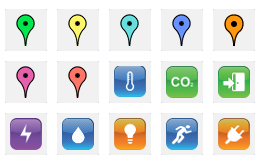

# Locating a device

You can locate a device in two ways: network location or manual
location.

You must have read-write access to Device Manager to change the device
location. Read more\... For more information, see [Opening a panel and
checking your read-/write
access](../use-interface.md#opening-a-panel-and-checking-your-read-write-access).

## Network location: viewing the device location history (LoRaWAN® only) {#network-location-viewing-the-device-location-history-lorawan®-only}

If a LoRaWAN® device has moved and if the network location is set, you
can view the device journey on the map with details on dates and
locations.

The network location can report the device location from:

- The GPS coordinates included in the device payload for devices
  supporting the feature.

- The geolocation information (for example TDoA-based location) provided
  by the Geolocation Solver on the network.

The network location is the default location. It can be changed when
creating the device and later. For more information, see [Manual
location: locating a device or editing its
location](#manual-location-locating-a-device-or-editing-its-location).

 

1.  Open a device in view mode.

2.  In the Device frame, click **View location history** under the map.

3.  On the map, click a marker to get the position coordinates and date
    of each step of the device journey.

## Manual location: locating a device or editing its location

When created with manual location, no location is reported for the
device. Consequently, the device is not located in Device Manager, and
the device default marker does not appear on the map.

If you have read-write access, use this task if you want to:

- Set the device in manual location

- Locate manually the device, that is to say enter manually a location
  for the device

- Edit the manual location

- Add the device marker on the map after having created the device with
  manual location.

**Notes**

- If you have read-only access, you can see the device location by
  opening the device in view mode, only if a read-write access end-user
  has manually located the device on the map.

- Device location history is not available in manual location.

 

1.  Open a device in edit mode.

2.  In the Device frame, click **Update location** under the map.

3.  In the Device location dialog box that displays a map, select
    **Manual location**.

4.  If you want to locate the device, do one of the following:

    - In the Search box, enter the location of the device.

    - Click the device marker, then click on the map where you want to
      move the device.

    

5.  Click **Save** in the Device location dialog box.

    -\> The maker has moved on the **Map** tab of the Devices panel.

## Changing the device marker

Device markers let you spot devices on the map and can be changed.

 

1.  Open a device in edit mode.

2.  In the Device frame, click **Change marker** under the map.

3.  In the Marker selection dialog box that opens, select the marker you
    want.

4.  Click **Save**.

    -\> The marker changes on the map.
