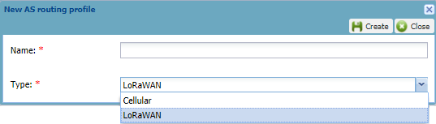

# Creating a LoRaWAN® or a cellular AS routing profile

You must have read-write access to Device Manager. Read more\... For
more information, see [Opening a panel and checking your read-write
access](../use-interface.md#opening-a-panel-and-checking-your-read-write-access).

It consists in creating an empty AS routing profile of LoRaWAN® or
cellular type, and giving it a name. It will populate according to the
connectivity, the New device dialog box used to create a device and the
Network panel of existing devices. By default, a cellular AS routing
profile is created in message mode but you can change it later. For more
information, see [Configuring a cellular AS routing
profile](configure-cellular-as-routing-profile.md).

The first created AS routing profile of each type is a default AS
routing profile. For more information, see [Changing the default AS
routing profile](change-default-as-routing-profile.md).

**Important** Hardware Security Module (HSM) is not applicable to
cellular devices. When creating a cellular AS routing profile, do not
activate the Hardware Security Module (HSM) if available.

 

1.  In the AS routing profiles panel, click **Create** in the Add AS
    routing profiles frame.

    

2.  In the New AS routing profile dialog box that opens:

- In the **Name** box: enter a name for the AS routing profile.

- In the **Type** list: select the type of AS routing profile you want
  to create.

  

1.  Click **Create**.

    -\> The new LoRaWAN® or cellular AS routing profile in message mode
    is created and opened in edit mode.
