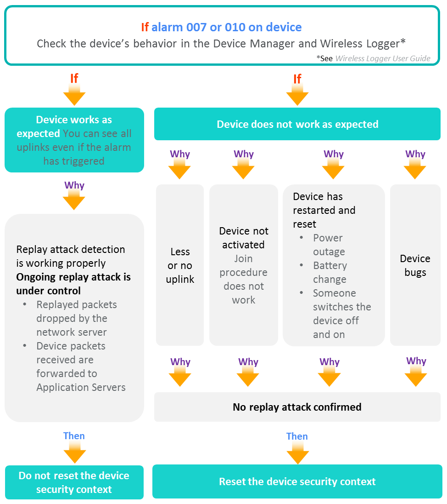

# Troubleshooting devices

## Alarms list with troubleshooting guidelines

Once you have investigated alarms as shown in [Monitoring
alarms](monitor-device-alarms.md), you can use the following table that
lists all the alarms triggered by Device Manager to help you
troubleshoot devices.

This table gives the ID and meaning of each alarm, its probable causes
and guidelines for corrective actions. It also tells if the alarm is
event-driven or state-driven. For more information, see [Alarm
occurrence management](index.md#alarm-occurrence-management).

The following alarms also apply to cellular devices and multicast
groups:

- **Alarm 002: Traffic Exceeds the Downlink Regulator Settings**
  (cellular message mode). Also applies to multicast groups.

- **Alarm 003: Traffic Exceeds the Uplink Regulator Settings** (cellular
  message mode)

- **Alarm 004: No Uplink Activity** (cellular message mode, cellular
  direct IP mode, cellular mixed mode)

|Alarm ID|Alarm Name|Explanation|Possible root causes|Guidelines|
|---|---|---|---|---|
|001|**Battery level threshold** (state-driven)|The power of the battery is very low.|The battery of the device has a very low power.|Change the battery of the device.|
|002|**Traffic exceeds the downlink regulator settings**  (event-driven)|The device is receiving too many packets.|Too many acknowledgments or downlink packets from application servers. The limit set in the connectivity plan does not match the device behavior.|Check the downlink packets sent to verify if the device's behavior is normal.  If the alarm persists, contact your support.|
|003|**Traffic exceeds the uplink regulator settings** (event-driven)|The device exceeds the connectivity plan policy by transmitting too many packets.|The device may send too many packets. It may quickly discharge the battery.|If the power level of the device is low, change the battery.   Use another connectivity plan if available. Reduce the number of packets sent by the device. If the alarm persists, contact your support.|
|004|**No uplink activity warning** (state-driven)|The device has not sent any packet for the past x hours according to the thresholds you have defined in [Configuring an inactivity alarm](configure-alarms.md#configuring-an-inactivity-alarm).|The device is OFF. No power or power too low to transmit packets. The device cannot connect to the network. Wrong provisioning of the device.|Check if the device is ON. If the power level of the device is low, change the battery. If the device is not located in the coverage area of the network, move the device. Check the device information. If the alarm persists, contact your support.|
|005|**Node uses higher data rate than expected** (state-driven)|The device sends packets whose Spreading Factor is too low (e.g. SF7 instead of SF10).|The device firmware does not support ADR or is configured with a fixed Spreading Factor. The device did not receive the LoRaWAN® ADR command to adjust Spreading Factor.|Check the device firmware ADR configuration (see your device documentation). If the alarm persists, contact your support.|
|006|**Node uses lower data rate than expected** (state-driven)|The device sends packets whose Spreading Factor is too high (e.g. SF10 instead of SF8).|The device firmware does not support ADR or is configured with a fixed Spreading Factor. The device did not receive the LoRaWAN® ADR command to adjust Spreading Factor. The device is using Spreading Factor fallback procedure (SNR degraded).|Check the device firmware ADR configuration (see your device documentation). Check the coverage of the device and move the device if necessary. If the alarm persists, contact your support.|
|007|**Join request replay detected (DevNonce replay)** (event-driven)|A DevNonce replay has been detected in a Join request (Last occurrence was for the given DevNonce).|The device is the victim of a join request replay attack. The device sent a join request containing a DevNonce already used.|See [Resetting the security context of a device](#resetting-the-security-context-of-a-device). If the number of the alarm occurrences is high:  If the device sent a join request containing a DevNonce already used, fix it.  The device may be the victim of a join request replay attack. Stop the radio and try to identify the attacker. If the alarm persists, contact your support.|
|008|**Wrong MIC detected in Join request** (event-driven)|A wrong MIC has been detected in a Join request.|The device is the victim of a join request adversary attack. The device sent a join request containing a wrong MIC possibly due to wrong device provisioning (e.g. bad Appkey).|If the number of the alarm occurrences is high:  Check the device's information and behavior, and fix issues.  The device may be the victim of a join request replay attack. Stop the radio and try to identify the attacker. If the alarm persists, contact your support.|
|009|**Join request replay detected (wrong MIC correlation)** (event-driven)|A wrong MIC correlation has been detected between a Join request and the following uplink packet (Last occurrence was for the given DevNonce).|The device is the victim of a join request replay attack.|If the number of the alarm occurrences is high, the device may be the victim of a join request replay attack. Stop the radio and try to identify the attacker. If the alarm persists, contact your support.|
|010|**Uplink frame replay detected (wrong FCnt)** (event-driven)|A wrong FCnt has been detected in an uplink packet (Last occurrence was for the given FCnt).|The device is the victim of an uplink packet replay attack. The device reset has not been detected by the network server.|See [Resetting the security context of a device](#resetting-the-security-context-of-a-device). If the number of the alarm occurrences is high, the base station may be the victim of a join request replay attack. Stop the radio and try to identify the attacker. If the alarm persists, contact your support.|
|011|**Uplink frame replay detected (repeated FCnt)** (event-driven)|A repeated FCnt has been detected in an Uplink packet (Last occurrence was for the given FCnt, provided with number and duration of transmissions).|The device is the victim of an uplink packet replay attack. The configured number of retransmissions of the device has been exceeded.|If the number of the alarm occurrences is high:  If the configured number of transmissions of the device has been exceeded, fix it. The device may be the victim of a join request replay attack. Stop the radio and try to identify the attacker. If the alarm persists, contact your support.|
|012|**MAC command transmission blocked (transmission rejected)** (state-driven)|The transmission of the given MAC command has been blocked after a given attempts and rejected.|The device rejects the MAC command sent by the network server.|Check the behavior of the device and fix it. If the alarm persists, contact your support.|
|013|**MAC command transmission blocked (no reply)** (state-driven)|The transmission of the given MAC command has been blocked after a given number of attempts because of no reply.|The device did not receive the MAC command sent by the network server. The device's firmware does not support the MAC command.|Check if the device is ON. If the power level of the device is low, change the battery. If the device is not located in the coverage area of the LoRaWAN® network, move the device. Check the behavior of the device and fix it. If the alarm persists, contact your support.|
|014|**Invalid AppEUI detected in Join request** (event-driven)  For LoRaWAN® 1.0 OTAA devices, only applies if the device supports counter-based DevNonce and has been created using a model activating this behavior. Applies to all LoRaWAN® 1.1 OTAA devices.|An invalid AppEUI issue has been detected in a Join request concerning the used AppEUI (or JoinEUI in LoRaWAN® 1.1).|The device has changed too many times its AppEUI/JoinEUI value (maximum allowed: 32).|If a LoRaWAN® 1.0 device, check that it supports the counter-based DevNonce feature and that the model used to create the device is correct. If yes, the replay attack risk will not jeopardize the device operation. If not, change the model.  If the device has used more than 32 different AppEUIs, fix it. Check the behavior of the device and fix it. If the alarm persists, contact your support.|
|015|**Join request replay detected (invalid DevNonce)** (event-driven)  For LoRaWAN® 1.0 OTAA devices, only applies if the device supports counter-based DevNonce and has been created using a model activating this behavior. Applies to all LoRaWAN® 1.1 OTAA devices.|A DevNonce replay attack has been detected in a Join request concerning the DevNonce used with the AppEUI (or JoinEUI in LoRaWAN® 1.1).|A DevNonce has been reused with the same AppEUI/Join EUI: The device is the victim of a join request replay attack.|If a LoRaWAN® 1.0 device, check that it supports the counter-based DevNonce feature and that the model used to create the device is correct. If yes, the replay attack risk will not jeopardize the device operation. If not, change the model.  If the number of the alarm occurrences is high, the device may be the victim of a join request replay attack. Stop the radio and try to identify the attacker. If the alarm persists, contact your support.|

## Resetting the security context of a device

You must have read-write access to Device Manager. Read more\... For
more information, see [Opening a panel and checking your read-write
access](../use-interface.md#opening-a-panel-and-checking-your-read-write-access).

It does not apply to cellular devices.

## About the security context of a device

The security context of a device is an history registered in the network
server (LRC). It contains information about packets sent by the device
that is used to prevent the device from replay attacks. This information
is compared with any new packet received. If an anomaly is detected, the
network server drops the packet alleged as replayed.

When a device resets whereas the network server does not detect the
reset, the traffic from the device is considered as replay attack.
Traffic is blocked, and the corresponding device alarm is triggered. The
security context must be reset only when you diagnose this situation.

**WARNING** The Reset the security context command resets the whole
device context in the network server and must be used with caution.
Never use it unless you are sure that the device software has really
reset without notifying the network. Otherwise, you will lose the
current state of the device by resetting the network server wrongly for
this device.

## Diagnosing when to reset the security context

If a device has one of the following alarms and does not work as
expected, you can troubleshoot it by resetting its security context, if
you have diagnosed that the replay attack is not real:

- For an OTAA device:

  **Alarm 007 - Join Request Replay Detected (DevNonce Replay)**

  The device must not reuse a used DevNonce in Join requests**.**

- For an ABP device:

  **Alarm 010 - Uplink frame replay detected (wrong FCnt)  
  **The device must always use an incremented FCnt in uplink frames.

It will stop the network server dropping the next device's packets
because they would not be seen as replayed anymore.

**WARNING** The Reset the security context command resets the whole
device context in the network server and must be used with caution.
Never use it unless you are sure that the device software has really
reset without notifying the network. Otherwise, you will lose the
current state of the device by resetting the network server wrongly for
this device.

 

1.  The following tree helps you diagnose and decide if necessary to
    reset the security context of a device.

1.  If you have diagnosed that the replay attack detected by the alarm
    007 or 010 is not real, follow the instructions given in [Resetting
    the security context](#resetting-the-security-context).

## Resetting the security context

If you have diagnosed that the replay attack detected by the alarm 007
or 010 is not real, you can reset the security context of a device to
troubleshoot it. For more information, see [Diagnosing when to reset the
security context](#diagnosing-when-to-reset-the-security-context).

You must have read-write access to Device Manager. Read more\... For
more information, see [Opening a panel and checking your read-write
access](../use-interface.md#opening-a-panel-and-checking-your-read-write-access).

**WARNING** The Reset the security context command resets the whole
device context in the network server and must be used with caution.
Never use it unless you are sure that the device software has really
reset without notifying the network. Otherwise, you will lose the
current state of the device by resetting the network server wrongly for
this device.

 

1.  In the navigation panel, click **Devices** to display the Devices
    panel, then click the **List** or the **Map** tab.

2.  Select the device you want to reset the security context and click
    **Edit**.

3.  In the device that appears in the navigation panel, click
    **Settings** to open the Node settings panel.

    

4.  In the Security context area of the Troubleshooting frame, click **Reset security context**.

    
    -\> If new packets are sent by the device:

    - The network server will forward them to the application server.

    - You can see the packets in the Wireless Logger.

    - The alarm is cleared by the system.
