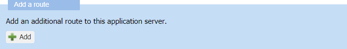
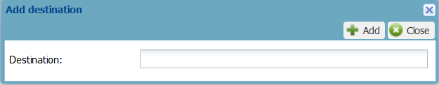

# Adding the route to the HTTP application server

You need the following information from the supplier of the application
server to add it one or more routes:

| Required information                      |
|-------------------------------------------|
| The URL or URLs of the application server |

1.  In the Add a route frame, click **Add**.

    

2.  In the Route frame that appears:

    

    1.  In the **Source ports** box, enter one or more ports according
        to the application server usage:

        - **For LoRaWAN® devices**: The source ports can be either one
          port, a list of ports (example: 1,2,3), a range of ports
          (example: 10-20), all or remaining ports (\*).

          If you want to define several routes to direct and distribute
          uplink reports according to the FPort:

          - **For uplink reports**: Only the first route **matching the
            FPort** of the uplink is used.

            - There is no use defining several routes with the same
              FPort.

            - Only use \*(all/remaining ports) in the last defined
              route. Like this, this route will match all uplinks having
              an FPort that did not match the preceding routes.

          - **For other reports**: The first route is always used.
            Subsequent routes are used to route uplinks **matching the
            FPort**.

            For more information about LoRaWAN® reports and FPort, see
            [LRC-AS Tunnel Interface Developer Guide](../../integrating-applications-with-tpw.md#lrc-as-tunnel-interface-developer-guide).

        - **For cellular devices**: There is no source port to define.

    2.  In the **Routing strategy** list, select **Sequential**.

3.  Click **Add**.

4.  In the Add destination dialog box that appears:

    

    1.  In the **Destination** box, enter the URL of the application
        server its supplier gave you.  
        If your operator made it mandatory on its platform, the URL must
        be secured using an https URL.

    2.  Click **Add**.

        -\>The new destination is displayed in the Destinations list of
        the Destinations frame.

        

5.  In the Destination list:

    |If you want to…|Do this…|
    |--- |--- |
    |**Add another destination**|Click **Add** and repeat the previous step. **Note** The maximum number of destination URLs you can add per route is defined by your operator when installing your platform.|
    |**Move a destination in the list**|Select the destination and click **Up** or **Down**.|
    |**Delete a destination**|Select the destination and click **Delete**.|
    |**Delete all destinations**|Click .|
    |**Edit a URL**|Select the destination and click **Edit**. Then modify the URL in the Edit destination dialog box and click **Edit** to save your change.|

6.  Click **Save** to keep all changes made on the application server.  

    -\> The Status frame of the Application server panel is updated with
    your last modifications.

    

    -\>The application server destination is ready to be added to an AS
    routing profile:

    - If you want to add it to an existing AS routing profile, see
      [Adding a destination to a LoRaWAN® AS routing profile](../manage-as-routing-profiles/add-destination-to-lorawan-as-routing-profile.md).

    - If you want to add it to a new AS routing profile, see [Managing AS routing profiles](../manage-as-routing-profiles/index.md)
      .
