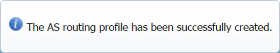

# Using the interface

This topic gives you guidelines with generic tasks to get familiar with
the interface concepts, common commands, and general behavior of Device
Manager.

## Entering Device Manager

When logging in Device Manager, the interface displays the Devices panel
by default. It gives an overview of all the LoRaWAN® and cellular
devices of the Subscriber account, if any already created.

In the Devices panel, you can easily shift between the **Map** and
**List** views of devices, by clicking the corresponding tabs.

The navigation panel gives access to **Devices**, **Multicast groups**,
**Connectivity plans**, **AS routing profiles**, **Application
servers**, and **Settings** panels.

## Opening a panel and checking your read-write access

Opening a panel allows you to display a list of objects (devices, AS
routing profiles, application servers...) that you can select one by
one, and perform:

- **All full read-write operations**  
  Including searching, viewing, creating, adding, editing, configuring,
  cancelling, saving, closing, refreshing, printing, downloading,
  cloning, deleting, \...

- **Restricted read-only operations**  
  Including searching, viewing, refreshing, printing, downloading,
  closing... The operations related to creating, editing, and deleting
  are not available.

You can only perform read-write operations in Device Manager if your
end-user account is associated with the Administrators or Device Manager
group in your subscriber account.

Some panels provide a Search frame. The first time you open Device
Manager, the lists in the panels may be empty if you or other end-users
of your subscriber account have not yet created any object.

The Device Manager includes the following panels:

- Devices with a Search frame

- Multicast groups with a Search frame

- Connectivity plans

- AS routing profiles

- Application servers

- Settings.

You can open them using the navigation panel. Only the Devices panel
displays objects in a map in addition to the list. The Connectivity
plans panel is read-only. For more information, see [More about the
navigation panel](#more-about-the-navigation-panel).

The example below shows you how to open the AS routing profiles panel.
It lists the existing AS routing profiles, if any.

 

1.  In the navigation panel, click **AS routing profiles** to open the
    AS routing profiles panel.

    

    -\> The AS routing profiles frame lists the AS routing profiles that
    are available in your subscriber account.

2.  If you neither have **Edit** nor
    **Save** on any
    panel, it means that you cannot perform read-write operations, and
    that you have read-only access to Device Manager.

3.  If your operator provides the User Portal on its platform, you can
    see the groups to which you belong in your Profile. Otherwise,
    contact an end-user of the Administrator group.

## Opening an object in view mode

The view mode is read-only. You can apply this procedure to any object
of the interface.

The view mode is available to read-write access and read-only access.
Read more\... For more information, see [Opening a panel and checking
your read-write
access](use-interface.md#opening-a-panel-and-checking-your-read-write-access).

 

1.  Select the object from the list (or the map if you are in the
    Devices' panel).

2.  Click **View** at the end
    of the row.

    -\> The object is opened in the object panel and is displayed in
    view mode in the navigation panel.

    

**Tips**

- The view mode does not display a **Save**  button.

- If you want to edit the object, click
  **Close** to exit the view mode, then open the object in edit mode.

## Opening an object in edit mode

This task shows you alternatively how to open an object in view mode and
in edit mode to see the difference between both ways. You can apply this
procedure to any object of the interface.

You must have read-write access to open an object in edit mode. Read
more\... For more information, see [Opening a panel and checking your
read-write
access](use-interface.md#opening-a-panel-and-checking-your-read-write-access).

 

1.  Select the object from the list (or the map if you are in the
    Devices' panel).

2.  Click **View** at the end of the row.

    -\> The object opens and displays its panel in view mode.

    -\> The object also appears in the navigation panel.

3.  Click **Devices** in the navigation panel to go back to the objects
    list.

4.  In the list that opens, select another device.

5.  Click **Edit** .

    -\> The object opens and displays its panel in edit mode.

    -\> The object also appears in the navigation panel.

    
    

**Important**

- The edit mode displays a
  **Save** 

- Click **Save** after
  any modification you have made in edit mode in the upper-right corner
  of the screen.

## Deleting an object

This task shows you how to delete an object such as a device, an AS
routing profile, or an application server, then refresh the objects
list.

You must have read-write access to Device Manager. Read more\... For
more information, see [Opening a panel and checking your read-write
access](use-interface.md#opening-a-panel-and-checking-your-read-write-access).

 

1.  Open the panel of the object that you want to delete.

2.  In the object list frame, select the object you want to delete.

3.  Click **Delete** at the end of
    the object row.

4.  In the message that displays, click **Yes** to confirm.

5.  In the object list frame that displays, click
    **Refresh** to update the list.

## More about the navigation panel

The navigation panel gives access to Devices, Connectivity plans, AS
routing profiles, Application servers, and Settings panels. It also
displays objects that you have opened in view and edit mode. It gives a
quick access to them throughout the session.

It looks like something like this:

**Notes**

- When expanding a folder in the navigation panel, it only displays the
  objects that you have opened, in view or edit mode, in a session. If
  you are looking for an object that you have created in a previous
  session, open the object panel that lists all the objects, not the
  navigation panel.

- If you want to remove an object from the navigation panel, select the
  object in the navigation panel, click
  **Save** in the object
  panel if you made some changes, then click **Close**.

## About feedback messages

Feedback messages appear in the lower-left corner of the screen:

- After you have performed an action.

- When data has been loaded.

After clicking a button, you can look at the status bar to check that
your changes have been taken into account.

Examples:

- If you have clicked **Create**:

  

- If you have clicked **Save**:

  

- If you have clicked **Delete**:

  

- If you have clicked **Reload**:

  

