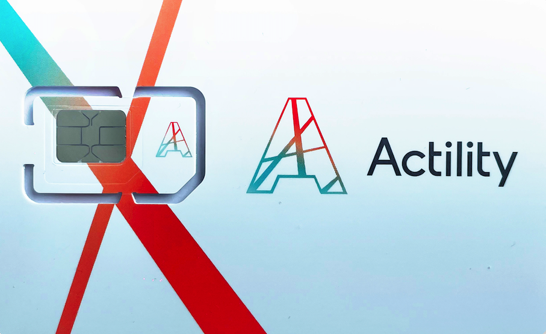
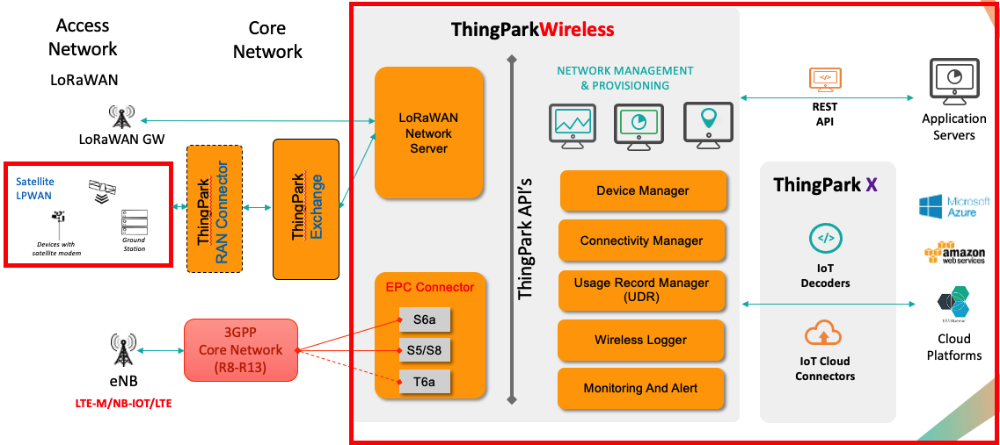

# ThingPark Global SIM overview

ThingPark Global SIM is LPWAN-enabled world-wide cellular connectivity service based on ThingPark Wireless.

The solution is based on ThingPark Wireless + EPC Connector (EPCC). EPCC is an add-on to ThingPark Wireless that allows interconnection with 3GPP core networks using 3GPP S6a and S5/S8 interface. The ThingPark Global Sim is based on EPCC connected to 3GPP global roaming hub that allows worldwide global cellular connectivity. 

::: warning WARNING
- The list of supported countries for LTE coverage is [here](https://thingpark.page.link/TPCellularSIMPricing).
- The service is primarily restricted to LTE-only coverage. For other countries or with option for 2G/3G data connectivity, please [contact us](/D-Reference/FAQ_R/).

- You can purchase ThingPark Global SIM from [here](https://market.thingpark.com/actility-global-sim)
:::

In the next sections, you will learn the high level features of ThingPark Wireless.

