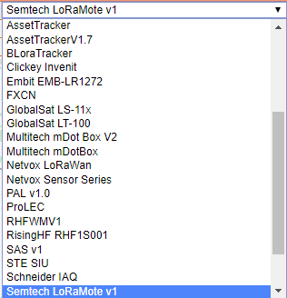
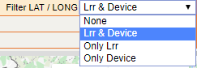

# Bars

## Search Bar

The search bar is used to retrieve the network packets to display.

The search bar contains different search fields:

- **Device EUI:** show network packets related to one or several
  devices. The device EUI is the device MAC Address.

- **LRR ID:** display packets related to one or more LRRs.

- **Last:** only display the last x packets. If this field is left
  empty, the last 50 packets are set by default.

- **From Local Timestamp** and **To Local Timestamp:** packets related
  to a specific time interval.

  **Note** From Network Survey version 1.11.0, the dates are set
  according to local time. In the previous tool versions, UTC time is
  the time reference.

- **Decoder:** field must be correctly set to ensure correct decoding of
  device payload, including the device coordinates.
  
  

- Packets with invalid coordinates can optionally be filtered out,
  depending on the choice for the field **Filter LAT/LON:**
  
  

- If **None** is selected, no filter and even null GPS position will be
  displayed.

- If **LRR & Device** is selected, null devices and LRR base stations
  GPS values will be filtered out and thus not displayed.

- If **Only LRR** is selected, only null LRR base station GPS values
  will be filtered out and thus not displayed.

- If **Only Device** is selected, only null device GPS values will be
  filtered out and thus not displayed.

  **Note** This last option has been implemented on Network Survey
  version 1.11.0 and does not appear on the previous versions of the
  tool.

**Important** Network Survey retrieves the data from Wireless Logger. As
Wireless Logger only keeps the data for 30 days (logs rotation), data
older than 30 days cannot be retrieved by Network Survey.

 

## Tool Bar

The tool bar contains different features:

-  **Log off**: sign out of the Network Survey
  tool.

-  **Request data**: retrieve again the data
  to refresh them.

-  **Display data table**: display data of
  all the packets in a table.

-  **Display map**: display data on a map.

-  **Download CSV**: export data in a .csv
  file.

-  **Download XLS**: export data in a .xls
  file.

-  **Request list**: save data set in the
  search bar into a request.

**Important** Save your data if you need to recover it later on. Unsaved
data records will be lost as only the packets available in Wireless
Logger rolling database are considered by Network Survey.
