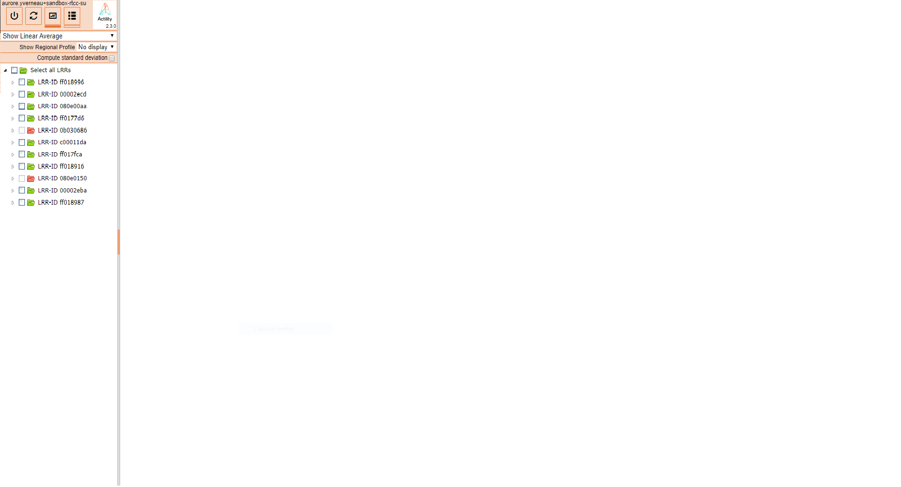

# Interface overview

Once logged into the Spectrum Analysis portal, the following window
appears:

The interface is based on two frames:

- A left sidebar menu

- A main application frame showing measurements

The left menu shows an overview of base stations and their associated
noise scan results.

In order for base station scan results to appear here, you have first to
launch a noise scan on the base station.

 

The retention period of each measurement file is configurable during the
database installation; it can also be modified after installation to
keep measurements for longer/shorter periods.

**Important** By default, the retention period configured in the tool
package is set to 90 days.
