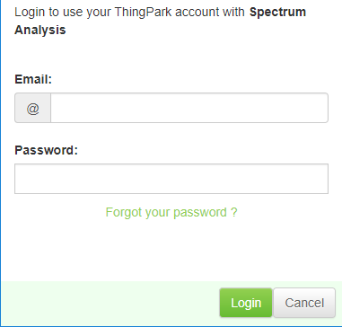

# Logging in

:::specificContent{flavor=tpw}

Launch the browser to access the URL:

http://\<operator\>.thingpark.com/spectrumAnalysis/

The following window appears:

Choose one of the following ways to log in:

If you have Network Supplier credentials:

1.  Enter the login and password of your Network Supplier account.

2.  Click Ok.

If you have Subscriber credentials and have gateways associated with
your subscriber account:

1.  Click Sign in with ThingPark.

2.  Enter the login and password of your Subscriber account in the
    following pop-up window.
    
    

3.  Click Login.
:::

:::specificContent{flavortpe}

You can access Spectrum Analysis tool directly from ThingPark Enterprise.

1.  Click **Manage** \> **Operating Management** \> **Network Tools**.
    

2.  Click **Spectrum Analysis Tool**.
    

:::