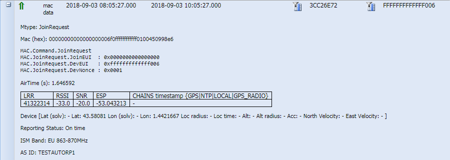

# Packet and payload

The applicative payload contains the application data of the packet. It
is a hexadecimal aggregation of several digital data sent or received by
the device. For uplink packets, the applicative payload contains data
such as temperature, GPS position, or battery level.

The packet content including the applicative payload is displayed in the
expandable panel of the packet. To open it, click
**+** icon on the left side of a
packet to display the MAC and/or applicative payload inside:

- By default, the payload is displayed in raw format in Wireless Logger.

  

- If the AppSKey is known to ThingPark, that is to say, the AppKey
  (respectively AppSKey) is provisioned during the OTA (respectively
  ABP) device creation, then uplink and downlink payloads can be
  decrypted by the LRC network server and displayed in Wireless Logger.
  Otherwise, the payload is displayed encrypted. For more information
  about how to decode payloads, see [Decoding LoRaWAN®
  payloads](decode-lorawan-payload.md).
