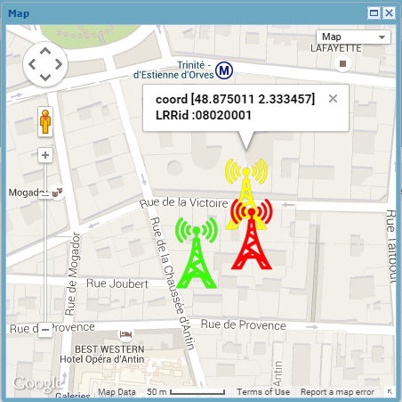
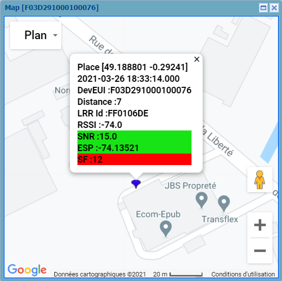

# Localizing base stations

Using the map, you can visually display the position of the LRR base
stations that received the information. This allows you to visually
locate the approximate position of the device and get more information.

1.  Click **Localize LRRs and device on a map** to
    display all LRR base stations that have received packets.

    

2.  Hover your mouse over a packet to display more information.

    

