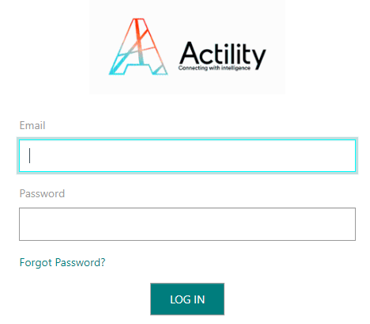

# Logging in

You can log in Wireless Logger as the following types of user:

## \... as a ThingPark Wireless operator 

As an administrator of a ThingPark Wireless operator, you can
impersonate a network partner or a subscriber account to access their
Wireless Logger application. The network partner or subscriber must have
a valid Wireless Logger subscription.

**Important** According to the role of the account you are accessing
Wireless Logger, you can see the following information:

<table>
<thead>
<tr>
<th>Role</th>
<th>Information</th>
</tr>
</thead>
<tbody>
<tr>
<td>For <strong>network partner</strong> role</td>
<td><ul>
<li>
Wireless Logger application shows all the packets associated with
the network-partner-ID you have impersonated; that is to say,
<strong>all the packets routed via all base stations provisioned under
this network partner account whatever the devices sending or receiving
these packets</strong>.
</li>
<li>
<strong>Passive roaming</strong>: LoRaWAN® packets sent or
received by foreign devices roaming into the operator’s network are
shown only in the network partner’s Wireless Logger application since
the corresponding subscribers are not registered in this
network. 
<strong>Note: This option is only applicable to LoRaWAN devices.</strong>
</li>
</ul></td>
</tr>
<tr>
<td>For <strong>subscriber</strong> role</td>
<td><ul>
<li>
Wireless Logger application shows all the packets associated with
the subscriber-ID you have impersonated; that is to say, <strong>all the
packets related to devices provisioned under this subscriber
account</strong>.
</li>
<li>
<strong>Passive roaming</strong>: LoRaWAN® packets sent or
received by foreign devices roaming in using the subscriber's base
stations are shown in the subscriber’s Wireless Logger
application.
</li>
</ul></td>
</tr>
</tbody>
</table>

1.  In your Internet browser, enter this URL using the domain name of
    your operator: `http://<operator>.thingpark.com/admin/`

2.  Enter your credentials: email and password.

3.  If you want to access the Wireless Logger application of a network
    partner:

    1.  Click the **Supplier** tab.

    2.  Search the network partner you want, select it and click
        **Impersonate**
        at the end of the line.

    3.  In the network partner account to which you are redirected,
        click the **Wireless Logger** tab.

4.  If you want to access the Wireless Logger application of a
    subscriber:

    1.  Click the **Subscriber** tab.

    2.  Search the subscriber you want, select it and click
        **Impersonate**
        at the end of the line.

    3.  In the subscriber account to which you are redirected, click the
        **Wireless Logger** tab.

## \... as a ThingPark Wireless network partner

As an administrator of a ThingPark Wireless network, you can directly
access your Wireless Logger application.

**Important** For network partner role, Wireless Logger application
shows all the packets associated with this network-partner-ID; that is
to say, all the packets routed via all base stations provisioned under
this network partner account whatever the devices sending or receiving
these packets.

 

1.  In your Internet browser, enter this URL using the domain name of
    your operator: `http://<operator>.thingpark.com/admin/`

2.  Enter your credentials: email and password.

3.  In your network partner account, click the **Wireless Logger** tab.

## \... as a ThingPark Wireless subscriber Logging in directly to Wireless through the User Portal 

As an end-user of a ThingPark Wireless subscriber account, you have two options to access Wireless Logger application.

**Important**

- For subscriber role, Wireless Logger application shows all the packets
  associated with the subscriber-ID; that is to say, all the packets
  related to devices provisioned under this subscriber account.

- **Passive roaming**: LoRaWAN® packets sent or received by foreign
  devices roaming in using the subscriber's base stations are shown in
  the subscriber's Wireless Logger application.

As an end-user of a subscriber, you can directly access your Wireless
Logger application.

1.  In your Internet browser, enter this URL using the domain name of
    your operator: `http://<operatordomainname>.thingpark.com/wlogger/`

2.  Click **Sign in with ThingPark**.

    

3.  Enter your credentials (email and password), then click **LOG IN**
    to enter Wireless Logger.

    

As an end-user of a subscriber, you can use the ThingPark User Portal of
your operator to access your Wireless Logger application.

1.  In your Internet browser, enter this URL using the domain name of
    your operator: `http://<operator>.thingpark.com/portal/`

2.  Enter your credentials (email and password), then click **LOG IN**.

    

3.  In ThingPark User Portal that opens, click **Wireless Logger** white
    arrow
    

    

:::

:::specificContent{flavor=tpe}

You can access Wireless Logger directly from ThingPark Enterprise.

1.  Log in to your ThingPark Enterprise account.

2.  Select **Manage \> Operating Management**.

3.  In the **Network Tools** page, click **WIRELESS LOGGER**.

    

:::