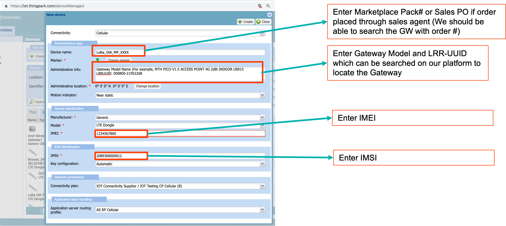

# Setup cellular backhaul with LoRaWAN Gateway
This section describes step by step procedure on setting up LoRaWAN gateway with cellular backhaul using ThingPark Global SIM. 

## Step 1: Insert SIM card in the Gateway
In this step, you need to insert the SIM card in the gateway. Please refer to the gateway manual on the steps to insert the SIM Card.

## Step 2: Flash the gateway with Actility LRR image & Provision in TPE/TPW
In this step, you need to flash the gateway with Actility LRR image and provision the gateway in ThingPark Enterprise (TPE) or ThingPark Wireless (TPW). Here are the instructions for installing LRR image for the following platform types:
- [ThingPark Wireless](https://docs.thingpark.com/thingpark-wireless/7.2/docs/user-guide/manage-base-stations/install-thingpark-image/)
- [ThingPark Enterprise](https://docs.thingpark.com/thingpark-enterprise/7.2/docs/user-guide/manage-base-stations/install-thingpark-image/install-lrr-package/)

The instructions for provisioning the gateway in ThingPark Wireless/ThingPark Enterprise are also available in the above links.

## Step 3: Configure the cellular modem in the Gateway
Once the LRR image installed, please do the following steps in the LoRaWAN gateway. These steps need to be done only one time.

:::warning Warning
- The commands should be entered by logging into the gateway with the root login/password. The root login/password of the gateway is present in the delivery note that is shipped along with the gateway.
- The AT commands above should return **OK**. If they do not return OK, then ensure SIM card is inserted properly and ensure the modem detects the SIM card properly and is detected by the OS correctly. If the problem persists, please do not proceed further and contact [Actility Support](/D-Reference/FAQ_R/).
- The AT command manuals for different Gateway models are [here](/D-Reference/DocLibrary_R/#cellular-modem-at-command-manuals). Please contact [Actility Support](/D-Reference/FAQ_R/) if the AT command manual is not available for your LoRaWAN Gateway model. 
:::

### Multitech Gateway (All models)
|Description|Command (MultiTech Gateway models) Cellular Modem: Telit LE910|
|-----------|--------------------------------------|
|Stop the failover script  (Optional, Only needs to be done if AT commands return error)|/etc/init.d/ipfailover2 stop |
|Get International Mobile Equipment Identifier (IMEI)   | radio-cmd ' AT+CGSN' |
|Get International mobile subscriber identity (IMSI)   | radio-cmd ' AT+CIMI' |
|Force modem to Packet Switched (PS) only ATTACH | radio-cmd ' AT+CEMODE=0’|
|Force modem to LTE only mode | radio-cmd ' AT+WS46=28 ‘ |
|Start the failover script once AT commands are done  (Optional, Only needs to be done if AT commands return error)|/etc/init.d/ipfailover2 start |

### Ufispace Gateway (All models)
|Description|Command (Ufispace Gateway models) Cellular Modem: Huawei E3372 USB dongle, Huawei ME906s|
|-----------|--------------------------------------|
|Stop the failover script  (Optional, Only needs to be done if AT commands return error)|/etc/init.d/ipfailover2 stop |
|Get International Mobile Equipment Identifier (IMEI)   | chat -V -s '' ' AT+GSN ' 'OK' '' > /dev/ttyUSB2 < /dev/ttyUSB2  |
|Get International mobile subscriber identity (IMSI)   | chat -V -s '' ' AT\^CIMI ' 'OK' '' > /dev/ttyUSB2 < /dev/ttyUSB2  |
|Force modem to Packet Switched (PS) only ATTACH | chat -V -s '' ' AT\^SYSCFGEX=\"00\",3fffffff,1,1,40000000,, ' 'OK' '' > /dev/ttyUSB2 < /dev/ttyUSB2 |
|Force modem to LTE only mode  | chat -V -s '' ' AT\^SYSCFGEX=\"03\",3fffffff,1,1,40000000,, ' 'OK' '' > /dev/ttyUSB2 < /dev/ttyUSB2  |
|Start the failover script once AT commands are done  (Optional, Only needs to be done if AT commands return error)|/etc/init.d/ipfailover2 start |

### Gemtek Gateway (Model: gemodu, gempiconext)
:::warning Note
The table below supports the following models:
- gemodu (Outdoor Micro Gateway)
- gempiconext (Pico Next Indoor Gateway)
:::
|Description|Command (Gemtek model: gemodu, gempiconext ) Cellular Modem: Quectel EC25|
|-----------|--------------------------------------|
|Stop the failover script  (Optional, Only needs to be done if AT commands return error)|/etc/init.d/ipfailover2 stop |
|Get International Mobile Equipment Identifier (IMEI)   | chat -V -s '' ' AT+GSN ' 'OK' '' > /dev/ttyUSB2 < /dev/ttyUSB2  |
|Get International mobile subscriber identity (IMSI)   | chat -V -s '' ' AT+CIMI ' 'OK' '' > /dev/ttyUSB2 < /dev/ttyUSB2  |
|Force modem to Packet Switched (PS) only ATTACH | chat -V -s '' ' AT+QCFG=\"servicedomain\",1,1 ' 'OK' '' > /dev/ttyUSB2 < /dev/ttyUSB2 |
|Force modem to enable roaming | chat -V -s '' ' AT+QCFG=\"roamservice\",2,1 ' 'OK' '' > /dev/ttyUSB2 < /dev/ttyUSB2 |
|Force modem to LTE only mode  | chat -V -s '' ' AT+QCFG=\"nwscanmode\",3,1 ' 'OK' '' > /dev/ttyUSB2 < /dev/ttyUSB2  |
|Start the failover script once AT commands are done  (Optional, Only needs to be done if AT commands return error)|/etc/init.d/ipfailover2 start |

### Gemtek Gateway (Model: gemfemto)
:::warning Note
The table below supports the following models:
- gemfemto (Indoor Femto Gateway)
:::
|Description|Command (Gemtek model: gemfemto) Cellular Modem: Huawei E3372 USB dongle|
|-----------|--------------------------------------|
|Stop the failover script  (Optional, Only needs to be done if AT commands return error)|/etc/init.d/ipfailover2 stop |
|Get International Mobile Equipment Identifier (IMEI)   | chat -V -s '' ' AT+GSN ' 'OK' '' > /dev/ttyUSB2 < /dev/ttyUSB2  |
|Get International mobile subscriber identity (IMSI)   | chat -V -s '' ' AT\^CIMI ' 'OK' '' > /dev/ttyUSB2 < /dev/ttyUSB2  |
|Force modem to Packet Switched (PS) only ATTACH | chat -V -s '' ' AT\^SYSCFGEX=\"00\",3fffffff,1,1,40000000,, ' 'OK' '' > /dev/ttyUSB2 < /dev/ttyUSB2 |
|Force modem to LTE only mode  | chat -V -s '' ' AT\^SYSCFGEX=\"03\",3fffffff,1,1,40000000,, ' 'OK' '' > /dev/ttyUSB2 < /dev/ttyUSB2  |
|Start the failover script once AT commands are done  (Optional, Only needs to be done if AT commands return error)|/etc/init.d/ipfailover2 start |

## Step 4: Configure the LoRa Gateway

Login to the Gateway support menu and ensure the following:
- The Access Point Name (APN) in the LoRaWAN Gateway is **actility**
- Cellular interface is configured and active as the primary interface
- Ethernet interface is configured and active as the secondary interface

## Step 5: Provision the Actility SIM Card
:::warning Warning
- This step is restricted to [Actility Support](/D-Reference/FAQ_R/) unless you have a dedicated account for your SIM Cards.
- For more information on ThingPark Wireless Device Manager, see [here](/B-Feature-Topics/DeviceManager_C/Overview.md)
:::

Login to the following URL [https://iot.thingpark.com/portal/web](https://iot.thingpark.com/portal/web) with your credentials and create a new cellular device as shown in the figure below.

Once all the above steps are done, you can restart the LoRa Gateway to connect and use Cellular backhaul. If there are still issues with cellular connectivity, please open a ticket to [Actility Support](/D-Reference/FAQ_R/).
