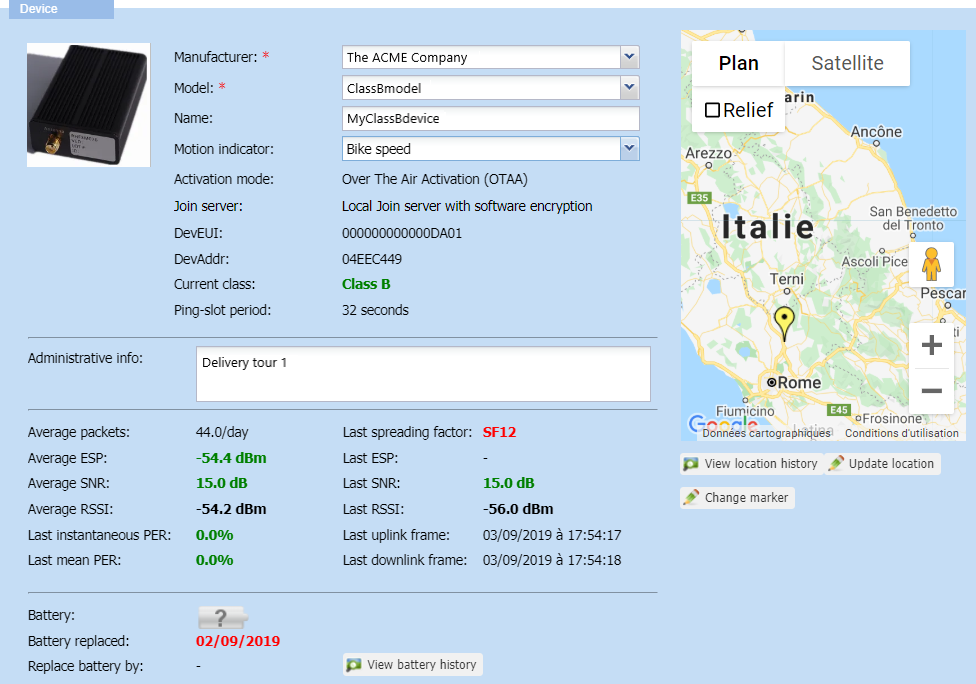
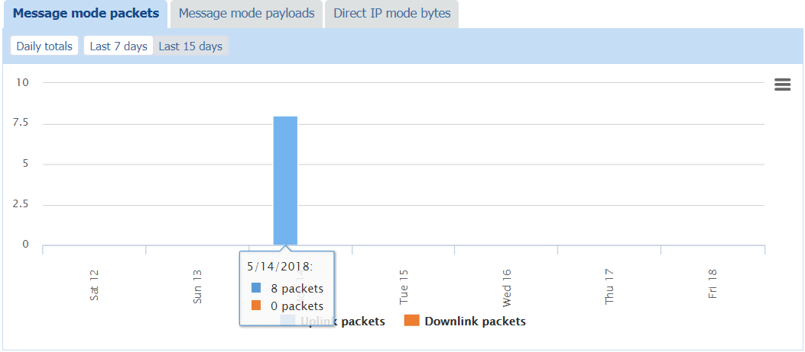
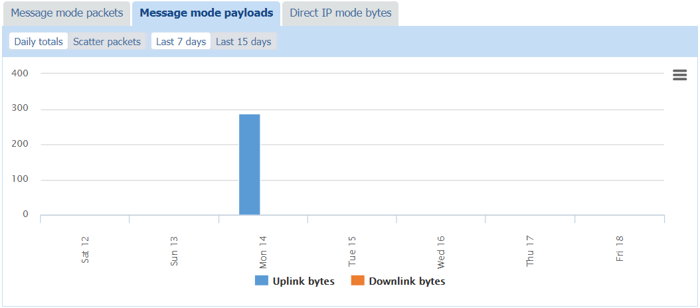
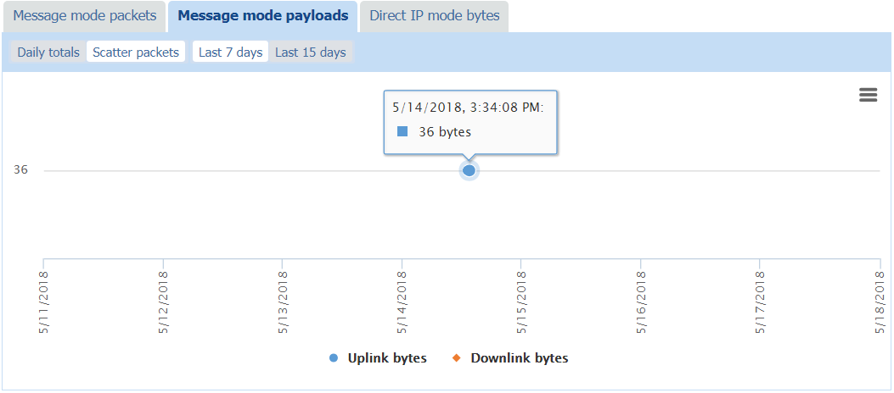
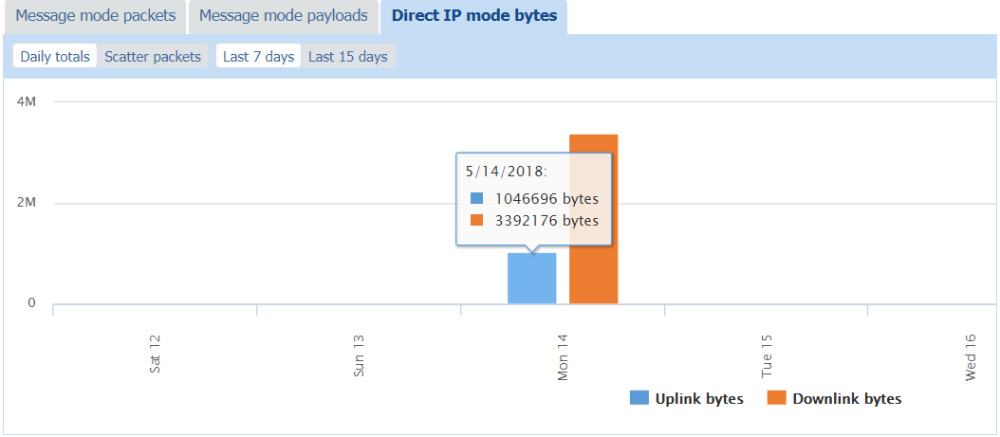
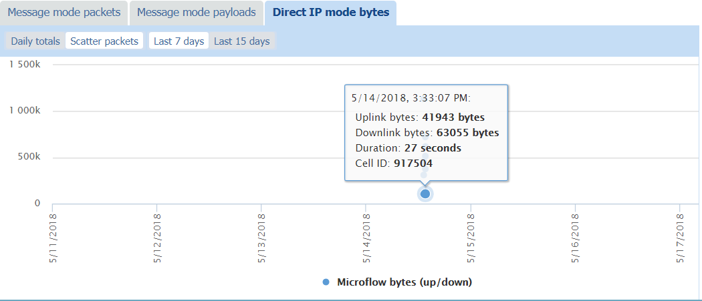

# Checking the device settings and activity

## Viewing general information, activity summary and location of a device

In the Device panel, you can see the general information, activity
summary and location of a:

- LoRaWAN® class A, B, or C device
- Cellular device.

1.  In the navigation panel, click **Devices** to display the Devices
    panel, then click the **List** or the **Map** tab.

2.  Select a device.

3.  Click **View** or **Edit** to enter the Device panel.

    - **For LoRaWAN® class A and C devices**:

      - The Device frame displays the basic information of the device such
        as the **Manufacturer**, **Model**, **Name**, Activation mode (OTAA or ABP), Join server mode (only for OTAA devices),
        DevEUI (similar to a MAC address),
        DevAddr (similar to a network address).

      - Current class: This is the class of the
        device model associated with the device. It is always displayed in
        green.

    - **For LoRaWAN® class B devices:**

      - Current class: When not working in
        class B, the device displays its current class in black. When
        switching to class B, the device reports its Ping-slot period and displays its
        current class in green.

        

    :::warning Note
    If a manufactured-class B device displays its current class in
    black for too long, it might also mean:

    - Either the device cannot switch to class B. If you want to check the
      device packets, see [Wireless Logger User
      Guide](../../../user-guide/network-tools/wireless-logger/overview).

    - Or when creating the device, it has been associated with:

      - A model that does not support class B. If you want to change it, see
        [Changing the device model](change-device-model.md).

      - A connectivity plan that does not allow class B. If you want to
        change it, see [Changing the connectivity
        plan](../manage-device-network/manage-connectivity-plan-device.md#changing-the-connectivity-plan).
    :::

4.  In the map, click the marker to display the manual or network
    coordinates of the device location. For more information, see
    [Network location: viewing the device location history (LoRaWAN®
    only)](locate-device.md#network-location-viewing-the-device-location-history-lorawan®-only)
    and [Manual location: locating a device or editing its
    location](locate-device.md#manual-location-locating-a-device-or-editing-its-location).

:::warning Note
In view mode, the **Update location** and **Change marker**
buttons are not available in the Device frame.
:::

## Monitoring the activity of a LoRaWAN® device

In the view or edit mode of the Device frame of a LoRaWAN® device, you
can switch from one tab to the other to display charts showing
statistics to monitor the activity of the device for a given time. This
information is read-only.

- [Monitoring packets and payloads history of a LoRaWAN®
  device](../orphans/dmug-monitor-packets-payloads-history-lorawan-device.md)

- [Monitoring radio statistics of a LoRaWAN® device](../orphans/dmug-monitor-radio-statistics-lorawan-device.md)

- [More about LoRaWAN® radio statistics](../orphans/dmug-more-lorawan-radio-statistics.md)

## Monitoring the activity of a cellular device

In the view or edit mode of the Device frame of a cellular device, you
can switch from one tab to the other to display charts showing
statistics to monitor the activity of the device for a given time. This
information is read-only.

These statistics are displayed according to the cellular mode enabled in
the connectivity plan associated with the device. If no connectivity
plan is associated, all corresponding tabs are displayed. For more
information about cellular modes, see [About AS routing profiles types
and cellular
modes](../Manage%20as%20routing%20profiles/index.md#about-as-routing-profiles-types-and-cellular-modes).

**Tips**

- Hovering your mouse over an item of the chart displays additional
  traffic information.

- Clicking an item of the caption makes it disappear/appear in the chart
  and adjusts the scale.

1.  In the navigation panel, click **Devices** to display the
    **Devices** panel, then click the **List** or the **Map** tab.

2.  Select a device and click **View** or **Edit** to enter the Device
    panel.

3.  Scroll down the Device panel to display the **Message mode
    packets**, **Message mode payloads**, and **Direct IP mode bytes**
    tabs with the charts.

4.  Click the **Message mode packets** tab, then:

    - Click **Daily totals** and **Last 7 days**, or **Last 15 days**,
      to view:

      - The total number of **Uplink packets** and the total number of
        **Downlink packets** sent in message mode over the selected
        period.

        **Tip** Hover your mouse over an item of the chart to read the
        exact number of packets with their distribution per day.

        
        

5.  Click the **Message mode payloads** tab and:

    - Click **Daily totals** and **Last 7 days**, or **Last 15 days**,
      to view:

      - The total size of **Uplink bytes** and the total size of
        **Downlink bytes** sent in message mode over the selected
        period.

        **Tip** Hover your mouse over an item of the chart to read the
        total size of bytes used with their distribution per day.
        
        

    - Click **Scatter packets** and **Last 7 days**, or **Last 15
      days**, to view the scattering of packets per day of:

      - **Uplink bytes** and **Downlink bytes** payloads sent in message
        mode with their timestamp, uplink, and downlink sizes over the
        selected period.

        **Tip** Hover your mouse over a packet in the chart to see its
        timestamp and size in bytes.
        
        

6.  Click the **Direct IP mode bytes** tab and:

    - Click **Daily totals** and **Last 7 days**, or **Last 15 days**,
      to view:

      - The total size of **Uplink bytes** and the total size of
        **Downlink bytes** of Direct IP microflow reports sent over the
        selected period.

        **Tip** Hover your mouse over an item in the chart to read the
        total size of bytes used with their distribution per day.
        
        

    - Click **Scatter packets** and **Last 7 days**, or **Last 15
      days**, to view the scattering of packets per day of:

      - **Microflow bytes (up/down**) sent per microflow report over the
        selected period.

        **Tip** Hover your mouse over an item in the chart to see its
        timestamp, uplink and downlink sizes in bytes, duration, and
        cell ID.
        
        

7.  If you want to remove some information from the chart, click the
    corresponding item in the chart caption. It also adjusts the scale
    according to the information displayed.

8.  If you want to print or download this chart, see [Printing or
    downloading a chart](#printing-or-downloading-a-chart).

## Printing or downloading a chart

You can print a chart or download its image in the format you want (PNG,
JPEG, PDF, SVG). This task is also available for read-only end-users.

1.  Display the chart you want as explained in:

    - [Monitoring packets and payloads history of a LoRaWAN®
  device](../orphans/dmug-monitor-packets-payloads-history-lorawan-device.md)

    - [Monitoring radio statistics of a LoRaWAN® device](../orphans/dmug-monitor-radio-statistics-lorawan-device.md)

    - [Monitoring the activity of a cellular
      device](#monitoring-the-activity-of-a-cellular-device)

2.  If you want to print the chart:

    - Click the **Chart context menu** 

      and click **Print.** In the Print window, set the printing options
      as you want and click **Print**.

3.  If you want to download an image of the chart:

    - Click the **Chart context menu** 

      and according to the format you want, click:

      - **Download PNG image**

      - **Download JPEG image**

      - **Download PDF document**

      - **Download SVG vector image**.

    - Follow your browser instructions to download the image.
