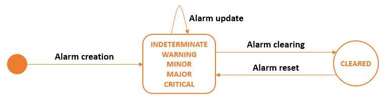

# Managing alarms

You can identify and prioritize device issues using alarms.

## About alarms

To help you identify and prioritize corrective actions when required,
Device Manager triggers alarms regarding a device when:

- A device does not work properly.  
  These alarms are triggered automatically.

- The device is a victim of a replay attack (LoRaWAN® only).

- You have configured an alarm based on an inactivity threshold of the
  device.  
  For more information, see [Configuring an inactivity
  alarm](configure-alarms.md#configuring-an-inactivity-alarm).

For more information about:

- The alarms that apply to LoRaWAN® devices, cellular devices, and
  multicast group, see [Alarms list with troubleshooting
  guidelines](troubleshoot-devices.md#alarms-list-with-troubleshooting-guidelines).

- How to receive an alarm notification by email, see [Setting alarm
  notification
  emails](../../Other/B-Feature-Topics/DeviceManager_C/device-manager-settings.md#setting-alarm-notification-emails).

The device must be ready to work. To do so, it must be associated with a
connectivity plan and an AS routing profile.

## Alarm management principles

An alarm is a visible signal used to indicate that a device malfunction,
a process deviation or an abnormal condition requires a response.

When a fault occurs on a device, an alarm is triggered in Device
Manager. The alarm management system qualifies the alarm and assigns it
a with a specific state.

The state of each type of alarm changes as it is subject to triggering
and clearing conditions. These conditions are based on device reports
produced by the network server and time stimulus.

Sometimes the issue is related to external conditions. It resolves
itself on its own and you have nothing to do. If the issue occurs and
clears repeatedly, it shows an instability of the device that you must
find the root cause to troubleshoot the device.

## Alarm states

Alarm states are related to severity levels and associated with the
following color codes:

| Alarm state                | Definition                                                                                                                                                                                                                                                                                                                                                                                                                             |
|----------------------------|----------------------------------------------------------------------------------------------------------------------------------------------------------------------------------------------------------------------------------------------------------------------------------------------------------------------------------------------------------------------------------------------------------------------------------------|
| **Critical** (Red)         | The service is affected, and an immediate corrective action is required.                                                                                                                                                                                                                                                                                                                                                               |
| **Major** (Orange)         | The service is partly affected, and an urgent action is required.                                                                                                                                                                                                                                                                                                                                                                      |
| **Minor** (Yellow)         | A fault that does not affect the service should be corrected to prevent a more serious problem.                                                                                                                                                                                                                                                                                                                                        |
| **Warning** (Blue)         | A potential or impending fault affecting the service should be diagnosed and corrected if necessary.                                                                                                                                                                                                                                                                                                                                   |
| **Indeterminate** (Purple) | The severity cannot be determined.                                                                                                                                                                                                                                                                                                                                                                                                     |
| **Cleared** (Green)        | The alarm has satisfied the clearing conditions and has been cleared by the system.   **Notes:**  - The current status of a cleared alarm is available in the Active alarms panel.   - The last status before clearance of a cleared alarm is available in the Alarms history panel during 15 days after clearance. Because this panel stores status before clearance, they all display status different from cleared. |

## Alarm lifecycle

The following graphic illustrates the alarm lifecycle:

- When the triggering conditions are satisfied:

  - The first time that an alarm is triggered, an active alarm is
    created.

  - If an active alarm is triggered again, it is updated.

  - If a cleared alarm is triggered again, it is reset and becomes
    active again.

- When the clearing conditions are satisfied, an active alarm is
  cleared.

  - The current status of an active alarm is available in the Active
    alarms panel.

  - The current status of a cleared alarm is available in the Active
    alarms panel.

  - The status a cleared alarm had before clearance is available in the
    Alarm history panel during 15 days after clearance.

  - This duration has been set by your operator when installing the
    platform.

## Alarm occurrence management

The following categories of alarms manage and display the number of
occurrences of alarms in a different way. To know which alarms are
event-driven or state-driven, see [Alarms list with troubleshooting
guidelines](troubleshoot-devices.md#alarms-list-with-troubleshooting-guidelines).

| Alarm Category | Description | 
| -- | -- |
| **Event-driven alarm** | Each time the event associated with the alarm is detected, the alarm occurrence is incremented by one. <strong>Example</strong> If a wrong MIC has been detected ten times, the Alarm 008 - Wrong MIC detected in Join request - displays ten occurrences. **Note:** For an event-driven alarm, no email notification is sent for any new occurrence if the alarm state, related to a severity level of the alarm, stays the same.  For more information, see [Viewing/Setting an alarm notification email in advanced mode](../device-manager-settings.md#viewing-setting-an-alarm-notification-email-in-advanced-mode). |
| **State-driven alarm**  | A state is a stable event that cannot repeat unless stopped. Each time the state associated with the alarm is detected, the alarm occurrence does not increase and always displays one. **Example:** If a low battery level has been detected ten times, the Alarm 001 - Battery level threshold - displays only one occurrence. |
