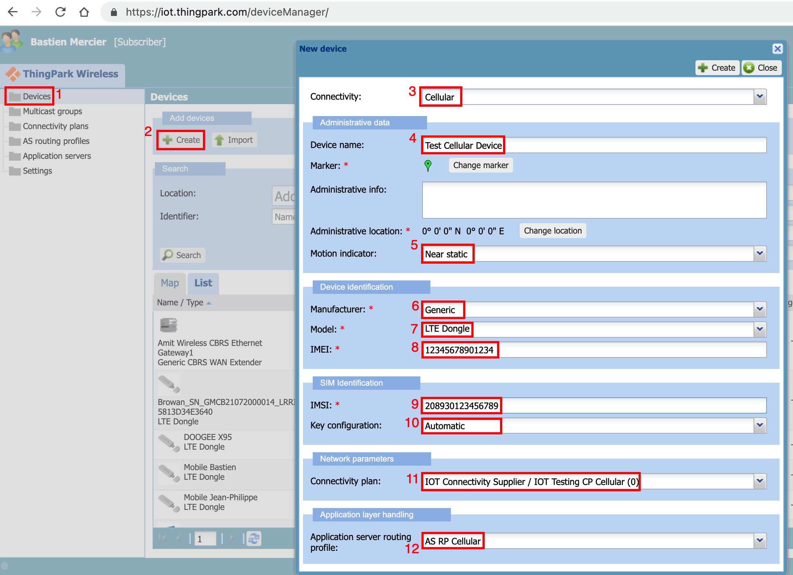
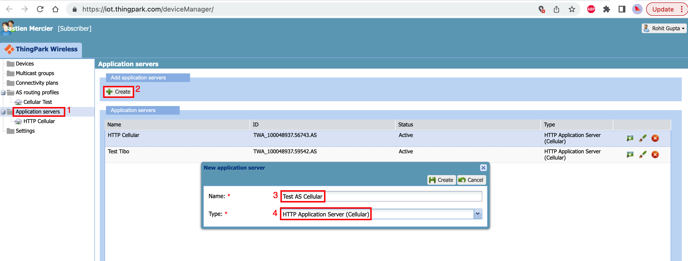
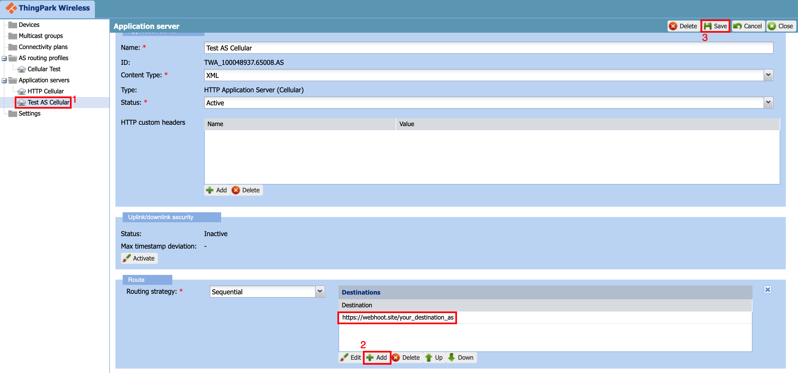
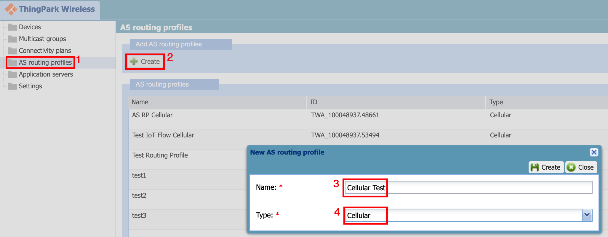
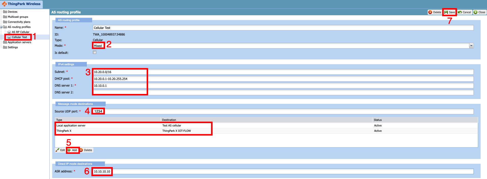
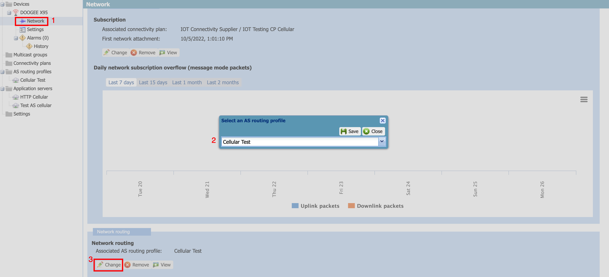
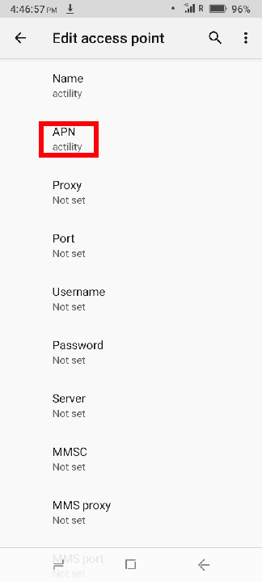
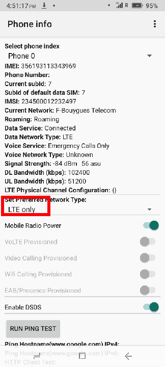
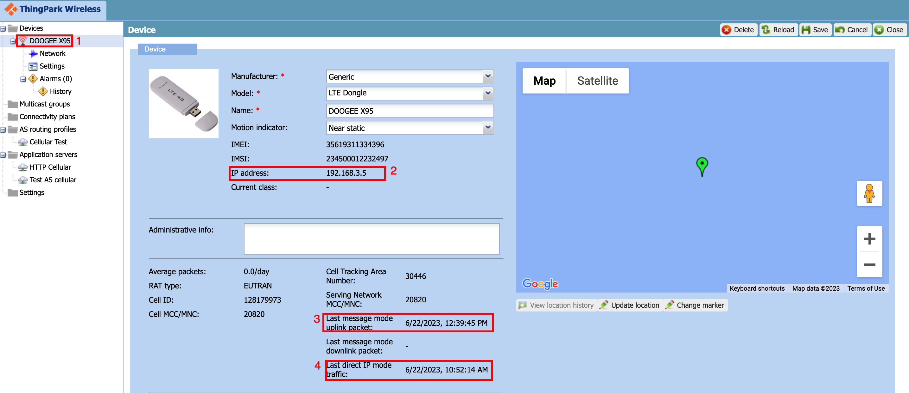

# Overview

In this section, we will provide you step by step procedure to get Cellular devices to connect to ThingPark Wireless. Here are the key steps:

- Step 1: Provision your devices 
- Step 2: Create routing profile and application server
- Step 3: Associate the device to the routing profile and connectivity plan
- Step 4: Configure Application Server Router (ASR) for Direct IP traffic
- Step 5: Configure the end device 
- Step 6: Check the device is connected
- Step 7: Viewing the device traffic in wireless logger
- Step 8: Using OSS APIs for automation

## Step 1: Provision your devices
The first step is to provision the devices in ThingPark Wireless. You can access the [Device Manager](https://iot.thingpark.com/deviceManager/). The URL is specific to EU PROD environment for cellular devices. For other platforms, please [contact us](/D-Reference/FAQ_R/). The figure below gives an overview of all the steps to provision the device.

1. Click "Devices" menu to browse the device list
2. Click "Create" to provision a new cellular device
3. Select "Cellular" from the connectivity
4. Select the name of the device
5. Select the motion indicator of the device(1)
6. Select the manufacturer of the device(2) 
7. Select the model of the device(2) 
8. Enter the "IMEI" of the cellular modem
9. Enter the "IMSI" of the cellular SIM card. The IMSI is available from the delivery note or it can be read from the cellular modem once the SIM is inserted into the device
10. Select "Key Configuration" as "automatic"(3) 
11. Assign the "cellular connectivity plan" to the newly created device
12. Assign the "routing profile" to the device. If this routing profile, does not exist, we will create one in the next steps
:::warning Note
(1) This field is only for informational purposes and has no impact on the functioning of the cellular device

(2) The manufacturer/model needs to be created by the operator admin in the operator manager. You can ask support to create the manufacturer/model of the device or you can select the generic make/model of the cellular device

(3) This step implies that the cellular SIM card keys are pre-provisioning the [Connectivity supplier](https://docs.thingpark.com/thingpark-wireless/7.2/docs/user-guide-tpw/supplier/use-connectivity-manager/pre-provision-cellular-devices#importing-sim-cards)

For more information of device manager, click [here](/B-Feature-Topics/DeviceManager_C/Overview)
:::

## Step 2: Create routing profile and application server
The next step is to create the routing profile and the application server.

### Create Application server
We will now create cellular application server to receive "message mode" traffic.

1. Click "Application servers" from the sidebar manu on the left
2. Click "Create" to create the new application server
3. Select the name of the application server
4. Select type as "HTTP Application Server (Cellular)"

Once the application server is created, it will open a new window as shown below.

1. Select the "Application server" you just created in earlier step
2. Enter the destination URL which will receive the message mode packets
3. Save the "application server" settings

### Create routing profile

1. Select the "AS routing profile" from the sidebar
2. Click "Create"
3. Give the name to the routing profile
4. Select the routing profile type as "Cellular"

Once the routing profile is created, it will open a new window as shown below.

1. Select the routing profile you just cretaed in the earlier step
2. Select the mode as "mixed" which will enable both message mode and Direct IP traffic in the routing profile
3. Select the "IP address pool" which will be allocated to the cellular device
4. Select the UDP source port that will classify the "message mode traffic". All the UDP payloads with the source port in this field will be sent to application server as message mode traffic with cellular metadata
5. Select the application server that was created in earlier step. You can also add the [ThingPark X IoT Flow](https://docs.thingpark.com/thingpark-x/latest/Overview/) which will allow the message mode traffic to be sent to numerous cloud connectors and it has also support for numerous drivers to decode the payloads.
6. Enter the ASR (ASR) IP Address. The application server router will terminate all the "Direct IP" traffic
7. Save the routing profile 

## Step 3: Associate the device to the routing profile and connectivity plan

The figure below shows the steps to add the routing profile created in earlier step to cellular device.

1. Find the device you just created earlier and goto its network settings
2. Change the AS routing profile to the one created in earlier step
3. Click "save" to save the routing profile

## Step 4: Configure Application Server Router (ASR) for Direct IP traffic
:::warning Note
- This step is only required if the routing profile mode is set to Mixed or Direct IP only.
:::

EPCC will terminate all the Direct IP traffic to the ASR using GRE tunnel. This ensures all the traffic originating to/from device stays in the customer's premises. This router can be configured with Enterprise specific rules forr handling the device traffic. Here are the commands to run inside Linux VM to terminate all the device traffic to internet using NAT:

| Linux command | Description | 
| - | -------- |
|sudo modprobe ip_gre gre| Insert the GRE kernel module |
|ip tunnel add gre1 mode gre remote **PGW_GRE_IP** local **GRE_VM_IP** ttl 255 | create the GRE tunnel |
|ip link set gre1 up | start the newly created GRE interface |
|route add -net **IP_DHCP_POOL_ROUTING_PROFILE** dev gre1 | Add a route to the GRE interface for the DHCP pool set in the routing profile |
|iptables -t mangle -D POSTROUTING -d **IP_DHCP_POOL_ROUTING_PROFILE** -p tcp -m tcp --tcp-flags SYN,RST SYN -j TCPMSS --set-mss 1300 | Force the TCP Maximum segment size to 1300 to avoid packet fragmentation|

Note:
1. **PGW_GRE_IP** refers to the IP address of the GRE interface on PGW. Please ask [support](/D-Reference/FAQ_R/) for this IP address
2. **GRE_VM_IP** refers to the IP address of GRE VM. From the example screenshots above, it is **10.10.10.10**.
3. **IP_DHCP_POOL_ROUTING_PROFILE** refers to the DHCP pool that is set in the routing profile. From the example screenshots above, it is **10.20.0.0/16**.
4. The customer can add further rules to handle Direct IP traffic.

## Step 5: Configure the end device
ThingPark cellular is LTE only service, so the device configuration must ensure the following:
- The device has its Access Point Name (APN) set to **actility**
- The device connects in data only mode or Packet Switched (PS) mode
- Enable data roaming on the phone in the network settings

#### Example configuration on a smart phone

You can change the APN settings on the phone by entering the network settings and creating the new APN. After that, the APN must be applied to the SIM card.
.

The next step is to force the phone to connect in "LTE only" mode. You can download the [Force LTE Only](https://play.google.com/store/apps/details?id=com.xsquarestudio.forcelte&hl=en&gl=US) android app to configure the phone in "LTE only" mode.
.

Note: You might have to put the phone in airplane mode and enable the mobile data to enable the new settings to take effect.

## Step 6: Check the device connection

Once the device is connected, you can see the device statistics on the device overview page,
.

1. Select the device from the device list
2. Check the IP address of the device is allocated after its connected
3. Check the last time message mode packet was sent
4. Check the last time Direct IP traffic was present

## Step 7: Viewing the device traffic in wireless logger

The next step is to visualize device traffic in the [Wireless logger](https://iot.thingpark.com/thingpark/wlogger/gui/). The Wireless logger URL will be different for other platforms.  

1. Select the "Cellular traffic" from the wireless logger
2. Enter the IMEI of your device
3. Visualize the traffic to/from the device in wireless logger

For more information on wireless logger, click [here](/B-Feature-Topics/network-tools/wireless-logger/overview)

## Step 8: Using OSS APIs for automation
ThingPark Wireless comes with rich set of APIs that can be used to automate the processes above and much more. You can also find information on how ThingPark Wireless sends message mode packets to the application server. For more information on using OSS APIs, see [here](https://docs.thingpark.com/thingpark-wireless/7.2/docs/user-guide-tpw/integrating-applications-with-tpw).
