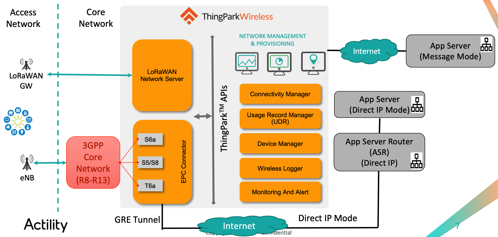

# Modes of communication

This section describes how ThingPark Wireless handles the cellular traffic. 

Cellular IoT is IP-based, but new proposals such as Non-IP Data Delivery (NIDD) in R13 3GPP standards enable efficient use in message mode. In order to optimize any Cellular IoT communication pattern, EPC Connection supports two modes of communication:
-	**Message mode:** In this mode, devices exchange small messages (NIDD) or based on UDP payload with the application server. This mode is used by low power battery operated devices and in this mode device sends a small payload either over UDP or NIDD and ThingPark Wireless routes this payload to the application server with the metadata. This mode can also interface with [ThingPark X](https://docs.thingpark.com/thingpark-x/latest/Overview/) which allows numerous cloud connectors, drivers, etc. ThingPark X enables the device control & communication from within the cloud platforms while at the same device only sends the payload necessary for its functioning. Traiditional cellular devices directly interact with cloud platforms over TCP and associated secuirity thus significantly draining the battery due to the overhead of TCP and associated secuirity procedures of cloud platforms. LoRaWAN is a non-IP protocol purely based on exchanging small messages between LoRaWAN devices and application servers. 

-	**Direct IP mode:** In this mode, EPC Connector routes the traffic directly to Application Server Router (ASR) via Internet, which routes it further to Application servers sitting behind firewall for security reasons. However, it sends charging information in real-time to ThingPark wireless applications. 

The modes of communication for different devices/IoT subscribers are configured within ThingPark Wireless using the routing profile and connectivity plan objects, which are also used for LoRaWAN. This unifies data records, traffic enforcement, traffic management seamlessly between LoRaWAN and/or Cellular devices to give a consistent experience for device and connectivity management to IoT subscribers.

The table below summarizes the differences between message mode and Direct IP mode.

|                                             | Message mode                                                                                                                                                                   | Direct IP mode                                                                                                                                                                                                                                                 |
|---------------------------------------------|--------------------------------------------------------------------------------------------------------------------------------------------------------------------------------|----------------------------------------------------------------------------------------------------------------------------------------------------------------------------------------------------------------------------------------------------------------|
| Primary Usage                               | Send one time small message (`<1400 Bytes`) via UDP/NIDD                                                                                                                       | Send a stream of messages (often IP fragmented) via TCP/UDP                                                                                                                                                                                                    |
| Traffic type                                | low (usually few messages/day)                                                                                                                                                 | high (streaming type)                                                                                                                                                                                                                                          |
| Example use cases                           | Temperature, humidity sensors                                                                                                                                                  | Video camera, anti-theft image sensor                                                                                                                                                                                                                          |
| Power Efficiency                            | High (as only one message is sent) - no TCP handshake                                                                                                                          | Not so much power efficient                                                                                                                                                                                                                                    |
| Connectivity to cloud Platforms             | Cloud connectivity done by [ThingPark X](https://docs.thingpark.com/thingpark-x/latest/Overview/)                                                                              | The device connect directly to cloud platforms                                                                                                                                                                                                                 |
| Device traffic visibility in TPW            | yes (with wireless logger)                                                                                                                                                     | no (only microflow traffic reports for charging purposes are visible in wireless logger)                                                                                                                                                                       |
| Traffic Enforcement                         | Done by ThingPark Wireless   (based on the uplink/downlink message mode limits inside the [connectivity plan](/B-Feature-Topics/DeviceManager_C/view-connectivity-plans) ) | Done by Operator's core/RAN   (The uplink/downlink bandwidth limits are sent as part of APN configuration in 3GPP signalling. The bandwidth limits are configurable in the [connectivity plan](/B-Feature-Topics/DeviceManager_C/view-connectivity-plans)) |
| Value add for connectivity Service Provider | -Savings in Power (reducing TCO) -Tracing user data in TPW -Connectivity to cloud platforms -Security ( rogue devices blocked by TPW)                                          | Security as devices are in private island of TPW                                                                                                                                                                                                               |
