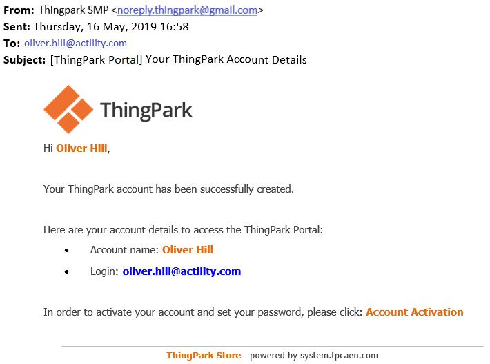
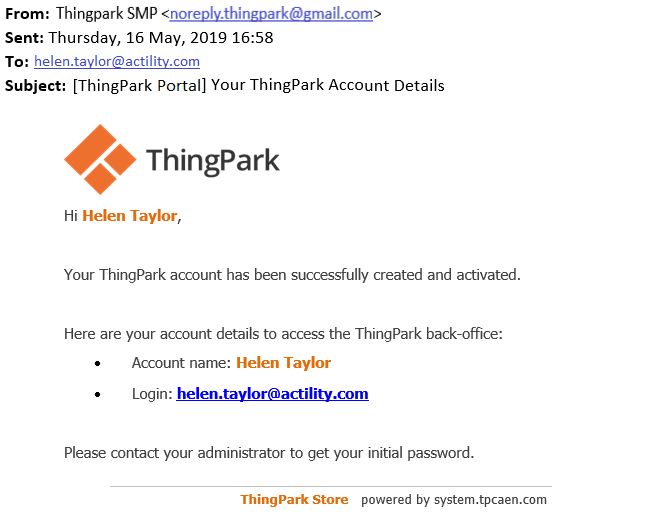

# Logging in for the first time

## Your account has been created by your vendor

You have received an account details email containing your ThingPark
account name and login:

- If this email asks you to click **Account Activation**, apply
  [Authenticating using an activation
  URL](../orphans/dmug-authenticate-activation-url.md).

  

- Otherwise, apply [Authenticating using an initial
  password](../orphans/dmug-authenticate-initial-password.md).

  

## You have created your account and password online

If you have created your account and password online, your password does
not require to be changed when logging in Device Manager:

- Apply [Usual logging in](usual-logging-in.md).
