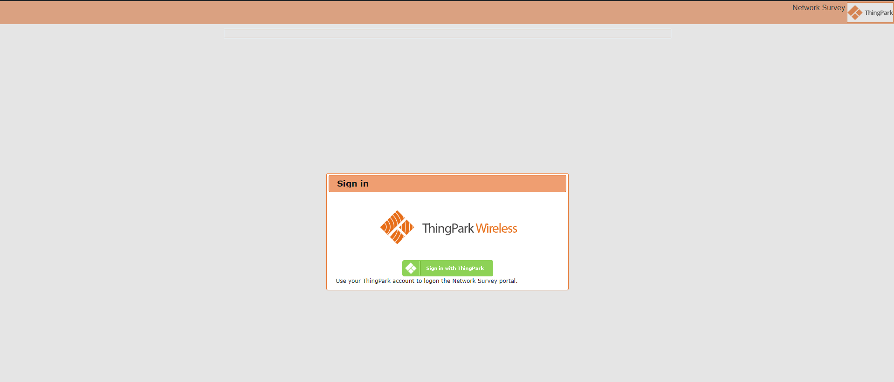
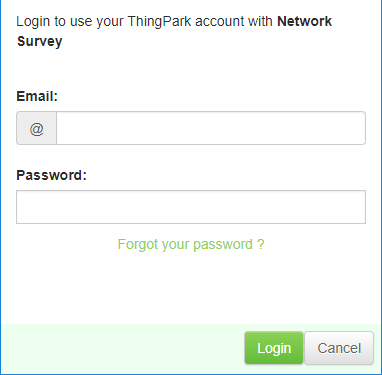
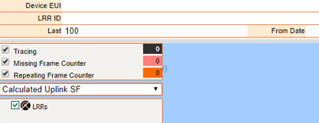

::
# Logging in

:::specificContent{flavor=tpw}

Launch the browser to access the URL:

http://\<operator\>.thingpark.com/networkSurvey/

The following window appears:

To log in:

1.  Click Sign in with ThingPark.

2.  Enter the login and password of your Subscriber account in the
    following pop-up window.

    

3.  Click Login.

:::

:::specificContent{flavor=tpe}

You can access Network Survey tool directly from ThingPark Enterprise.

1.  Click **Manage** \> **Operating Management** \> **Network Tools**.

    

2.  Click **Network Survey Tool**.

    

:::

