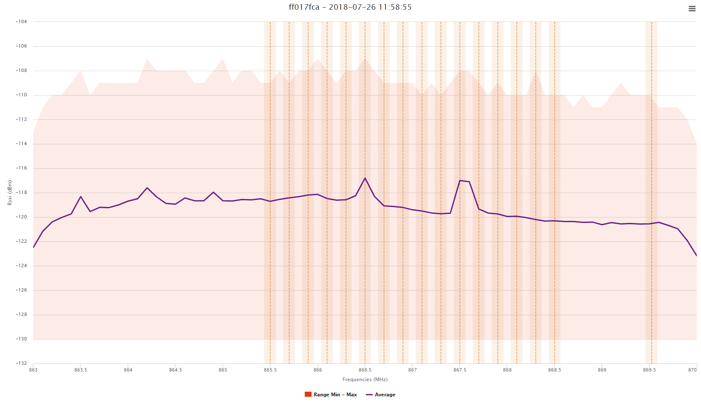
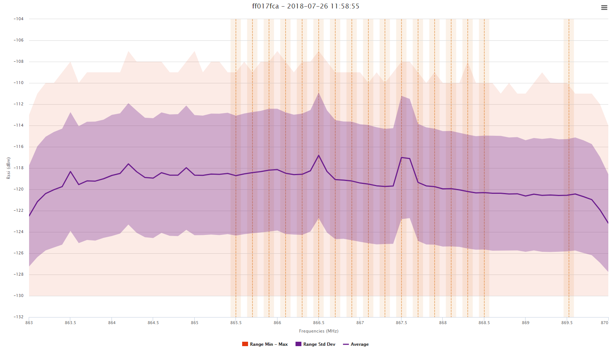

## Displaying Linear Average

Linear average computation is the linear (that is to say, converting all
the RSSI levels from dBm scale to mW scale) average of all the RSSI
values obtained for one frequency, then translated in dBm.

Although this method is reliable to represent the effect of sporadic
high-power interferers, it is more sensitive to extremely high RSSI
values; therefore, erroneous samples tend to fake the result.

The min and max RSSI values obtained for each frequency range are also
displayed, they are highlighted by the orange zone.

Select "Compute standard deviation" if standard deviation values are
needed, the graph will then show a purple zone representing the average
RSSI +/- standard deviation.

