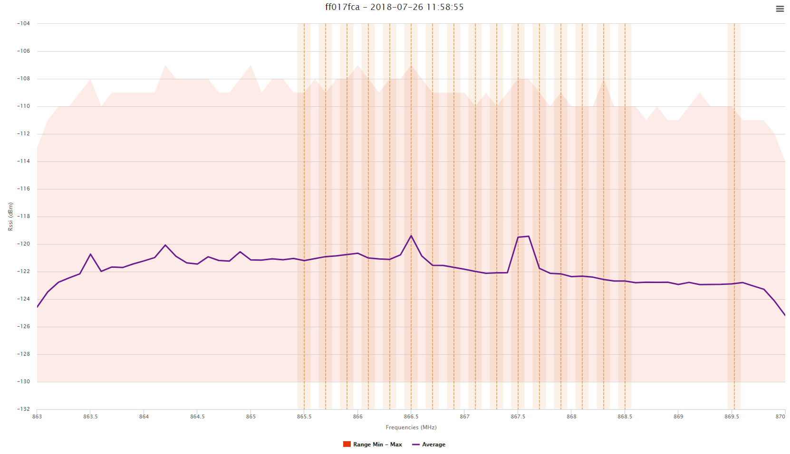
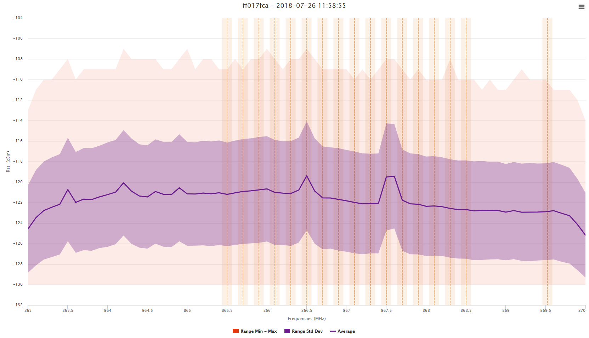

## Displaying Logarithmic Average

The logarithmic average computation is the direct average of all the
RSSI values obtained for one frequency range, as the values are in dBm.

The impact of extreme values is limited with this method, but it is hard
to detect sporadic interferers with high power level.

The min and max RSSI values obtained for each frequency range are also
displayed.

Select **Compute standard deviation** if standard deviation values are
needed, the graph will then show a purple zone representing the average
RSSI +/- standard deviation.

