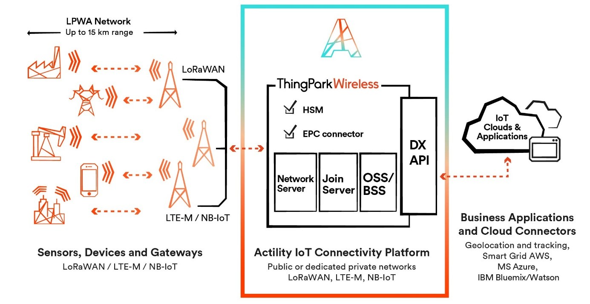

# ThingPark Wireless overview

The key capabilities of ThingPark Wireless make it the market-leading
**LPWA connectivity management platform**. It provides IoT service
providers with the ability to:

- **Connect** devices with the most optimal performance - which is
  critical to ensure IoT use case adoption & ROI
- **Manage** the connectivity service and its underlying infrastructure
  efficiently
- Guarantee the end-to-end **security** of the service they operate.
- **Monetize** their services in a flexible way that support various go
  to market options.
  

<strong>Connect</strong>

ThingPark Wireless benefits from the experience of multiple national
roll-outs across the globe to offer the best LoRaWAN® network management
capabilities:

- A **best-in-class Adaptive Data Rate algorithm**, leveraging the
  uplink macro diversity, power control and frame repetition to optimize
  the device performance, boost radio capacity and minimize battery
  consumption and packet error rate.

- A Radio Access Network management framework that allows to seamlessly
  **support multiple regional RF plans** on a single ThingPark Wireless
  instance and gateway.

- **Openness** with regards to the base station manufacturers,
  supporting multiple partners (such as Kerlink, Cisco, Multitech,
  Ufispace, Tektelic) and types (macro, nano, pico). It provides
  consistent management and monitoring capabilities from the ThingPark
  Wireless OSS thanks to the LRR gateway software (Channel plan
  configuration, Radio performance monitoring, backhaul connectivity
  status, remote access, RF spectrum scan, buffering of uplink radio
  frames in case of temporary backhaul disconnection, backhaul interface
  failover in case of primary interface failure, etc.)

- Support of **heterogeneous network deployments** with a seamless
  connectivity across a mix of macro and pico/nano gateways (8, 16 and
  up to 72 channels) and optimized traffic routing algorithms.

- Compliance to the latest LoRaWAN® standards: LoRaWAN® 1.1. and
  LoRaWAN® 1.0.3, besides LoRaWAN® 1.0, 1.0.1 and 1.0.2. ensuring the
  utmost compatibility with the LoRaWAN® ecosystem

- A carrier-grade platform **reliability** (High Availability
  architecture, Local buffering and graceful recovery in LRR software)

- A **horizontally-scalable core network architecture** supporting up to
  150K packets/second (up to 1.2 billion devices) and up to 10 million
  gateways per cluster. The platform design fully separates data plane
  and OSS/BSS plane: all network information is forwarded to the OSS/BSS
  layer by means of a message queue, which absorbs any trafic peak and
  ensures seamless operation stability. Furthermore, ThingPark has a
  fundamental patent on tolerance of collisions on the DevAddr, using
  MIC to re-obtain a unique DeVEUI. Any competitor network will not be
  able to scale to tens of millions of devices without facing addressing
  space collisions or infringing this international patent.

- Passive **roaming**, compliant with the latest official LoRaWAN®
  Backend interfaces specification and pre-integrated to ThingPark
  Exchange (see further).

- Unified interface to IoT subscribers which have **both LoRaWAN® and
  3GPP** (NB-IoT / LTE-M) based deployments.

- A native support for network based geolocation leveraging LoRaWAN®
  TDOA capabilities.

<strong>Manage</strong>

- ThingPark Wireles offers **a full set of back-office applications** to
  support onboarding and management of devices, gateways and
  applications. These applications provide:
  - Easy troubleshooting of device/network issues
  - KPI Dashboards to ease network monitoring.
  - Advanced gateway management.
  - Easy day-to-day network management activities: Network Survey (radio
    coverage assessment), Spectrum Analysis (RF scan and reporting to
    optimize frequency assignment).
- These applications can be integrated to the Service Provider OSS/BSS
  through a comprehensive set of **RESTful APIs**.
- ThingPark Wireless enables service providers to implement a
  **multitenant and multivendor** solution for a diverse go-to-market
  and channel strategy.
- ThingPark Wireless offers advanced **connectivity plan management**
  features, ensuring that fine traffic policies can be applied to
  devices with differentiated grades of service, and charged
  accordingly. For example, through connectivity plans, you can manage :
  - Number of authorized uplink / downlink message per day
  - Range of authorized SF
  - Activation of value-added services e.g. roaming, geolocation, etc.

<strong>Secure</strong>

ThingPark Wireless implements **multilayered end-to-end security** to
route sensor data to application servers:

- At MAC layer: AES128 cryptography supported by LoRaWAN® protocol,
  including data encryption and integrity.
- At transport layer: IPSEC and TLS tunneling options between gateways
  and core network. TLS between core network and application servers.
- Protection of device's root keys via Hardware Security Module.
- It provides simplified and secure device activation for all on-boarded
  devices for the manufacturer, the network operators, and the end user
  via ThingPark Activation.

<strong>Monetize</strong>

The ThingPark platform allows to develop IoT connectivity and value
added services revenue streams for your customers connecting devices and
application to your network with ThingPark Wireless integrated Billing
Support System (BSS):

- Using the **advanced role management system**, service providers can
  easily onboard multiple vendors and connectivity providers, and enable
  business processes with easy solution creation and resale.
- Billing is managed through simple integration with any operator BSS.
  The platform generates precise UDRs (Usage Detail Records) for each
  data transaction, enabling easy integration.

## Technical Features List Functional Description

This resource provides a functional-level description of ThingPark
Wireless product.

See [TP-6.1-Technical-Features-List-Product-Functional-Description.pdf](https://actilitysa.sharepoint.com/:f:/t/product/EiSxy1ZXL-tNrdnahig5_ngBx9d9RCzsQYji447jvEl7WA?e=OW4Y6d) and [TP-5.2.2-Technical-Features-List-Product-Functional-Description.pdf](https://actilitysa.sharepoint.com/:f:/t/product/EiSxy1ZXL-tNrdnahig5_ngBx9d9RCzsQYji447jvEl7WA?e=OW4Y6d)

## Evolved Packet Core Connector Product Description

This resource describes the ThingPark Wireless Evolved Packet Core (EPC)
Connector solution which is a module within ThingPark Wireless to
interface with 3GPP core network. It deals with the architecture
description, the solution configuration, and the feature limitation and
expected roadmap enhancements of the product.

See [ThingPark-Wireless-Evolved-Packet-Core-Connector-Product-Description.pdf](https://actilitysa.sharepoint.com/:f:/t/product/EiSxy1ZXL-tNrdnahig5_ngBx9d9RCzsQYji447jvEl7WA?e=OW4Y6d)

::: warning Note
- This portal only focusses on the ThingPark Wireless documentation specific to cellular devices. For complete documentation of ThingPark Wireless, please refer [here](https://docs.thingpark.com/thingpark-wireless/7.2/Content/Home.htm).
:::
