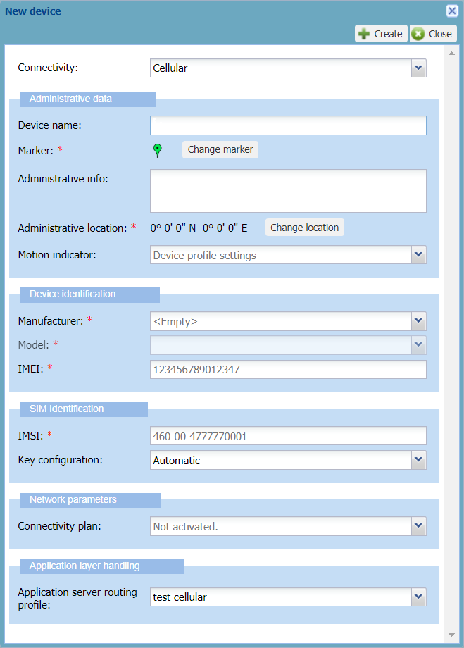

# Creating a cellular device

You must have read-write access to Device Manager. Read more\...For more
information, see [Opening a panel and checking your read-write access](../use-interface.md#opening-a-panel-and-checking-your-read-write-access).

To connect successfully a cellular device to the cellular network, the
EPC Connector and ThingPark Wireless, the following information is
required:

| Required information |                                                                                                                                          |                                                                                   |
|----------------------|------------------------------------------------------------------------------------------------------------------------------------------|-----------------------------------------------------------------------------------|
| **IMEI**             | Identifier of the device that is printed on it                                                                                           |                                                                                   |
| **Manufacturer**     | Identifier of the manufacturer                                                                                                           |                                                                                   |
| **Model**            | Identifier of the model                                                                                                                  |                                                                                   |
| **IMSI**             | Identifier present inside the SIM card                                                                                                   | Only required if your operator configuration is set to provision device HSS data. |
| **Ki**               | Device secret key present inside the SIM card. If not pre-provisioned by your operator, you can enter it in clear text or RSA encrypted. |                                                                                   |

**Note** The connectivity plan and the AS routing profile are necessary
to make the device work. You can associate them by editing the device
later.

&nbsp;

1.  In the navigation panel, click **Devices** to open the Devices
    panel.

2.  In the Add Devices frame, click **Create**.

3.  In the New device dialog box that appears, select **Cellular** from
    the Connectivity list.

    -\&gt; The dialog box is updated with cellular parameters.

    

**Tips**

- Only the fields marked with an asterisk are required to create the
  device in Device Manager.

- A tooltip appears when hovering your mouse over a field.

- An example is given that disappears when entering your data.

- To help you, type slowly in the box until a blue frame appears. If the
  frame is red, your data is not correct.

  &nbsp;

1.  In the Administrative data frame, enter the following information:

    - **Device name:** Enter a name that helps you identify easily the
      device on your IoT network.

    - **Marker:** If you want to change the default device marker, click
      **Change the marker**, and apply [Changing the device       marker](../manage-a-device/locate-device.md#changing-the-device-marker)
      from step 3.

    - **Administrative info**: Enter any useful information related to
      the device. Such information is displayed in alarm notification
      emails. For more information, see [Setting alarm notification       emails](../device-manager-settings.md#setting-alarm-notification-emails).

    - **Administrative location:** By default, the device location is
      not set. If you want to locate the device, click **Change
      location**. For more information, see [Manual location: locating a       device or editing its       location](../manage-a-device/locate-device.md#manual-location-locating-a-device-or-editing-its-location)
      from step 3.

    - **Motion indicator:** To allow the network server to use the best
      base station to send downlinks, replace **Device profile
      settings** by the motion indicator that best applies to your
      device during operation. **Note** If your device is always static,
      select **Near static**. If your device can change location during
      operation, do not select **Near static**.

2.  In the Device identification frame:

    - In the **Manufacturer** list: Select the manufacturer of the
      device. If it is not in the list, contact your operator.

    - In the **Model** list: Select the model of the device. If the
      model is not in the list, contact your operator. If your operator
      modifies a model, all existing associated devices and their
      behavior are modified accordingly.

    - In the **IMEI** box: Enter the 15-digit IMEI of the cellular
      device to check that the IMEI uniquely identifies it. If not,
      enter a 14-digit IMEI. The optional 15^th^ digit is a Luhn
      checksum that verifies that the IMEI is correct.

3.  In the SIM Identification frame:

    - In the **IMSI** box: Enter the IMSI identifying the SIM card of
      the device (10 to 15 digits with or without separating dashes).

      -\&gt; If your operator or its connectivity supplier pre-provisions
      and manages SIM cards, the Ki associated with the IMSI you have
      entered will be recognized to identify an unallocated SIM card
      (**Automatic** must be selected in the **Key configuration**
      list).

4.  If your operator or its connectivity supplier does not pre-provision
    SIM cards, you must enter the Ki of the SIM card associated with the
    device as described in the following two steps.

5.  If you want to enter a Ki in clear text:

    1.  In the **Key configuration** list, select **Manual (clear
        text)**.

    2.  In the **Ki** box that appears, enter the 32-hexadecimal digits
        Ki with or without separating dashes that has been assigned by
        the operator during the personalization process and
        authenticates the SIM card on the cellular network.

6.  If you want to enter an RSA encrypted Ki:

    1.  Select **Manual (RSA encrypted)**from the **Key configuration**
        list.

        -\&gt; The **RSA encrypted Ki**box appears.

    2.  Click **Download RSA Public Key** to download it in X.509
        SubjectPublicKeyInfo /OpenSSL PEM format.

    3.  Using for instance an OpenSSL command in a shell terminal,
        encrypts the Ki with the RSA public key (PKCS#1 v1.5 padding) as
        follows:

        ``` text
        openssl rsautl –encrypt –in ki.bin –inkey TWK1.pem –pubin –pkcs –out encryptedKi.bin
        ```

        Where:

        - `ki.bin` is the Ki in binary format. For example, you can set
          `ki.bin` by executing the following commands:

          - echo `{MY_KI_IN_HEXA}` \&gt; `ki.hex`

          - cat `ki.hex` \| xxd --r --p \&gt; `ki.bin`

        - `TWK1.pem` is the RSA Public Key in X.509
          SubjectPublicKeyInfo/OpenSSL PEM format

        - `encryptedKi.bin` is the RSA encrypted Ki in binary format.

    4.  Do one of the following:

        - If you want to enter the RSA encrypted Ki uploading the binary
          file resulting from the encryption:

          - Save `encryptedKi.bin` on your workstation.

          - Click **Browse...** next to the **RSA encrypted Ki** box.

        - Otherwise, if you want to enter the RSA encrypted Ki as a
          base64 string:

          - Using for instance a Linux command in a shell terminal,
            encode `encryptedKi.bin` in base64 as follows:

            ``` text
            cat encryptedKi.bin | base64
            ```

          - Copy-paste the result in the **RSA encrypted AppKey** box.

7.  In the Network parameters frame:

    - Select a **Connectivity plan** from the list that only contains
      cellular connectivity plans.  
      The number in parenthesis indicates the remaining connectivity
      plans available. For more information about connectivity plans,
      see [Viewing connectivity plans](../view-connectivity-plans).

8.  In the Application layer handling frame:

    - In the **Application server routing profile** list, select an AS
      routing profile to route the cellular device packets towards one
      or more applications servers.

      - **Important**You can only use an AS routing profile that does
        not contain more destinations, summing up all types of
        application servers in it, than defined in the connectivity plan
        associated with the device. For more information, see Maximum allowed Application Servers in
        [Cellular IoT connectivity plan         details](../reference-information.md#cellular-iot-connectivity-plan-details).

      - If there is no AS routing profile in the list, you will
        associate it later by opening the device's Network panel after
        you have created a cellular AS routing profile. For more
        information, see [Managing AS routing         profiles](../manage-as-routing-profiles/index.md) and [Managing         the AS routing profile of a         device](../manage-device-network/manage-as-routing-profile-device.md).

9.  Click **Create**.

    -\&gt; If the process takes time, a message tells you that you will
    receive an email when finished.

    -\&gt; The device is displayed in the device list.
