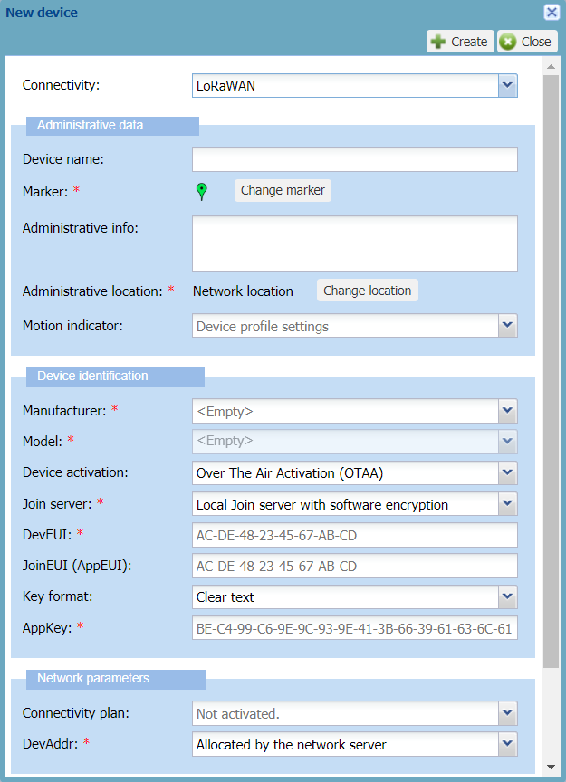
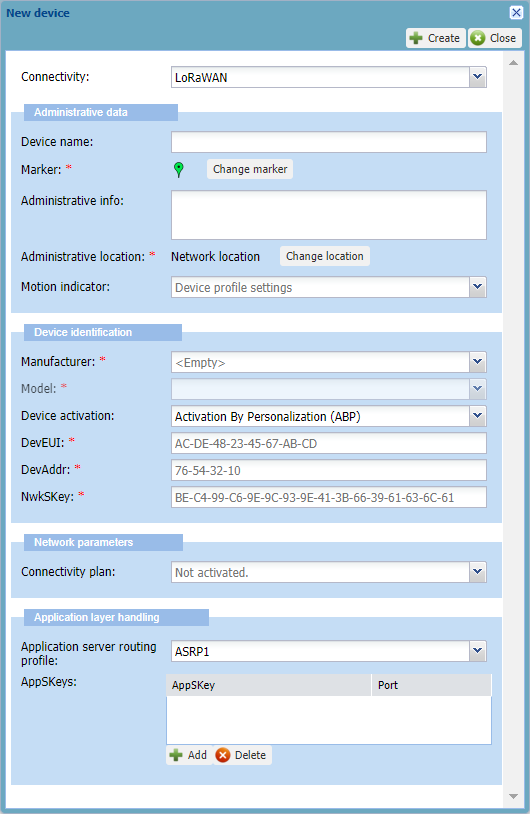

# Creating a LoRaWAN® device

You must have read-write access to Device Manager. Read more\...For more
information, see 
[Opening a panel and checking your read-write access](../use-interface.md#opening-a-panel-and-checking-your-read-write-access).

## OTAA versus ABP devices

For LoRaWAN® connectivity, you can create OTAA and ABP devices that are
manufactured with a different mode of registration and activation on the
network:

<table>
<thead>
<tr>
<th>Device</th>
<th>Activation</th>
<th>Tips</th>
</tr>
</thead>
<tbody>
<tr>
<td><strong>Activation By Personalization (ABP)</strong></td>
<td><p>The configuration of the device is static.<br/>
The device’s activation keys are stored in it at production time and
cannot be changed. The device is customized and manufactured to be
attached to a specific network.</p></td>
<td><p>When creating an ABP device, you must have a DevAddr to
enter.</p></td>
</tr>
<tr>
<td><strong>Over The Air Activation (OTAA)</strong></td>
<td><p>The configuration of the device is dynamic.<br/>
The device requests activation keys to the server for configuring the
device by the means of the Join Procedure. The activation keys are
regularly changed per every activation request. The device is not
customized and is manufactured to be used by any network.</p></td>
<td><p>When creating an OTAA device, the DevAddr is not needed because
it is generated by the network at every join request of the
device.</p></td>
</tr>
</tbody>
</table>

## Class B devices

You can create LoRaWAN® devices of class A, B and C with Device Manager.

If you want to create an OTAA or ABP class B device, you must use a
model and a connectivity plan that both support class B. It will make
the manufactured-class B device switch to class B mode after a
successful acquisition of the beacon signal.

The device model is created and managed by your operator. For more
information, see [More about models and manufacturers](../manage-a-device/change-device-model.md#more-about-models-and-manufacturers).
The connectivity plan is created by the connectivity supplier and is
included in a Vendor offer to be purchased by the Subscriber. For more
information, see the **Class B support** parameter in 
[LoRaWAN® unicast connectivity plan details](../reference-information.md#lorawan-unicast-connectivity-plan-details).

For more information about class B devices, see [Viewing general information, activity summary and location of a device](../manage-a-device/check-device-settings-activity.md#viewing-general-information-activity-summary-and-location-of-a-device).

## Creating an OTAA device

You must know the manufacturer and the model of the OTAA device you want
to register in Device Manager to connect it to your IoT network. When
selected, the model applies the LoRaWAN® version, class and
configuration of the device. For more information, see [More about models and manufacturers](../manage-a-device/change-device-model.md#more-about-models-and-manufacturers).

You must have the following information ready to be used:

<table>
<thead>
<tr>
<th>For a LoRaWAN® 1.0 device</th>
<th>For a LoRaWAN® 1.1 device</th>
</tr>
</thead>
<tbody>
<tr>
<td><ul>
<li><strong>Manufacturer</strong></li>
<li><strong>Model</strong></li>
<li><strong>DevEUI</strong></li>
<li><strong>AppEUI</strong></li>
<li><strong>AppKey</strong><sup>1</sup></li>
<li>Verification code<sup>2</sup>(optional)</li>
</ul></td>
<td><ul>
<li><strong>Manufacturer</strong></li>
<li><strong>Model</strong></li>
<li><strong>DevEUI</strong></li>
<li><strong>JoinEUI</strong></li>
<li><strong>NwkKey</strong><sup>1</sup></li>
<li><strong>AppKey</strong><sup>1</sup></li>
<li>Verification code<sup>2</sup>(optional)</li>
</ul></td>
</tr>
<tr>
<td colspan="2"><p><sup>1</sup> Not required if the LRC (network server)
works with an external Join Server configuration. For more information,
see ThingPark Wireless Join Server Solution Description. Can be RSA
encrypted.</p>
<p><sup>2</sup> If you have subscribed to the Address Manager.</p></td>
</tr>
</tbody>
</table>

**Notes**

- The connectivity plan and the AS routing profile are necessary to make
  the device work. You can associate them by editing the device later as
  described in [Allocating a connectivity   plan](../manage-device-network/manage-connectivity-plan-device.md#allocating-a-connectivity-plan)
  and [Allocating an AS routing   profile](../manage-device-network/manage-as-routing-profile-device.md#allocating-an-as-routing-profile).

- If you want a hardware protection of the device's root keys, you must
  use a connectivity plan and an AS routing profile that both enable HSM
  protection. For more information, see 
[LoRaWAN® unicast connectivity plan details](../reference-information.md#lorawan-unicast-connectivity-plan-details)
  and 
[Configuring a LoRaWAN® AS routing profile for HSM](../manage-as-routing-profiles/configure-lorawan-as-routing-profile-for-hsm.md).

 

1.  In the navigation panel, click **Devices** to open the Devices
    panel.

2.  In the Add Devices frame of the Devices panel, click **Create**.

    -\> By default, the New device dialog box appears with LoRaWAN® 1.1
    connectivity and OTAA configuration.

    

**Tips**

- Only the fields marked with an asterisk are required.

- A tooltip appears when hovering your mouse over a field.

- An example is given that disappears when entering your data.

- To help you, type slowly in a box until a blue frame appears. If the
  frame is red, your data is incorrect.

1.  In the Administrative data frame, enter the following information:

    - **Device name**: Enter a name that helps you identify easily the
      device on your IoT network.

    - **Marker**: If you want to change the default device marker, click
      **Change the marker**, and apply [Changing the device       marker](../manage-a-device/locate-device.md#changing-the-device-marker)
      from step 3.

    - **Administrative info**: Type any useful information related to
      the device. Such information is displayed in alarm notification
      emails. For more information, see [Setting alarm notification       emails](../device-manager-settings.md#setting-alarm-notification-emails).

    - **Administrative location:** By default, the network location is
      set for the device. If you want to set the manual location, click
      **Change location,** and apply [Manual location: locating a device       or editing its       location](../manage-a-device/locate-device.md#manual-location-locating-a-device-or-editing-its-location)
      from step 3.

    - **Motion indicator:** To allow the network server to use the best
      base station to send downlinks, replace **Device profile
      settings** by the motion indicator that best applies to your
      device during operation. **Note** If your device is always static,
      select **Near static**. If your device can change location during
      operation, do not select **Near static**.

2.  In the Device identification frame, apply the configuration
    corresponding to the device you have as follows:

    1.  In the **Manufacturer** list, select the manufacturer of the
        device. If it is not in the list, contact your operator.

        -\> It populates the **Model** list with the device models of
        the manufacturer.

    2.  In the **Model** list, select the model of the device. If
        defined by your operator, the model name is followed by the
        supported ISM bands. If the model is not in the list, contact
        your operator.

        -\> The dialog box is updated with the model configuration. If
        the model supports LoRaWAN® 1.1, the dialog box is updated with
        related parameters.

    3.  In the **Device activation** list: **Over The Air Activation
        (OTAA)** must be selected

3.  In the **Join server** list, select the join server mode on which
    you want the OTAA device to do its join procedure:

    - If you want to use a joint server that is local to the network
      server with software protection of the device's root keys, select
      **Local Joint server with software encryption**.

    - If you want to use a joint server that is local to the network
      server with hardware protection of the device's root keys, select
      **Local Joint server with HSM protection**, then from the **HSM
      group** list that appears, select the HSM group you want to use.

    - If you want to use a joint server that is external to the network
      server, select **External joint server** and go to step 9.

4.  According to the LoRaWAN® version supported by the model you have
    selected, enter the device information in the boxes that are
    displayed:

    - **DevEUI**: Globally unique identifier of the device which is
      written on it. It is composed of 16 hexadecimal digits (0 to 9,
      and A to F).

    - **JoinEUI (AppEUI)**: JoinEUI for LoRaWAN® 1.1 (AppEUI for
      LoRaWAN® 1.0). Global application identifier that uniquely
      identifies the application provider of the device. It is composed
      of 16 hexadecimal digits (0 to 9, and A to F). It is mandatory
      only when using an external join server.

5.  If you are using a local join server with software encryption and
    you want to enter the AppKey in clear text:

    1.  Select **Clear text** from the **Key format** list.

    2.  Enter the following information in the boxes that appears:

        - **NwkKey**: Only displayed if the
          model you have selected supports LoRaWAN® 1.1. The Network Key
          is anAES-128 key that
          encrypts the device's communication with the network. It is
          composed of 32hexadecimal digits (0 to 9, and A to F).

        - **AppKey**: The Application Key is an AES-128 key assigned by
          the application owner to the device to encrypt the join
          communication.

6.  If you are using a local join server with software encryption and
    you want to enter an RSA encrypted AppKey, or if you are using a
    local join server with hardware protection, apply the following:

    1.  From the **Key format** list, select **RSA encrypted**.

        -\> The **RSA encrypted AppKey**box appears.

        -\> The **RSA encrypted NwkKey** box also appears if the model
        you have selected supports LoRaWAN® 1.1.

    2.   Click Download RSA Public Key
        to download it in X.509 SubjectPublicKeyInfo /OpenSSL PEM
        format.

    3.  Using for instance an OpenSSL command in a shell terminal,
        encrypts the AppKey (and the NwkKey if using LoRaWAN® 1.1) with
        the RSA public key (PKCS#1 v1.5 padding) as follows:

        ``` text
        openssl rsautl –encrypt –in appKey.bin –inkey TWK1.pem –pubin –pkcs –out encryptedAppKey.bin
        openssl rsautl –encrypt –in nwkKey.bin –inkey TWK1.pem –pubin –pkcs –out encryptedNwkKey.bin
        ```

        Where:

        - `appKey.bin` is the AppKey in binary format. For example, you
          can set `appKey.bin` by executing the following commands:

          - echo `{MY_APPKEY_IN_HEXA}` \> `appKey.hex`

          - cat `appKey.hex` \| xxd --r --p \> `appKey.bin`

        - `nwkKey.bin` is the NwkKey in binary format

        - `TWK1.pem` is the RSA Public Key in X.509
          SubjectPublicKeyInfo/OpenSSL PEM format

        - `encryptedAppKey.bin` is the RSA encrypted AppKey in binary
          format

        - `encryptedNwkKey.bin` is the RSA encrypted NwkKey in binary
          format.

    4.  Do one of the following:

        - If you want to enter the RSA encrypted AppKey uploading the
          binary file resulting from the encryption:

          - Save `encryptedAppKey.bin` on your workstation.

          - Click **Browse...** next to the **RSA encrypted AppKey**
            box.

          - Repeat for the **RSA encrypted NwkKey** if using LoRaWAN®
            1.1.

        - Otherwise, if you want to enter the RSA encrypted AppKey as a
          base64 string:

          - Using for instance a Linux command in a shell terminal,
            encode `encryptedAppKey.bin` in base64 as follows:

            ``` text
            cat encryptedAppKey.bin | base64
            ```

          - Copy-paste the result in the **RSA encrypted AppKey** box.

          - Repeat for the **RSA encrypted NwkKey** if using LoRaWAN®
            1.1.

7.  If the **Verification code**box if displayed, enter the verification
    code associated with the DevEUI and provided by your operator. This
    box is displayed if you have subscribed to the Address Manager.

8.  In the Network parameters frame, enter the following information:

    - In the **Connectivity plan** list:

      The number in parenthesis indicates the remaining devices
      available in the connectivity plan. For more information about
      connectivity plans, see [Viewing connectivity       plans](../view-connectivity-plans.md).

      - If you want to create a class B device, select a connectivity
        plan that supports class B. If not, the device will work as a
        class A device.

      - If you are using a local join server with hardware protection,
        select a connectivity plan enabling HSM protection.

    - In the **DevAddr** list:

      By default, **Allocated by the network server** is selected. This
      is the default behavior of the OTAA device having its DevAddr
      generated by the join procedure.

      - If you want to use a specific DevAddr for the device, the device
        will not have an OTAA behavior anymore. In that case, select
        **Manual configuration (advanced mode)**, then in the **Manual
        DevAddr** box enter the DevAddr you want with 8 hexadecimal
        digits (0 to 9, and A to F).

9.  In the Application layer handling frame, enter the following
    information:

    - In the **Application server routing profile** list, select an AS
      routing profile to route the device packets towards one or more
      applications servers.

      - If you are using a local join server with hardware protection,
        select an AS routing profile with HSM activated.

      - **Important**You can only use an AS routing profile that does
        not contain more destinations, summing up all types of
        application servers in it, than defined in the connectivity plan
        associated with the device. For more information, see Maximum allowed Application Servers in
        [LoRaWAN® unicast connectivity plan         details](../reference-information.md#lorawan-unicast-connectivity-plan-details).

      - If there is no AS routing profile in the list, you will
        associate it later by opening the device's Network panel after
        you have created a LoRaWAN® AS routing profile. For more
        information, see [Managing AS routing         profiles](../manage-as-routing-profiles/index.md) and [Managing         the AS routing profile of a         device](../manage-device-network/manage-as-routing-profile-device.md).

    - If supported by the connectivity plan you have selected, the
      ThingPark X configuration area is displayed. If you want to set a
      specific ThingPark X configuration for this device, add a
      ThingPark X driver configuration like this:

      - Click **Add**.

      - Click the row that appears, then delete the mask to enter the
        ThingPark X driver configuration provided by your operator.

      - Enter a **port** number. It can be a range of ports, for
        instance 1-20. **Note**\* means all ports.

10. Click **Create**.

    -\> If the process takes time, a message tells you that you will
    receive an email when finished.

    -\> The device is displayed in the device list.

## Creating an ABP device

You must know the manufacturer and the model of the ABP device you want
to register in Device Manager to connect it to your IoT network. When
selected, the model applies the LoRaWAN® version, class and
configuration of the device. For more information, see [More about models and manufacturers](../manage-a-device/change-device-model.md#more-about-models-and-manufacturers).

You must have the following information ready to be used:

| For a LoRaWAN® 1.0 device | For a LoRaWAN® 1.1 device |
| -- | -- |
| **Manufacturer**<br/>**Model**<br/>**DevEUI**<br/>**DevAddr**<br/>**NwkSKey**<br/>**AppSKey<sup>1</sup>**<br/>**Verification code<sup>2</sup>** | **Manufacturer**<br/>**Model**<br/>**DevEUI**<br/>**DevAddr**<br/>**FNwkSIntKey**<br/>**SNwkSIntKey**<br/>**NwkSEncKey**<br/>**AppSKey<sup>1</sup> (optional)**<br/>**Verification code<sup>2</sup> (optional)**|
<sup>1</sup> Allows the Wireless Logger to display the packet payload in decoded form and parse it if the syntax is supported. For more information, see [More about the AppSKey for ABP devices](#more-about-the-appskey-for-abp-devices)<br/>
<sup>2</sup> If you have subscribed to the Address Manager.

**Note:** The connectivity plan and the AS routing profile are necessary to make the device work. You can associate them by editing the device
later as described in [Allocating a connectivity plan](../manage-device-network/manage-connectivity-plan-device.md#allocating-a-connectivity-plan)
and [Allocating an AS routingprofile](../manage-device-network/manage-as-routing-profile-device.md#allocating-an-as-routing-profile).

 

1.  In the navigation panel, click **Devices** to open the Devices
    panel.

2.  In the Add Devices frame, click **Create**.

    -\> By default, the New device dialog box appears with LoRaWAN® 1.0
    connectivity and OTAA configuration.

3.  In the Administrative data frame, enter the following information:

    - **Device name**: Enter a name that helps you identify easily the
      device on your IoT network.

    - **Marker**: If you want to change the default device marker, click
      **Change the marker**, and apply [Changing the device       marker](../manage-a-device/locate-device.md#changing-the-device-marker)
      from step 3.

    - **Administrative info**: Type any useful information related to
      the device. Such information is displayed in alarm notification
      emails. For more information, see [Setting alarm notification       emails](../device-manager-settings.md#setting-alarm-notification-emails).

    - **Administrative location:** By default, the network location is
      set for the device. If you want to set the manual location, click
      **Change location,** and apply [Manual location: locating a device       or editing its       location](../manage-a-device/locate-device.md#manual-location-locating-a-device-or-editing-its-location)
      from step 3.

    - **Motion indicator:** To allow the network server to use the best
      base station to send downlinks, replace **Device profile
      settings** by the motion indicator that best applies to your
      device during operation. **Note** If your device is always static,
      select **Near static**. If your device can change location during
      operation, do not select **Near static**.

4.  In the Device identification frame, apply the configuration
    corresponding to the device you have as follows:

    1.  In the **Manufacturer** list, select the manufacturer of the
        device. If it is not in the list, contact your operator.

        -\> It populates the **Model** list with the device's models of
        the manufacturer.

    2.  In the **Model** list, select the model of the device. If
        defined by your operator, the model name is followed by the
        supported ISM bands. If the model is not in the list, contact
        your operator.

        -\> The dialog box is updated with the model configuration. If
        the model supports LoRaWAN® 1.1, the dialog box is updated with
        related parameters.

    3.  In the **Device activation** list, select **Activation By
        Personalization (ABP)**.

        -\> The dialog box is updated with ABP configuration.

        
        

**Tips**

- Only the fields marked with an asterisk are required.

- A tooltip appears when hovering your mouse over a field.

- An example is given that disappears when entering your data.

- To help you, type slowly in a box until a blue frame appears. If the
  frame is red, your data is incorrect.

1.  According to the LoRaWAN® version supported by the model you have
    selected, enter the device information in the boxes that are
    displayed:

    - **DevEUI**: Globally unique identifier of the device which is
      written on it. It is composed of 16 hexadecimal digits (0 to 9,
      and A to F).

    - **DevAddr**: Device address on the network. Composed of 8
      hexadecimal digits (0 to 9, and A to F), it identifies the device
      on the current network.

    - **NwkSKey**: Applies to LoRaWAN® 1.0.
      TheNetwork Session Key is an AES-128 key composed of 32hexadecimal digits (0 to 9, and A to F).

    - **FNwkSIntKey**: Applies to LoRaWAN®
      1.1. TheForwarding Network Session Integrity Keyis composed of 32hexadecimal digits (0 to 9, and A to F).

    - **SNwkSIntKey**: Applies to LoRaWAN®
      1.1. TheServing Network Session Integrity Key. is composed of 32hexadecimal digits (0 to 9, and A to F).

    - **NwkSEncKey**: Applies to LoRaWAN® 1.1.
      TheNetwork Session Encryption Keyis composed of 32hexadecimal digits (0 to 9, and A to F).

    - **Verification code:** Only displayed if you have subscribed to
      the Address Manager. Enter the verification code associated with
      the DevAddr/DevEUI pair and provided by your operator.

2.  In the Network parameters frame, select a **Connectivity plan** from
    the list:

    The number in parenthesis indicates the remaining devices available
    in the connectivity plan. For more information about connectivity
    plans, see [Viewing connectivity     plans](../view-connectivity-plans.md).

    - If you want to create a class B device, select a connectivity plan
      that supports class B. If not, the device will work as a class A
      device.

3.  In the Application layer handling frame, enter the following
    information:

    - In the **Application server routing profile** list, select an AS
      routing profile to route the device packets towards one or more
      applications servers:

      - **Important**You can only use an AS routing profile that does
        not contain more destinations, summing up all types of
        application servers in it, than defined in the connectivity plan
        associated with the device. For more information, see Maximum allowed Application Servers in
        [LoRaWAN® unicast connectivity plan         details](../reference-information.md#lorawan-unicast-connectivity-plan-details).

      - If there is no AS routing profile in the list, you must
        associate it later by opening the device's Network panel after
        you have created a LoRaWAN® AS routing profile. For more
        information, see [Managing AS routing         profiles](../manage-as-routing-profiles/index.md) and [Managing         the AS routing profile of a         device](../manage-device-network/manage-as-routing-profile-device.md).

    - If you want the payloads to be encrypted, you can enter one
      distinct AppSKey for each LoRaWAN® ports used by your device. You
      can also use a unique AppSKey for a range of ports or all LoRaWAN®
      ports. In the **AppSKeys** area:

      1.  Click **Add**.

      2.  Click the row that appears, then delete the mask to enter the
          AppSKey (128-bit hexadecimal key, 32 hexadecimal digits from 1
          to 9 and A to F).

      3.  Enter a **Port** number, a range of ports (example: 1-20), or
          all ports using\*.

      4.  Repeat as necessary to add more AppSkeys.

    - If supported by the connectivity plan you have selected, the
      ThingPark X configuration area is displayed. If you want to set a
      specific ThingPark X configuration for this device, add a
      ThingPark X driver configuration like this:

      1.  Click **Add**.

      2.  Click the row, then delete the mask to enter the ThingPark X
          driver configuration provided by your operator.

      3.  Enter a **port** number. It can be a range of ports, for
          instance 1-20, or all ports using \*.

      4.  Repeat as necessary to add more ThingPark X driver
          configurations.  

4.  Click **Create**.

    -\> If the process takes time, a message tells you that you will
    receive an email when finished.

    -\> The device is displayed in the device list.

## More about the AppSKey for ABP devices

You can use an application session key when creating an ABP device if
you want the device payloads to be encrypted.

The optional 128-bit AppSKey allows the LRC in the network server to
encrypt and decrypt the payload of the packets. It must be shared with
the application servers.

- **If you do not provision AppSKey:** ThingPark Wireless forwards the
  payload in encrypted form to the application server(s) and has no
  access to the payload clear-form content. Consequently, network tools
  like Wireless Logger cannot decode the payload and will display it in
  encrypted form.

- **If you provision one or more AppSKeys:** The LRC decodes the payload
  before forwarding it to the application server(s). Consequently, the
  Wireless Logger can display the packet payload in decoded form and
  parse it if the payload syntax is supported.

You can use a unique AppSKey for a range of ports or all LoRaWAN® ports
used by your device, or allocate one distinct AppSKey for each port. For
more information, see [Creating an ABP device](#creating-an-abp-device).
