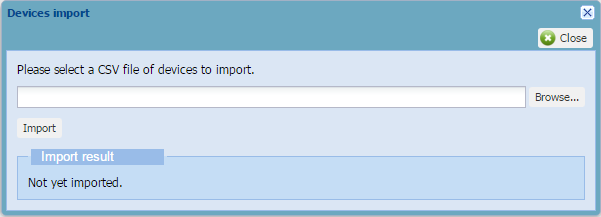

# Importing LoRaWAN® or cellular devices

You must have read-write access to Device Manager. For more
information, see [Opening a panel and checking your read-/write access](../use-interface.md#opening-a-panel-and-checking-your-read-write-access).

You can create several LoRaWAN® or cellular devices at a time in Device
Manager by importing a formatted CSV file containing the necessary
information.

You can also use this technique as mass deletion. In this case, you only
need the following information to identify the device to delete:

- **DevEUI** for a LoRaWAN® device

- **IMEI** for a cellular device.

 

1.  According to the type of device you want to import, build your CSV
    file applying one of the structures described below:

    - [Import CSV file for LoRaWAN® OTAA       devices](../reference-information.md#import-csv-file-for-lorawan-otaa-devices)

    - [Import CSV file for LoRaWAN® ABP       devices](../reference-information.md#import-csv-file-for-lorawan-abp-devices)

    - [Import CSV file for cellular       devices](../reference-information.md#import-csv-file-for-cellular-devices).

    **Important**The CSV file is structured as follows:

    - One row for every device to be provisioned.

    - The columns correspond to the device details that must be
      completed for an individual provisioning.

    - The value separator is a comma.

2.  In the Devices panel, click **Import** in the Add Devices frame.

3.  In the Devices import dialog box that opens, click **Browse...**

    

4.  Select the .csv file from your directory and click **Import**.

    -\> If the process takes time, a message tells you that you will
    receive an email when finished.

    -\> The result appears in the Import result area of the Devices
    import dialog box.

5.  Click **Close**.
