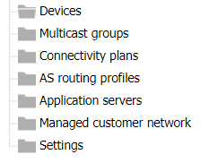
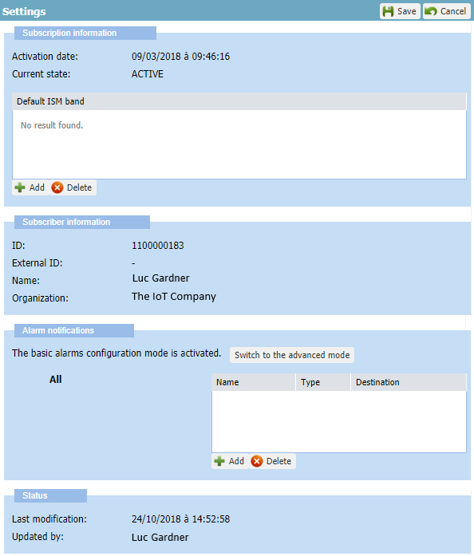
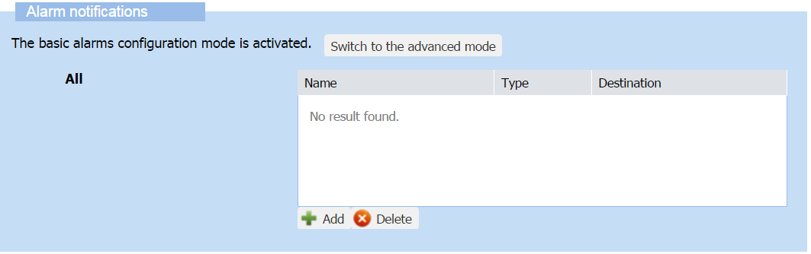

# Device Manager settings

The Settings panel displays information about the account of the
subscriber you belong, and its subscription to Device Manager.

It also allows you to view the recipients of alarm email notifications,
and configure these email notifications if you have read-write access to
Device Manager. Read more\... For more information, see [Opening a panel
and checking your read-write
access](use-interface.md#opening-a-panel-and-checking-your-read-write-access).

## Accessing the Settings panel and viewing account details

1.  Click **Settings** in the navigation panel to open the Settings
    panel:

    

2.  The Settings panel appears displaying the following information:
    

    - The Subscription information frame gives the activation date and
      status of the subscription.

    - The Subscriber information frame gives the ID, name and
      organization of your subscriber.

    - The Alarm notifications frame lets you configure alarm
      notification emails and appears by default with the basic mode.

    - The Status frame indicates when the **Settings** section got
      updated and by whom.

## Restricting device models according to supported ISM bands

You, or your operator on your behalf, can define the ISM bands
corresponding to your deployment to only display compatible models when
creating or updating devices. For more information, see 
[Creating an OTAA device](create-devices/create-lorawan-device.md#creating-an-otaa-device),
[Creating an ABP device](create-devices/create-lorawan-device.md#creating-an-abp-device),
and [Changing the device model](manage-a-device/change-device-model.md)
.

You must have read-write access. Read more\... For more information, see
[Opening a panel and checking your read-/write access](use-interface.md#opening-a-panel-and-checking-your-read-write-access).

 

1.  Click **Settings** in the navigation panel to open the Settings
    panel.

2.  In the Default ISM band area of the Subscription information frame,
    click **Add**.

3.  To display the list of ISM bands, click the row that appears in the
    Default ISM band frame.

4.  Select from the list, the ISM band you want to display the
    compatible models.

5.  If you want to add another ISM band, repeat from step 2.

6.  Click **Save**.

## Setting alarm notification emails

## About alarm notification emails

In addition to the alarms notifications appearing in the Devices panel
and the Active alarms panel of a device Read more\... For more
information, see 
[Viewing not acknowledged alarms of your network](./manage-alarms/monitor-device-alarms.md#viewing-not-acknowledged-alarms-of-your-network)
and 
[More about searching alarms](./manage-alarms/monitor-device-alarms.md#more-about-searching-alarms),
you can set alarm notifications by email to monitor all devices of the
account when necessary, and independently of the device the alarm
belongs to:

- The **basic mode** lets you send notification emails whatever the
  alarm state to all recipients.

- The **advanced mode** lets you send notification emails to the
  recipients according to the alarm state.

An alarm state corresponds to a severity level of the alarm, or a
cleared or acknowledged alarm.

**Important**

- Click **Save** after you have finished your configuration in any mode.

- When shifting from the advanced mode to the basic mode and clicking
  **Save**, the basic mode overwrites what you have set in the advanced
  mode.

- The Setting panel opens with the last saved configuration mode.

You must have read-write access to Device Manager to set alarms
notifications emails. Read more\... For more information, see 
[Opening a panel and checking your read-/write access](use-interface.md#opening-a-panel-and-checking-your-read-write-access).

If you have read-only access, you can see who receives alarm
notification emails for which alarms state. For more information, see
[Viewing/Setting an alarm notification email in advanced mode](#viewingsetting-an-alarm-notification-email-in-advanced-mode). If
you want to receive alarm notification emails, ask an end-user with
read-write access to set it for you.

## Setting alarm notification emails in basic mode

In basic mode, the recipient receives an email whenever an alarm is
triggered, whatever the alarm state (Critical, Major, Minor, Warning,
Indeterminate, Cleared or Acked).

You must have read-write access to Device Manager to set alarms
notifications emails. Read more\... For more information, see 
[Opening a panel and checking your read-/write access](use-interface.md#opening-a-panel-and-checking-your-read-write-access).

 

1.  Click **Settings** in the navigation panel to open the Settings
    panel.

2.  In the Alarm Notifications frame set in the basic mode, click
    **Add**.

    

3.  Click the row that appears, and in the **Name** box, enter the name
    of the recipient you want to add.

4.  In the **Destination** box, enter the recipient email address.

5.  If you want to add more recipients, repeat from step 1.

6.  Click **Save**.

    -\> The recipients registered will receive an email whenever an
    alarm is triggered on any device.

## Viewing/Setting an alarm notification email in advanced mode

In advanced mode, if an alarm state having a registered recipient is
reached, an email for all devices impacted is sent:

- Whenever a new alarm is triggered with this alarm state.

- Whenever an existing alarm changes to this alarm state.  
  **Note** For an event-driven alarm, no email is sent for any new
  occurrence if the alarm state is the same. For more information, see
  [Alarm occurrence
  management](./manage-alarms#alarm-occurrence-management).

- Whenever the alarm has been acknowledged and increases to this alarm
  state.  
  **Note** When an acknowledged alarm increases its alarm state, the
  acknowledgement is canceled by the system.

Alarm states are related to severity levels and associated with the
following color codes:

| Alarm state                | Definition                                                                                           |
|----------------------------|------------------------------------------------------------------------------------------------------|
| **Critical** (Red)         | The service is affected, and an immediate corrective action is required.                             |
| **Major** (Orange)         | The service is partly affected, and an urgent action is required.                                    |
| **Minor** (Yellow)         | A fault that does not affect the service should be corrected to prevent a more serious problem.      |
| **Warning** (Blue)         | A potential or impending fault affecting the service should be diagnosed and corrected if necessary. |
| **Indeterminate** (Purple) | The severity cannot be determined.                                                                   |
| **Cleared** (Green)        | The alarm has satisfied the clearing conditions and has been cleared by the system.                  |

You must have read-write access to Device Manager to set alarms
notifications emails. Read more\... For more information, see [Opening a
panel and checking your read-/write
access](use-interface.md#opening-a-panel-and-checking-your-read-write-access).

**Tip** If you want to see who receives alarm notification emails for
which alarms state, click **Settings \>** **Switch to the advanced
mode** and do not click **Save**.

 

1.  Apply all steps described in [Setting alarm notification emails in
    basic mode](#setting-alarm-notification-emails-in-basic-mode)
    entering the email addresses of all the recipients you want to
    notify, whatever the alarm state of the devices.

2.  Click **Switch to the advanced mode**.

    -\> All the recipients email addresses have been copied in all alarm
    state areas.

3.  In the Alarm state area that you want, select the recipient you do
    not want to notify, and click **Delete**. Repeat as necessary in any
    other alarm state area.  
    If necessary, you can add more recipients in the alarm state area
    you want.

4.  Click **Save**.

    -\> The recipients registered will receive an email when the
    corresponding alarm state is reached for any device.

    -\> Next time you open the Settings panel, the Alarm notifications
    frame will appear with the advanced mode.

To learn more how you can use alarms to identify and prioritize device
issues, see [Managing alarms](./manage-alarms).
