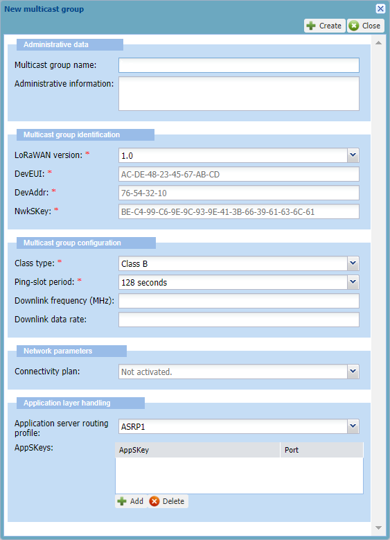
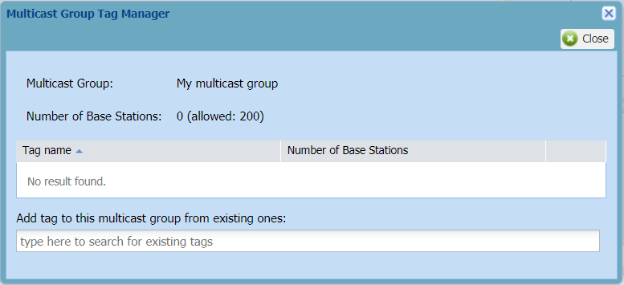

# Creating a multicast group associated with a base station group

You must have read-write access to Device Manager. Read more\... For
more information, see [Opening a panel and checking your read-/write access](../use-interface.md#opening-a-panel-and-checking-your-read-write-access).

You must perform this task in two main steps.

## Creating a multicast group

You must have read-write access to Device Manager.

You can create a class B or C multicast group to send simultaneously a
same downlink payload to many target multicast devices in your LoRaWAN®
network. The LoRaWAN® version and the class of the multicast group must
be the same as the LoRaWAN® version and the class of the target
multicast devices working with it.

The following information must be pre-shared with the multicast devices:

- For a **LoRaWAN® 1.0** multicast group: **DevAddr**, **NwkSKey**, and
  **optional AppSKey**

- For a **LoRaWAN® 1.1** multicast group: **DevAddr**, **FNwkSIntKey**,
  **SNwkSIntKey**, **NwkSEncKey**, and **optional AppSKey**.

You must have the following information ready to be used:

| |Required information (LoRaWAN® 1.0) |Required information (LoRaWAN® 1.1) |Optional information|
|---|---|---|---|
|**Class B**|**Ping-slot period**, **DevEUI**, **DevAddr**, **NwkSKey**.|**Ping-slot period**, **DevEUI**, **DevAddr**, **FNwkSIntKey**, **SNwkSIntKey**, **NwkSEncKey**.|AppSKey (1), Verification code (2), Downlink frequency (MHz), Downlink data rate.|
|**Class C**|**DevEUI**, **DevAddr**, **NwkSKey**.|**DevEUI**, **DevAddr**, **FNwkSIntKey**, **SNwkSIntKey**, **NwkSEncKey**.|AppSKey (1), Verification code (2), Downlink frequency (MHz), Downlink data rate.|

(1) For more information, see [More about the AppSKey for ABP&nbsp;devices](../create-devices/create-lorawan-device.md#more-about-the-appskey-for-abp-devices).

(2) If you have subscribed to the Address Manager.

In additional the the multicast group must be associated with:
* **Multicast connectivity plan**,
* **AS routing profile** associated with an application server doing multicast.

**Important** When created, a multicast group is not associated with any
base station group and not ready to work. You will have to add it a base
station tag.

&nbsp;

1.  In the navigation panel, click **Multicast groups**.

2.  In the Multicast Groups panel that appears, click **Create**.

    -\&gt; By default, the New multicast group dialog box appears with
    LoRaWAN® 1.0 and class B configuration.

    

3.  In the Administration data frame, enter the following information:

    - **Multicast group name**: Enter a name that helps you identify
      easily the multicast group on your IoT network.

    - **Administrative information**: Enter any useful information
      related to the multicast group.

4.  In the Multicast group identification frame, enter or select the
    following information:

    - **LoRaWAN® version**: Select the LoRaWAN® version of the target
      multicast devices that will work with the multicast group.

      -\&gt; If 1.1 is selected, the New multicast group dialog box is
      refreshed with LoRaWAN® 1.1 parameters.

    - **Device EUI**: Enter the globally unique identifier of the
      multicast group.  
      Composed of 16 hexadecimal digits (0 to 9, and A to F), it allows
      the application server that sends the downlink payload to identify
      the target multicast group. It is not shared with the multicast
      devices.

    - **DevAddr**: Enter the multicast group address on the network.
      Composed of 8 hexadecimal digits (0 to 9, and A to F), it
      identifies the multicast group on the current network.

5.  According to the selected LoRaWAN® version, enter in the displayed
    boxes the following information that allows the multicast group to
    identify the target multicast devices working with it:

    - **NwkSKey**: Applies to LoRaWAN® 1.0. Enter the Network Session
      Key of the multicast group. It is an AES 128-bit hexadecimal key,
      composed of 32 hexadecimal digits (0 to 9, and A to F).

    - **FNwkSIntKey**: Applies to LoRaWAN® 1.1. Enter the Forwarding
      Network Session Integrity Key of the multicast group. It is
      composed of 32 hexadecimal digits (0 to 9, and A to F).

    - **SNwkSIntKey**: Applies to LoRaWAN® 1.1. Enter the Serving
      Network Session Integrity Key of the multicast group. It is
      composed of 32 hexadecimal digits (0 to 9, and A to F).

    - **NwkSEncKey**: Applies to LoRaWAN® 1.1. Enter the Network Session
      Encryption Key of the multicast group. It is composed of 32
      hexadecimal digits (0 to 9, and A to F).

    - **Verification code:** Only displayed if you have subscribed to
      the Address Manager. Enter the verification code associated with
      the DevAddr/DevEUI pair and provided by your operator.

6.  In the Multicast group configuration frame, enter or select the
    following information:

    1.  According to the class of the target multicast devices, do one
        of the following:

    - **To create a class B multicast group**:

      - In the **Class type** list: select **Class B**.

      - In the **Ping-slot period** list: select a duration that is used
        to compute the periodicity in which all devices working with the
        multicast group open ping-slots between two beacons to receive
        downlinks.

        | Examples                                                                         |
        |----------------------------------------------------------------------------------|
        | If every **128 s** is defined, all devices wake up and listen every 128 seconds. |
        | If every **4 s** is defined, all devices wake up and listen every 4 seconds.     |
        | If every **1 s** is defined, all devices wake up and listen every 1 second.      |

    - **To create a class C multicast group**:

      - In the **Class type** list: select **Class C**.  
        The same RX2 window as the unicast
        specifications of the target devices is used to receive
        downlinks.

    1.  **Downlink frequency (MHz**): Downlink frequency of the target
        devices used by the multicast group to send multicast downlinks.
        Do one of the following:

        - If you know the downlink frequency of the target devices you
          can use in the RF region, enter it (from 433 to 928 MHz and up
          to 4 decimal digits).

        - If you do not know it, ask your operator:

          - If your operator has defined a class B or class C downlink
            frequency in the RF region associated with the base stations
            working with your multicast group, your class B or class C
            multicast group will use it respectively. You do not need to
            enter anything.

          - Otherwise or if your target devices are not compliant with
            this value or if your operator has defined more than one RX2
            or pingslot channels within the same RF region, enter the
            frequency given by your operator.

    2.  **Downlink data rate**: Data rate of the target devices used by
        the multicast group to send multicast downlinks. Do one of the
        following:

        - If you know the data rate corresponding to the usage of your
          target devices, enter a data rate (from 0 to 15).

        - If you do not know it, ask your operator:

          - If your operator has defined a data rate in the class B or
            class C channel plan configuration of the RF region
            associated with the base stations working with your
            multicast group, your class B or class C multicast group
            will use it respectively. You do not need to enter anything.

          - Otherwise for class C multicast group only, if defined in
            the multicast connectivity plan, or failing that, in the
            unicast connectivity plans of the target devices, your class
            C multicast group will use the value of the **Force RX2 Data
            Rate** parameter. For more information, see [LoRaWAN® multicast connectivity plan details](../reference-information.md#lorawan-multicast-connectivity-plan-details)
            and [LoRaWAN® unicast connectivity plan details](../reference-information.md#lorawan-unicast-connectivity-plan-details).
            You do not need to enter anything.

          - Otherwise or if your target devices are not compliant with
            this value or if your operator has defined more than one RX2
            or pingslot channels within the same RF region, enter the
            downlink data rate given by your operator.

7.  In the Network parameters frame:

    - Select a connectivity plan from the **Connectivity plan** list.

      - All connectivity plans in the list are multicast connectivity
        plans.

      - The number in parenthesis indicates the remaining multicast
        devices available in the multicast connectivity plan. If there
        is no connectivity plan available, you can add it later by
        editing the multicast group.

      - For more information about connectivity plans, see [LoRaWAN® multicast connectivity plan details](../reference-information.md#lorawan-multicast-connectivity-plan-details).

8.  In the Application layer handling frame:

    - In the **Application server routing profile** list, select an AS
      routing profile associated with one or more application servers
      that will send multicast downlinks. If there is no AS routing
      profile available, you can add it later by editing the multicast
      group.

    - If you want the downlink payloads to be encrypted, you can enter
      one distinct AppSKey for each LoRaWAN® ports used. You can also
      use a unique AppSKey for a range of ports or all LoRaWAN® ports.
      In the **AppSKeys** area:

      - Click **Add**.

      - Click the row that appears, then delete the mask to enter the
        AppSKey (128-bit hexadecimal key, 32 hexadecimal digits from 1
        to 9 and A to F).

      - Enter a **Port** number, a range of ports (example: 1-20), or
        all ports using\*.

      - Repeat as necessary to add more AppSkeys.

9.  Click **Create**.

    -\&gt; If the process takes time, a message tells you that you will
    receive an email when finished.

    -\&gt; The multicast group is displayed in the Search frame of the
    Multicast Groups panel.

    -\&gt; If you want to make the multicast group ready to work, see
    [Adding a base station tag to a multicast     group](#adding-a-base-station-tag-to-a-multicast-group).

## Adding a base station tag to a multicast group

You must have read-write access to Device Manager. Read more\... For
more information, see [Opening a panel and checking your read-/write access](../use-interface.md#opening-a-panel-and-checking-your-read-write-access).

Adding a base station tag to a multicast group is mandatory to make it
work.

A base station tag identifies a group of base stations within the reach
of the target multicast devices. When added, it associates the multicast
group with a group of base stations that will transmit the multicast
downlinks to the multicast devices.

Usually a base station tag corresponds to a geographic area. You must
know which tag corresponds to the area where your multicast devices are
or will be located, or ask your operator for the tags you can use:

- All base stations having the same tag belong to the same base station
  group.

- A base station group can contain one or more base stations.

- A multicast group can have one or more base station tags.

Tags are created and added to base stations by operators, or network
partners if base stations tagging is delegated. For more information,
see [Operator user guide] and [Network Manager user guide].

For more information about base station tags, see [Viewing, managing and removing base station tags in a multicast group](management/manage-general-settings-multicast-group.md#viewing-managing-and-removing-base-station-tags-in-a-multicast-group).

1.  In the navigation panel, click **Multicast groups**.

2.  In the Search frame of the Multicast Groups panel, select the
    multicast group you want to associate to a base station group, and
    click **Edit**.

3.  In the Tags area of the Multicast group that opens, click **Tags
    Management**.

    -\&gt; The Multicast Group Tag Manager opens.

    

4.  In the **Add tag to this multicast group from existing ones** box:

    - Type the first character of the tag name you want to add until a
      suggestion list appears.

    - If the list is too long, type more characters to restrict your
      search.

    - In the suggestion list, select the tag you want.

5.  Click **Add tag**.

    -\&gt; In the Multicast Group Tag Manager:

    - The tag is added to the tag list.

    - The number of base stations in the multicast group is updated.

6.  Click **Close**.

    -\&gt; Base stations of the added multicast group that have a known
    location appears on the map of the Multicast Group panel.
