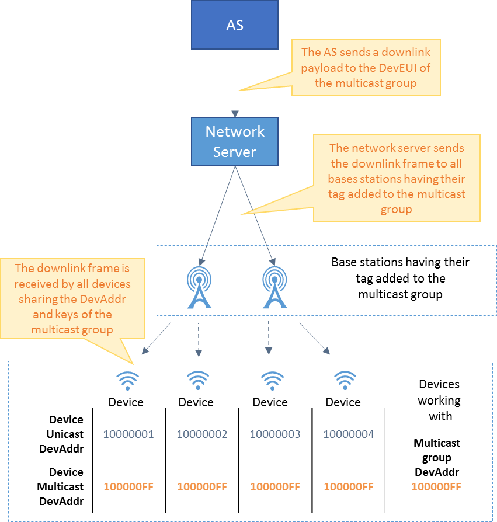

# Doing multicast

Multicast is only applicable to LoRaWAN® connectivity.

You must have read-write access to Device Manager to create a multicast
network of devices. If you have read-only access, this topic shows you
how to view your multicast network and get information about it. Read
more\... For more information, see [Opening a panel and checking your read-/write access](../use-interface.md#opening-a-panel-and-checking-your-read-write-access).

## About multicast

Unicast OTAA or ABP devices supporting multicast can receive
simultaneously the same downlink payload in a LoRaWAN® network if they:

- Share the same LoRaWAN® version, identifiers, keys, and class as the
  multicast group they will work with, whether they have been already
  created or not with their own LoRaWAN® version, identifiers and keys
  as unicast devices. For more information, see [Creating a multicast   group](create-multicast-group-associated-base-stations-group.md#creating-a-multicast-group).

- Are in the coverage of one or more base stations having their tag
  added to this multicast group. For more information, see [Adding a   base station tag to a multicast   group](create-multicast-group-associated-base-stations-group.md#adding-a-base-station-tag-to-a-multicast-group).

The multicast downlink is an unconfirmed data down message without MAC
commands. For more information, see [LRC-AS Tunnel Interface Developer Guide](https://docs.thingpark.com/thingpark-wireless/7.2/docs/user-guide-tpw/integrating-applications-with-tpw#lrc-as-tunnel-interface-developer-guide-for-cellular).

