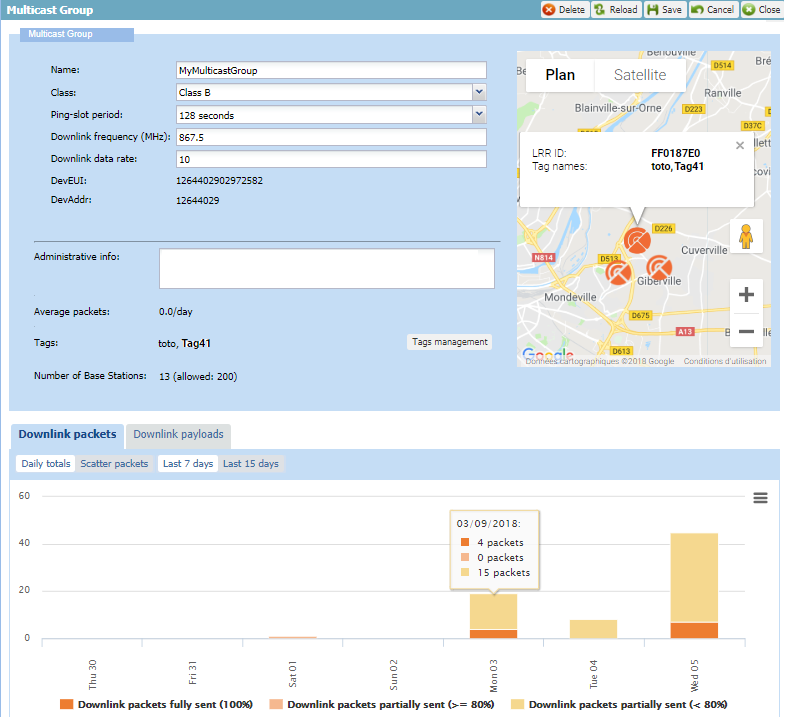
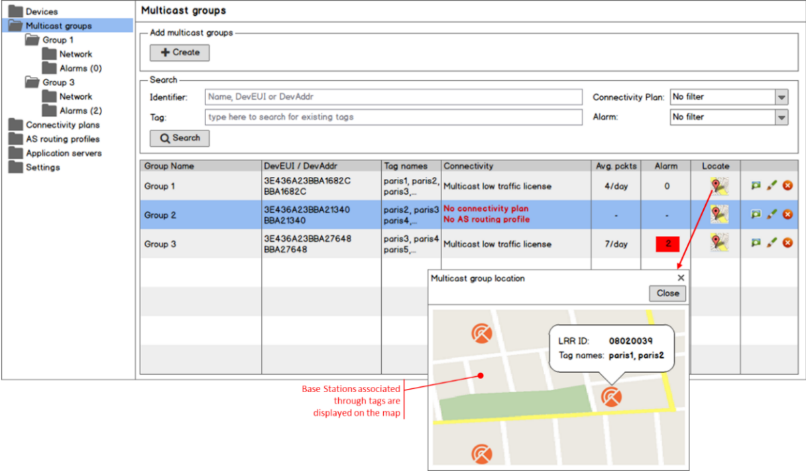
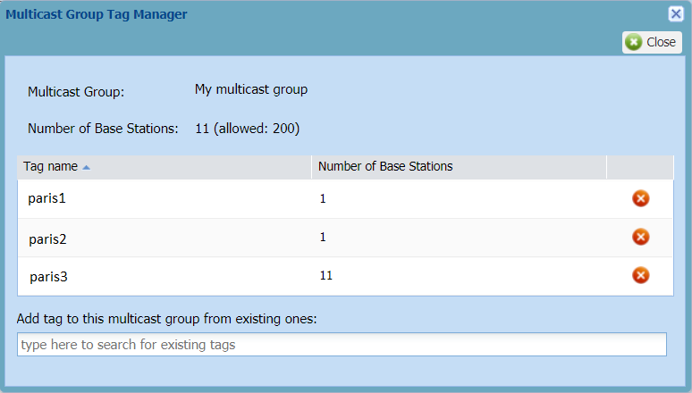
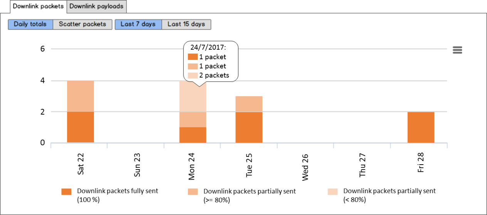
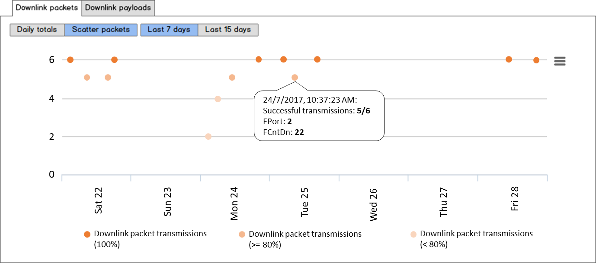
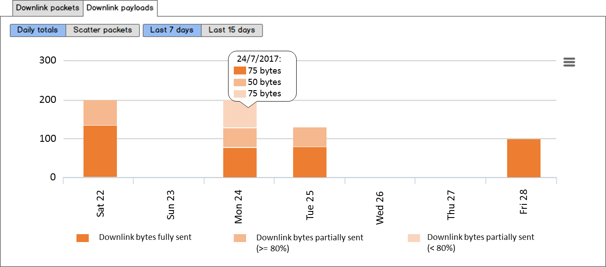

# Managing the general settings of a multicast group

## Viewing or editing the general settings of a multicast group

The multicast group general information is displayed in the Multicast
group frame of the Multicast group panel. You must have read-write
access to Device Manager if you want to edit a multicast group. Read
more\... For more information, see [Opening a panel and checking your
read-write
access](../../use-interface.md#opening-a-panel-and-checking-your-read-write-access).

 

1.  In the navigation panel, click **Multicast groups** to display the
    Multicast Groups panel.

2.  In the list displayed in the Search frame, select the multicast
    group you want to open, and click **View**  or **Edit** 
    -\> The multicast group opens in the Multicast group panel.

    

3.  For more information about editing the multicast group settings, see
    [Creating a multicast
    group](../create-multicast-group-associated-base-stations-group.md#creating-a-multicast-group).

## Viewing base stations associated with a multicast group

You can display on a map or a satellite view all the base stations
associated with a multicast group that have a known location.

It allows you to display:

- The LRR ID of a base station

- All its tags that identify the base station groups it belongs to.

There are two ways to do it:

- Either from the Multicast Group panel if the multicast group is open.
  For more information, see [Managing the general settings of a
  multicast group](#_Ref516768849).

- Or from the list of the Multicast Groups panel as shown in this task.

 

1.  In the navigation panel, click **Multicast groups**.

2.  In the multicast group list of the Search frame, click the map
    corresponding to the multicast group you want.

    -\> The Multicast group location window opens, showing the base
    station markers on the map.

    

3.  Click a base station marker to display the LRR ID of the base
    station and the tags it has.

4.  If you want to see the satellite view, click **Satellite**.

5.  Click **Close**.

## Viewing, managing and removing base station tags in a multicast group

If you have read only access to Device Manager, you can view the base
station tags associated with a multicast group.

If you have read-write access to Device Manager Read more\... For more
information, see [Opening a panel and checking your read-write
access](../../use-interface.md#opening-a-panel-and-checking-your-read-write-access),
you can manage base station tags in a multicast group by removing and
adding tags:

- Removing a base station tag from a multicast group reduces the number
  of base stations transmitting multicast downlinks in it, and thus the
  multicast group coverage area. If you remove a base station tag
  corresponding to an area where multicast devices are located, it will
  stop these devices to receive multicast downlinks.

- For adding tags, apply [Adding a base station tag to a multicast
  group](../create-multicast-group-associated-base-stations-group.md#adding-a-base-station-tag-to-a-multicast-group).

When the multicast group is open in view mode, the Multicast Group Tag
Manager information is read-only. This task shows you how to remove a
base station tag.

 

1.  In the navigation panel, click **Multicast groups**.

2.  In the Search frame of the Multicast Groups panel, select the
    multicast group you want to delete a base station tag, and click
    **Edit**.

3.  In the Tags area of the Multicast group that opens, click **Tags
    Management**.

    -\> The Multicast Group Tag Manager opens.

    

4.  In the tag list, select the tag you want to delete and click
    **Delete** 

    -\> In the Multicast Group Tag Manager:

    - The tag is removed from the tag list.

    - The number of base stations in the multicast group is updated.

5.  Click **Close**.

    -\> The base stations of the removed multicast group that have a
    known location are removed from the map of the Multicast Group
    panel.

## Checking the activity of a multicast group

You can monitor the activity of a multicast group on your network for a
given time by displaying charts showing statistics on the multicast
downlinks it manages. This information is read-only.

**Tips**

- Hovering your mouse over an item of the chart displays additional
  traffic information.

- Clicking an item of the caption makes it appear/disappear from the
  chart and adjust the scale.

For more information about charts, see [Monitoring packets and payloads
history of a LoRaWAN®
device](../../orphans/dmug-monitor-packets-payloads-history-lorawan-device)
and [Printing or downloading a
chart](../../Manage%20a%20device/check-device-settings-activity.md#printing-or-downloading-a-chart).

 

1.  In the navigation panel, click **Multicast groups**.

2.  In the Search frame of the Multicast Groups panel, select the
    multicast group you want to monitor, and click **View** or **Edit**.

3.  Scroll down the Multicast group panel to display the **Downlink
    packets** and the **Downlink payloads** tabs that you can switch to
    display:

    - The **Downlink packets** chart showing the daily totals multicast
      downlinks.
      

    - The **Downlink packets** chart showing the scatter packets of
      multicast downlinks.
      

    - The **Downlink payloads** chart showing the daily totals of
      multicast downlinks.
      

    - The **Downlink payloads** chart showing the scatter packets of
      multicast downlinks.
      

