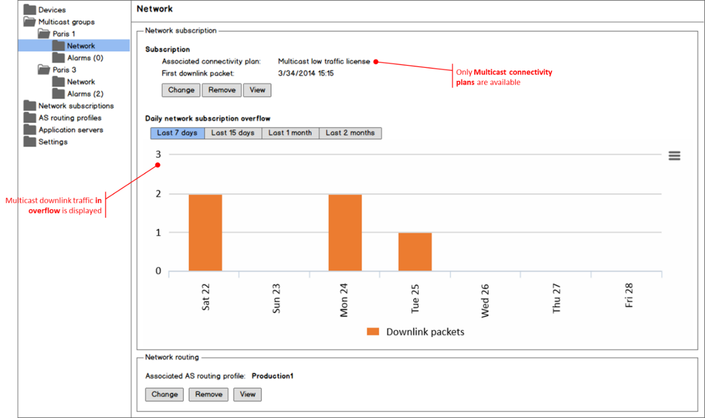

# Managing the network settings of a multicast group

The network settings of a multicast group are displayed in the Network
panel of the multicast group.

## Managing the network subscription of a multicast group

### Managing the connectivity plan of a multicast group

In the Network panel of a multicast group, you can get information about
the current network subscription of the multicast group that is a
LoRaWAN® multicast connectivity plan:

- If the multicast connectivity plan is already associated, you can also
  **View** it.

- If you have read-write access Read more\... For more information, see
  [Opening a panel and checking your read-write
  access](../../use-interface.md#opening-a-panel-and-checking-your-read-write-access),
  you can also **Change** or **Remove** it, or **Allocate** it if no
  connectivity plan is associated.

For more information, see [LoRaWAN® multicast connectivity plan
details](../../reference-information.md#lorawan®-multicast-connectivity-plan-details).

 

1.  In the navigation panel, click **Multicast groups**.

2.  In the list displayed in the Search frame of the Multicast Groups
    panel, select the multicast group you want to open, and click
    **View** or **Edit** if you have read-write access.

    -\> The multicast group appears in the navigation panel.

3.  In the multicast group displayed in the navigation panel, click
    **Network**.

    -\> The multicast group appears in the navigation panel.

For more information, see [Managing a
device](../../manage-a-device/index) that works similarly.

 

### Checking the overflow activity of a multicast group

In the Network panel of a multicast group, you can monitor the multicast
group's overflow activity compared with the conditions of the allocated
LoRaWAN® multicast connectivity plan. The information is read-only for
all end-users.

 

1.  In the navigation panel, click **Multicast groups**.

2.  In the list displayed in the Search frame of the Multicast Groups
    panel, select the multicast group you want to open, and click
    **View** or **Edit**.

    -\> The multicast group appears in the navigation panel.

3.  In the multicast group displayed in the navigation panel, click
    **Network**.

    -\> The Network panel of the multicast group opens.

    

4.  For more information, see [Managing the device
    network](../../manage-device-network/index) that works similarly.

## Managing the AS routing profile of a multicast group

In the Network panel of a multicast group, you can get information about
the current AS routing profile associated with the multicast group:

- If the AS routing profile is already associated, you can also **View**
  it.

- If you have read-write access Read more\... For more information, see
  [Opening a panel and checking your read-write
  access](../../use-interface.md#opening-a-panel-and-checking-your-read-write-access),
  you can also **Change** or **Remove** it, or **Allocate** it if no AS
  routing profile is associated.

For more information, see [Managing AS routing
profiles](../../manage-as-routing-profiles/index) that works
similarly.
