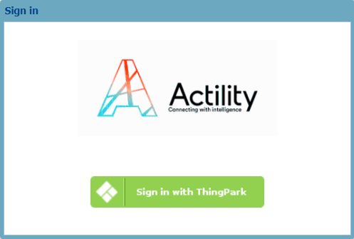
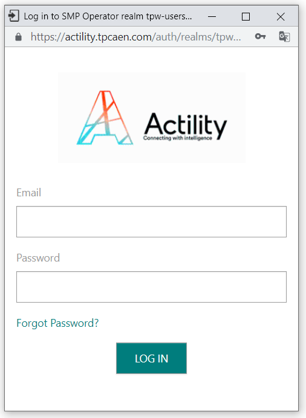

# Log in troubleshooting

## Your account is locked - Asking to unlock your account

If you cannot log in Device Manager after three password attempts, your
account is locked. You can log in again without the need of changing
password by asking your account to be unlocked.

1.  Contact the vendor to unlock your account.

2.  When done, log in Device Manager with your usual password. For more
    information, see [Usual logging in](usual-logging-in.md).

## You have lost your password - Asking a password reset or self-resetting password

If you have forgotten either the password you were given to log in
Device Manager for the first time (initial password) or a password you
have created, you must create a new password by either of the following
ways:

- Asking to reset a password. To do this, contact your vendor. You will
  receive an email with a new URL to click allowing you to create a new
  password.

- Resetting a password by yourself. To do this, apply the steps below.

 

1.  In your Internet browser, launch the following URL with the domain
    name of your operator: `https://operatordomain/devicemanager`.

2.  In the Welcome to ThingPark® window that opens, click **Sign in with
    ThingPark**.

    
    

3.  In the login window that opens, click **Forgot Password?**.

    

4.  Apply the guidelines that appear on screen.
