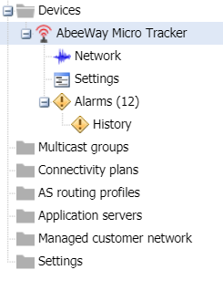

# Acknowledging alarms

When you have dealt with an alarm, you can acknowledge it in the Active
alarms panel opened in edit mode. You can also acknowledge an alarm
whenever you consider it as being not important and you do not want to
see it in the default display of alarms.

You can acknowledge an alarm, a set of alarms or all alarms.

When acknowledged:

- If the **Acked** filter is set to **No filter** or **Acknowledged,**
  the alarm will appear as checked in the Active Alarms and the Alarms
  history panels of the device.

- If the alarm state increases to a higher severity level, the
  acknowledgement is automatically canceled.

**Before you begin** You must have read-write access to Device Manager.
Read more\... For more information, see [Opening a panel and checking
your read-write
access](../use-interface.md#opening-a-panel-and-checking-your-read-write-access).

 

1.  In the navigation panel, click **Devices** to display the Devices
    panel, then click the **List** tab.

2.  In the Device list, click **Edit** on the device you want to
    acknowledge an alarm.

3.  In the navigation panel, click **Alarms** to open the Active alarms
    panel of the device.

    

4.  In the Active alarms panel that opens, click in the Active alarms
    frame the alarm you want to acknowledge.

5.  Click **Ack**. You can use the **Ctrl** Key to select a set of
    alarms.

6.  To acknowledge all alarms, click **Ack all**.

7.  If a message is displayed, click **Yes** to confirm.

    -\> If the Search frame, if the **Acked** filter is set to **No
    filter** or **Acknowledged**, a check mark and who acknowledged it
    and when are displayed on the alarm.

    

