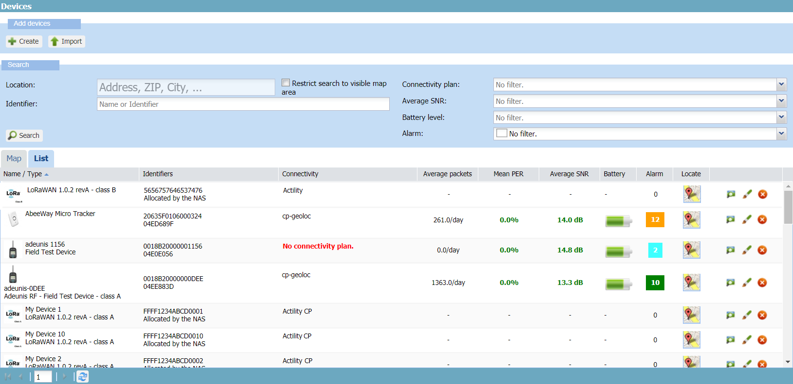
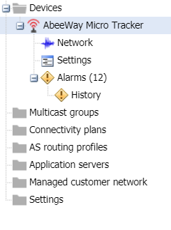
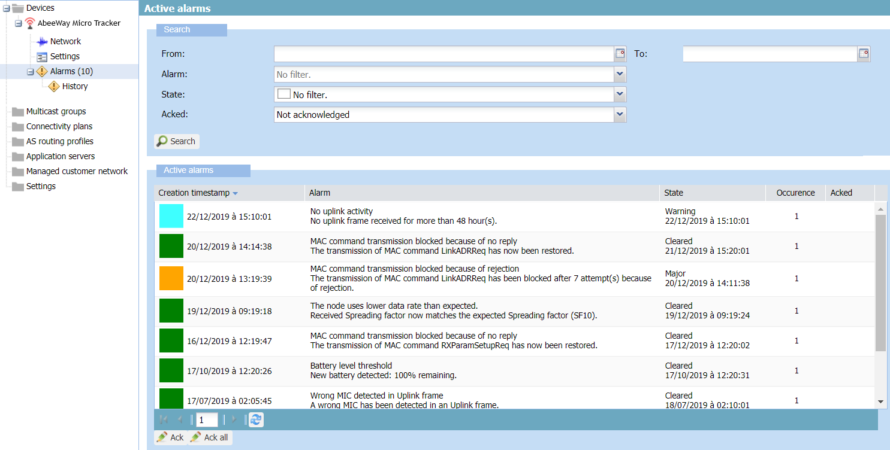
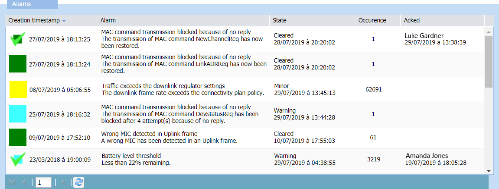
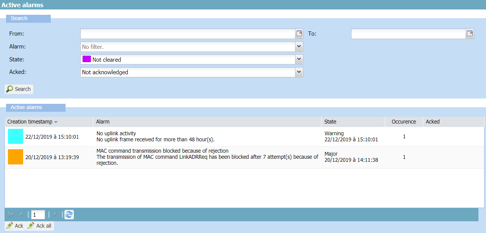
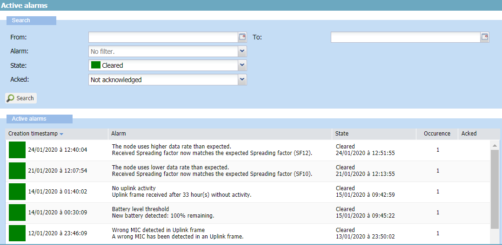
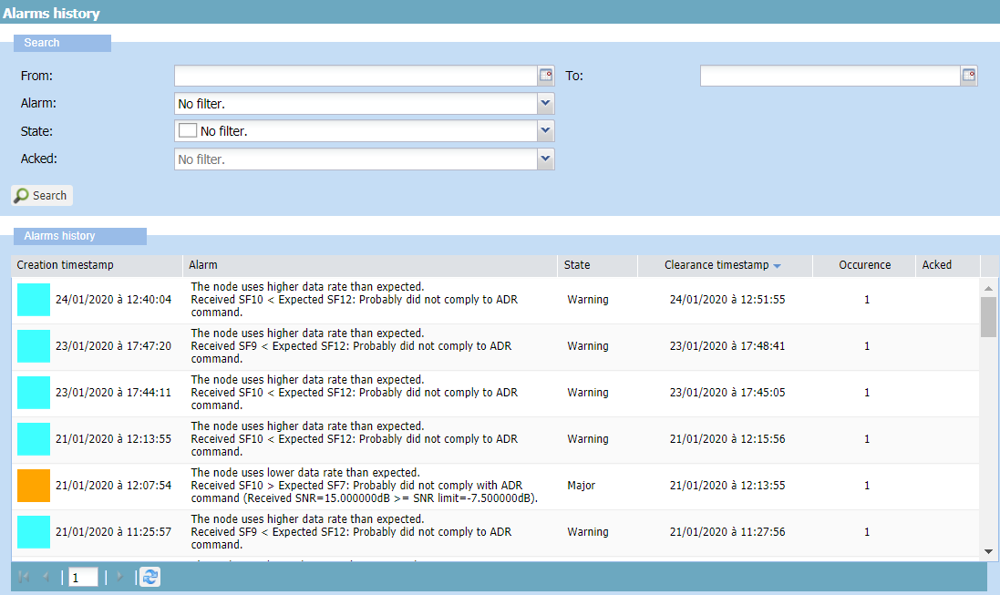
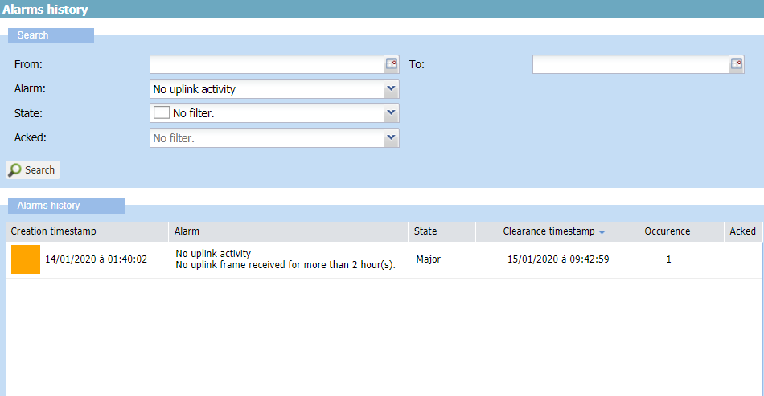
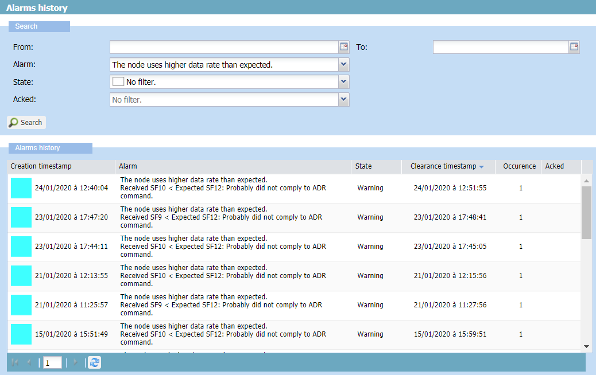
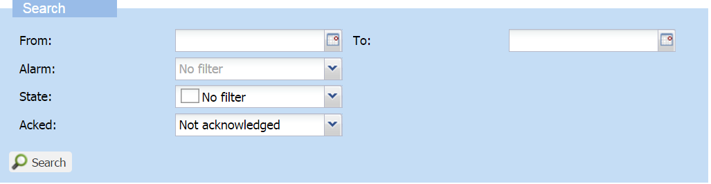

# Monitoring alarms

To monitor your fleet of devices, you can:

- View all not acknowledged alarms of your fleet of devices

- View all alarms of a device you want to check

- Filter active, cleared and acknowledged alarms

- Get the information returned by an active and a cleared alarm

- Check if a cleared alarm has already been triggered during the last
  fifteen days

- Get the last status with the associated information before clearance

- Check that an alarm you have troubleshot is cleared

- Detect a situation where the device is instable.

The following tasks give an example of scenario to deal with the alarms
of your devices.

By default, the display of alarms is set to show not acknowledged
alarms, except in the Alarm history panel of the device.

## Viewing not acknowledged alarms of your network

You can have a global view of all the not acknowledged alarms of your
fleet of devices in the Devices panel. The alarms can be active or
cleared. It allows you to detect devices to investigate.

If you prefer being notified when alarms are triggered and change states
on your device fleet, see [Setting alarm notification
emails](../device-manager-settings.md#setting-alarm-notification-emails).

 

1.  In the navigation panel, click **Devices**.

2.  In the Devices panel, click the **List** tab.

    -\> In the Alarm column, a color displays the number of alarms that
    have not been acknowledged, whether active or cleared, with the
    highest state of them. Green is for cleared alarm, that is
    considered as a final state. For more information about alarm
    states, see [Alarm states](index.md#alarm-states).

    

## Filtering devices with greatest number of not acknowledged alarms

This task shows you how to filter devices with greatest number of not
acknowledged alarms in the Devices panel. It allows you to prioritize
devices to investigate.

You can optionally use the **Not cleared** filter to restrict your
search to active and not acknowledged alarms. For more information about
alarms filters, see [More about searching
alarms](#more-about-searching-alarms).

 

1.  In the navigation panel, click **Devices**.

2.  In the Devices panel, click the **List** tab.

3.  In the **List** tab, click **Sort Descending** in the Alarm column.

    -\> All devices with greatest number of not acknowledged alarms of
    your fleet of devices are displayed. Devices with greatest number of
    devices are displayed first. **Note** The sorting only applies to
    the current page of the list.

4.  If necessary, scroll down the page to see more devices. If
    available, click **Next page** and click **Sort Descending** again
    in the Alarm column.

5.  (Optional) In the **Search** frame, select **Not cleared** from the
    Alarm list.

    -\> All devices with active and not acknowledged alarms are
    displayed.

## Viewing not acknowledged alarms of a device with their current status

When you have detected in the Devices panel a device having issues, you
can view all its not acknowledged alarms, whether active or cleared,
with information on their current status in the Active alarms panel of
the device.

It quickly gives you the current state of the device to start
investigating.

**Notes**

- The current status of a cleared alarm appears in the Active alarm
  panel. For more information, see [Viewing current status of cleared
  alarms of a
  device](#viewing-current-status-of-cleared-alarms-of-a-device).

- By default, the Active alarm panel is set to filter not acknowledged
  alarms. If you want to see all alarms of the device, see [More about
  searching alarms](#more-about-searching-alarms).

 

1.  In the navigation panel, click **Devices**.

2.  In the Devices panel, click the **List** tab.

3.  In the device list, select a device, and click **View**, or **Edit**
    if you have read-write access.

    -\> In the navigation panel, the device appears displaying its
    number of alarms that have not been acknowledged, whether active or
    cleared. This is the same number as the one displayed with a state
    color in the Alarm column of the device list. For more information,
    see [Viewing not acknowledged alarms of your
    network](#viewing-not-acknowledged-alarms-of-your-network).

    

4.  In the navigation panel, click **Alarms**.

    -\> The Active alarms panel opens displaying active and cleared
    alarms, all being not acknowledged.

    

-\> The Active alarms frame displays:

- Only one row per alarm because it keeps updating according to state
  changes, except for alarms 012 and 013 related to MAC command
  transmission that display separated rows. Latest created alarms are
  displayed first.

- Cleared alarms appear in green. All other alarms are active.

- It gives the following information:

| Column | Description |
| -- | -- |
| **Color** | Indicates the state of the alarm. If the alarm is not cleared, the color gives the severity state of the alarm. For more information, see [Alarm states](index.md#alarm-states). |
| **Creation timestamps** | Creation timestamp of the alarm. |
| **Alarm** | Alarm name. Information, values or conditions that have triggered or cleared the alarm. Can be used for troubleshooting the device. |
| **State** | Latest state of the alarm with timestamp update. For more information, see [Alarm states](index.md#alarm-states). |
| **Occurrence** | Incremented each time an event-driven alarm is triggered once again. Always set to 1 for state-driven alarms. For more information, see [Alarm occurrence management](index.md#alarm-occurrence-management). | 
| **Acked** | If the alarm has been acknowledged, who did it and when. This column is empty with the default **Not acknowledged** filter setting.|

1.  (Optional) If you want to see if any alarms have been acknowledged,
    select **No Filter** or **Acknowledged** from the **Acked** list,
    then click **Search**.

    -\> A check mark and who acknowledged it and when are displayed on
    acknowledged alarms.

    - 
      

## Dealing with active alarms of a device

This task shows you how to filter active alarms of a device, then how to
deal with them.

Active alarms are alarms that are not cleared, regardless of their
acknowledgment status and severity state. You can search them in the
Active alarms panel of the device. By default, this panel is set to
filter not acknowledged alarms.

 

1.  In the navigation panel, click **Devices**.

2.  In the Devices panel, click the **List** tab.

3.  In the device list, select a device, and click **View**, or **Edit**
    if you have read-write access.

4.  In the navigation panel, click **Alarms** to open the Active alarms
    panel of the device.

5.  In the Search frame, select **Not cleared** from the **State** list,
    and click **Search**.

    

6.  In the **State** column, click **Sort Descending** to display first
    the highest states of alarms.

7.  Deal with the alarms starting from the highest to the lowest state
    of them:

    1.  Get the alarm name and associated information.

    2.  Follow the corresponding guidelines in [Troubleshooting
        devices](troubleshoot-devices).

    3.  If you consider the alarm as being not important and do not want
        to see it anymore in the default display, click **Ack**. For
        more information, see [Acknowledging
        alarms](acknowledge-alarms).

8.  Repeat until all active alarms disappear.

## Viewing current status of cleared alarms of a device

After you have troubleshot all the active alarms, you can check that
they appear as cleared in the Active alarm panel of the device. You can
also filter cleared alarms whenever you want.

**Notes**

- The current status of a cleared alarm appears in the Active alarm
  panel.

- Its status before clearance appears in the Alarm history panel. For
  more information, see [Investigating a cleared alarm in the alarms
  history of the
  device](#investigating-a-cleared-alarm-in-the-alarms-history-of-the-device).

 

1.  In the navigation panel, click **Devices**.

2.  In the Devices panel, click the **List** tab.

3.  In the device list, select a device, and click **View**, or **Edit**
    if you have read-write access.

4.  In the navigation panel, click **Alarms** to open the Active alarms
    panel of the device.

5.  In the Search frame, select **Cleared** from the **State** list to
    filter cleared alarms, and click **Search**.

    -\> The Active alarm frame shows the cleared alarms of the device at
    the time they have been cleared. Clearance timestamp is displayed in
    the State column. Clearing conditions are displayed in the Alarm
    column.

    -\> Latest created alarms are displayed first.

    

6.  Do one of the following:

    - If you want to know more about the alarm, see [Investigating a
      cleared alarm in the alarms history of the
      device](#investigating-a-cleared-alarm-in-the-alarms-history-of-the-device).

    - If you consider the alarm as being not important and do not want
      to see it anymore in the default display, click it, and click
      **Ack**. For more information, see [Acknowledging
      alarms](acknowledge-alarms).

## Investigating a cleared alarm in the alarms history of the device

If you want to know more about a cleared alarm, you can investigate its
last status before clearance in the Alarm history panel of the device.
It gives you the last level of severity the alarm had before clearance
with the information that triggered it. For more information about alarm
states, see [Alarm states](index.md#alarm-states).

The Alarm history panel displays the last status before clearance of
alarms that have been cleared during the past 15 days regarding the
device. By default, this panel is set with no filter.

**Notes**

- The current status of a cleared alarm appears in the Active alarm
  panel. For more information, see [Viewing current status of cleared
  alarms of a
  device](#viewing-current-status-of-cleared-alarms-of-a-device).

- Its status before clearance appears in the Alarm history panel.

This task makes you go from the Active alarm panel to the Alarm history
panel of the device. It also shows you how to detect an instable
situation of the device where an alarm keeps triggering and clearing.

 

1.  In the navigation panel, click **Devices**.

2.  In the Devices panel, click the **List** tab.

3.  In the device list, select a device, and click **View**, or **Edit**
    if you have read-write access.

4.  In the navigation panel, click **Alarms** to open the Active alarms
    panel of the device.

5.  In the Search frame, select **Cleared** from the **State** list and
    click **Search** to filter cleared alarms.

6.  In the Active alarms panel, take note of the alarm name, clearance
    and creation timestamps of the cleared alarm you want to
    investigate, and click **History** in the navigation panel.

    -\> The Alarms history panel opens with a Search frame set by
    default with no filter. For more information, see [More about
    searching alarms](#more-about-searching-alarms).

    

    -\> In the Alarms history frame:

    - Each row represents an alarm that have been cleared. It shows the
      status it had before clearance. Only the last status per alarm is
      shown.

    - If a same alarm has been cleared several times, several rows per
      alarm are displayed.

    - Latest cleared alarms are displayed first.

7.  In the Search frame of the Alarms history frame, select from the
    **Alarm** list the name of the cleared alarm you want to
    investigate, and click **Search**.

    -\> The last status before clearance of this alarm appears. The
    information to check is:

    | Column                   | Description                                                                                                                                                              |
    |--------------------------|--------------------------------------------------------------------------------------------------------------------------------------------------------------------------|
    | **Clearance timestamps** | Date and time when the state has changed and the alarm has been cleared                                                                                                  |
    | **Creation timestamps**  | To deduce the time duration of the alarm.                                                                                                                                |
    | **Alarm**                | The information associated with the issue that triggered the alarm or changed its state.                                                                                 |
    | **State**                | The last state before clearance with its severity level. For more information, see [Alarm states](index.md#alarm-states).                                                |
    | **Occurrence**           | Relevant if more than one occurrences. Only apply to state-driven alarms. For more information, see [Alarm occurrence management](index.md#alarm-occurrence-management). |
    | **Acked**                | Indicates if the alarm has been acknowledged before clearance by who and when. **No Filter** or **Acknowledged** filters must be set.                                    |

8.  If only one state before clearance is displayed for the alarm:

    1.  The issue has happened only once during the last 15 days. It is
        ended.

        
        

    2.  (Optional) If you consider the alarm as being not important and
        do not want to see it anymore in the default display, click
        **Alarms** in the navigation panel to enter the Active alarm
        panel. Select the alarm name from the **Alarm** list, click
        **Search**, then click the alarm, and click **Ack**. For more
        information, see [Acknowledging alarms](acknowledge-alarms).

9.  Repeat steps 6 and 7 to investigate another cleared alarm.
    -\> If more than one state before clearance are displayed for the
    alarm, it means that the alarm keeps triggering and clearing. The
    device is instable.
    
    1.  Get the information returned by the alarm, in particular the
        creation and clearance timestamps to estimate the time frequency
        at which the alarm has been triggered and cleared.

    2.  Follow the guidelines corresponding to the alarm in
        [Troubleshooting devices](troubleshoot-devices).

    3.  (Optional) If you want to acknowledge the alarm, repeat step
        8.b.

10. Repeat steps 6 and 7 to investigate another cleared alarm.

    1.  In the Alarm list of the Search frame, select another alarm to
        investigate, and click **Search**.

        -\> If no state appears, it means that the alarm has been
        cleared for more than 15 days and no information is available.

    2.  (Optional) If you want to acknowledge the alarm, repeat step
        8.b.

## More about searching alarms

In the Active alarms panel and the Alarms history panel, the Search
frames allow to filter alarms to be able to deal with them with the
right priority level.

 

1.  In the navigation panel, click **Devices** to display the Devices
    panel, then click the **List** tab.

2.  In the device list, select a device, and click **View**, or **Edit**
    if you have read-write access, to open the Device panel.

3.  In the navigation panel, do one of the following:

    - Click **Alarms** to open the Active alarms panel, and view the
      current status of active and cleared alarms of the device.

    - Click **History** to open the Alarms history panel, and view the
      last status before clearance of all the alarms of the device that
      have been cleared during the past 15 days.

4.  Restrict your search using the following filters as you want.
    
    - **From** and **To**: Click the calendar to select a date or enter
      an ISO 8601 timestamp format. Example: 2020-01-20T14:16:20+01:00.
      These filters can be used independently.

      - **From**: Returns alarms created after the date and time you
        have entered.

      - **To**:

        - **In the Active alarms panel**: Returns alarms created,
          updated and cleared before the date and time you have entered.

        - **In the Alarms history panel**: Only returns alarms cleared
          before the date and time you have entered.

    - **Alarm**: Returns alarms according to the alarm name you have
      selected. For more information, see [Alarms list with
      troubleshooting
      guidelines](troubleshoot-devices.md#alarms-list-with-troubleshooting-guidelines).

    - **State**: Returns alarms with the following states:

      | Filter                   | Returned alarm states                                                  |
      |--------------------------|------------------------------------------------------------------------|
      | **Critical** (Red)       | Critical                                                               |
      | **Major** (Orange)       | Major, and critical                                                    |
      | **Minor** (Yellow)       | Minor, major, and critical                                             |
      | **Warning** (Blue)       | Warning, minor, major, critical                                        |
      | **Not cleared** (Purple) | Indeterminate, warning, minor, major, and critical (all active alarms) |
      | **Cleared** (Green)      | Cleared                                                                |

      For more information about associated alarm states, see [Alarm
      states](index.md#alarm-states).

      - **Acked**: Acknowledged alarms or not. By default, this filter
        is set to:

        - **Not acknowledged** in the Active alarms panel

        - **No filter** in the Alarms history panel.

5.  Click **Search**.
