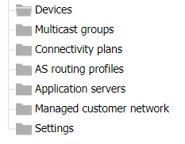

# Accessing AS routing profiles

The AS Routing Profiles panel displays LoRaWAN® and cellular AS routing
profiles that can be created, edited and deleted by the read-write
access end-users of Device Manager. Read-only access end-users only can
open AS routing profiles in view mode to check their parameters.

The panel also displays the default AS routing profiles. For more
information, see [Changing the default AS routing
profile](change-default-as-routing-profile)

 

1.  In the navigation panel, click **AS routing profiles** to open the
    AS routing profiles panel:

1.  The AS routing profiles panel lists the LoRaWAN® and cellular AS
    routing profiles available, if any already created, that you can
    **View**. If you are a read-write access end-user, you can also
    **Edit** or **Delete** them.

