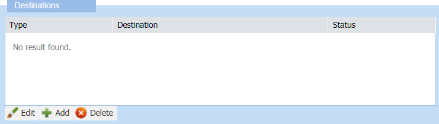
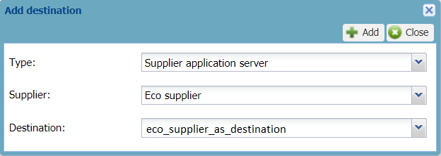
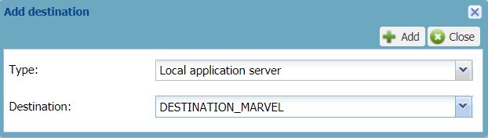

# Adding a destination to a LoRaWAN® AS routing profile

Once created, the LoRaWAN® AS routing profile requires one or more
destinations that are the following application servers:

- **ThingPark X destinations**

- **Supplier application servers**: LoRaWAN® HTTP application servers or
  Kafka clusters

- **Local applications servers**: LoRaWAN® HTTP application servers or
  Kafka clusters

For more information, see [AS routing profiles and application servers
mapping](index#as-routing-profiles-and-application-servers-mapping).

**Important** The maximum number of destinations, summing up all types
of application servers you can add in a LoRaWAN® AS routing profile, is
defined in the connectivity plan associated with the device. For more
information, see the Maximum allowed Application
Servers parameter in [LoRaWAN® unicast connectivity plan
details](../../../../Device%20Manager%20User%20Guide/reference-information.md#lorawan®-unicast-connectivity-plan-details).

If you want to use a local application server, it must have a route and
be active to work properly. For more information, see [Adding a route to
a local application
server](../manage-local-application-servers/add-route-to-local-application-server.md)
and [Deactivating a local application
server](../manage-local-application-servers/deactivate-local-application-server.md).
When added to the AS routing profile, a destination displays its status.

**Before you begin**

- You must have read-write access to Device Manager. Read more\... For
  more information, see [Opening a panel and checking your read-write
  access](../use-interface.md#opening-a-panel-and-checking-your-read-write-access).

- The LoRaWAN® AS routing profile must be opened in edit mode.

 

1.  In the Destinations frame of the AS routing profile panel, click
    **Add**.

    

2.  In the Add destination dialog box that appears, do one of the
    following:

    - If required by your operator to use a ThingPark X destination:

      

      1.  In the **Type** list: select **ThingPark X**.

      2.  In the **Destination** list: select the ThingPark X
          destination your operator gave you. If \<No cloud configured\> is
          displayed, contact your operator.

    - If you want to use a shared application server defined at supplier
      level:
      
      1.  In the **Type** list: select **Supplier application server**.

      2.  In the **Supplier** list: select the shared supplier you want
          to use the application server.

    - If you want to use an HTTP application server or a Kafka cluster
      you have created earlier:
      

      1.  In the **Type** list: select **Local application server**.

      2.  In the **Destination** list: select the HTTP application
          server or the Kafka cluster you want to use as a destination
          for the AS routing profile.

      3.  In the **Destination** list: select the supplier application
          server destination. It can be a LoRaWAN® HTTP application
          server or a Kafka cluster created by the shared supplier. If is displayed,
          contact your operator.

3.  Click **Add**.

    -\> The application server appears in the Destinations frame
    displaying its status.

4.  If you want to add another destination, click **Add**, and repeat
    from step 2.  
    Repeat as necessary. **Note** If you add more destinations that the
    number allowed in the connectivity plan you want to associate with
    the device, you will not be able to create or edit the device using
    this AS routing profile.

5.  Click **Save** in the AS routing profile panel.

    -\> The Status frame is updated with your last modifications.

    -\> The LoRaWAN® AS routing profile is ready to be allocated to a
    LoRaWAN® device:

    - Either when creating the device.

      For more information, see [Creating
      devices](../create-devices/index.md).

    - Or after you have created the device.

      For more information, see [Managing the AS routing profile of a
      device](../manage-device-network/manage-as-routing-profile-device.md)
      or [Changing the AS routing
      profile](../manage-device-network/manage-as-routing-profile-device.md#changing-the-as-routing-profile).
