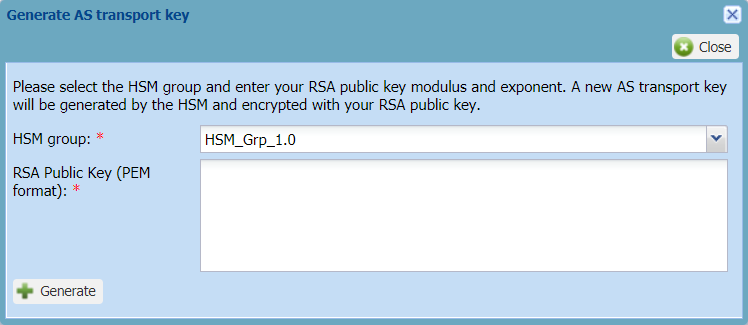

# Configuring a LoRaWAN® AS routing profile for HSM

This task consists in activating a Hardware Security Module (HSM) on an
AS routing profile you will associate with an OTAA device you want a
hardware protection of the device's root keys. For more information, see
[Creating an OTAA device](../create-devices/create-lorawan-device.md#creating-an-otaa-device).

It generates the AS transport key used by the application server to
decrypt the AppSKey, then the device payload. You will use an RSA key to
generate the AS transport key.

**Important** ThingPark does not know your AS transport key. If you lose
it, you will have to generate a new one and all devices associated with
this AS routing profile will have to restart a join procedure.

You must have read-write access to Device Manager Read more\... For more
information, see [Opening a panel and checking your read-write access](../use-interface.md#opening-a-panel-and-checking-your-read-write-access),
an HSM installed on your operator platform and a connectivity plan with
the **Hardware Security Module (HSM) protection** parameter set. For
more information, see [LoRaWAN® unicast connectivity plan details](../../device-manager-user-guide/reference-information.md#lorawan-unicast-connectivity-plan-details).

&nbsp;

1.  In the navigation panel, click **AS routing profiles**.

    -\&gt; The AS routing profile panel opens.

2.  In the AS routing profile frame, click the AS routing profile you
    want to activate the HSM, and click **Edit**.

    -\&gt; The Hardware Security Module (HSM) frame appears in the AS
    routing profile if you have a connectivity plan enabled for HSM.

    

3.  In the Hardware Security Module (HSM) frame, click **Activate**. If
    a message appears, click **Yes**.

    -\&gt; The Generate AS transport key dialog box appears.
    
    

4.  Using for instance an OpenSSL command in a shell terminal:

    1.  Generate an RSA key using the following command:

        ``` text
        openssl genrsa -out rsa.private 1024
        ```

    2.  Extract the RSA public key using the following command:

        ``` text
        openssl rsa -in rsa.private -pubout > rsa.public
        ```

        Here is an example of RSA public key:

        ``` text
        -----BEGIN PUBLIC KEY-----MIGfMA0GCSqGSIb3DQEBAQUAA4GNADCBiQKBgQDuT5R7jWa0T4N9gwpRPNQxH62VuLYwW4qVb03DV28i0vhflIj2oERy2ahK9EawbojdY5ZOSjzeCoa8pfSgXbRNFBFdm/2xABEcI6X70iyW2g8qRZDeUA0AkGOAfqd+X52bWMgBK3TpwAVFlao6rqw3w9oWLOlVuiUsnwY/GJ2vDwIDAQAB-----END PUBLIC KEY-----&nbsp;
        ```

5.  In the Generate AS transport key dialog box, copy the content of
    your RSA public key in the **RSA Public Key (PEM format**) box.

6.  Click **Generate**.

    -\&gt; The **Encrypted AS transport key (hexadecimal string)** box
    appears containing your encrypted AS transport key.

7.  Click **Copy**.

8.  Paste your encrypted AS transport key in a text file you can name
    for instance:` encrypted_astk.txt`

9.  In the shell terminal:

    1.  Convert the encrypted AS transport key to binary using the
        following command:

        ``` text
        xxd -r -p encrypted_astk.txt encrypted_astk.bin
        ```

    2.  Decrypt the AS transport key using the RSA private key and the
        following command:

        ``` text
        openssl rsautl –decrypt -inkey rsa.private -in encrypted_astk.bin -out astk.txt
        ```

        -\&gt; The generated astk.txt file contains your AS transport key
        in hexadecimal format.

10. Click **Close**.

    -\&gt; Now the AS routing profile has been activated for HSM, you can
    associate it with an OTAA device that uses **Local Joint server with
    HSM protection**:

    - Either when creating the device.  
      For more information, see [Creating an OTAA       device](../create-devices/create-lorawan-device.md#creating-an-otaa-device).

    - Or by editing it using [Allocating an AS routing       profile](../manage-device-network/manage-as-routing-profile-device.md#allocating-an-as-routing-profile).

    -\&gt; Your AS transport key in hexadecimal format is ready to be given
    to the owner of the application server to be configured on it.
