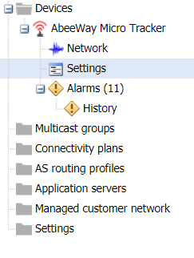
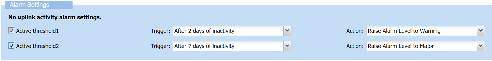

# Configuring alarms

## Configuring an inactivity alarm

An inactivity alarm is defined by the no-uplink activity of the device.
This alarm applies to LoRaWAN®, cellular message mode, cellular direct
IP mode, and cellular mixed mode.

You can define only one inactivity alarm by device, but you can define
one or two thresholds to trigger the alarm. For example, triggering the
alarm after two days of inactivity, and triggering the alarm again after
five days of inactivity. For cellular mixed mode, the alarm is triggered
when both no message mode traffic and no direct IP mode traffic have
been received since the configurable period.

You can configure the inactivity alarm in the Node Settings panel of the
device you want.

**Prerequisite**You must have read-write access to Device Manager. Read
more\... For more information, see [Opening a panel and checking your read-write access](../use-interface.md#opening-a-panel-and-checking-your-read-write-access).

 

1.  In the navigation panel, click **Devices** to display the Devices
    panel, then click the **List** or the **Map** tab.

2.  Select a device and click **Edit**.

3.  In the device that appears in the navigation panel, click
    **Settings** to open the Node settings panel.

    

4.  In the Alarm settings frame, select **Active threshold1**.
    

    1.  From the **Trigger** list, select the duration of inactivity
        (from 1 hour to 15 days) after which you want the alarm to be
        triggered.  
        Set this duration according to the usage of your device.

    2.  From the **Action** list, select a severity level you want to
        associate to the threshold1.

        Each severity level corresponds to an alarm state and a color to
        display to help you monitor the alarms in the Alarms frame.

        | Alarm state                | Definition                                                                                           |
        |----------------------------|------------------------------------------------------------------------------------------------------|
        | **Critical** (Red)         | The service is affected, and an immediate corrective action is required.                             |
        | **Major** (Orange)         | The service is partly affected, and an urgent action is required.                                    |
        | **Minor** (Yellow)         | A fault that does not affect the service should be corrected to prevent a more serious problem.      |
        | **Warning** (Blue)         | A potential or impending fault affecting the service should be diagnosed and corrected if necessary. |
        | **Indeterminate** (Purple) | The severity cannot be determined.                                                                   |
        | **Cleared** (Green)        | The alarm has satisfied the clearing conditions and has been cleared by the system.                  |

5.  (Optional) If you want to create another threshold for the alarm,
    select **Active threshold2** and repeat step 4.

6.  Click **Save**.

    -\> The alarm will be displayed in the Active alarms panel of the
    device when the conditions are satisfied.

## Receiving alarm notification email

If you want to receive a notification email when an alarm is triggered
on any device, see [Setting alarm notification emails](../device-manager-settings.md#setting-alarm-notification-emails).
