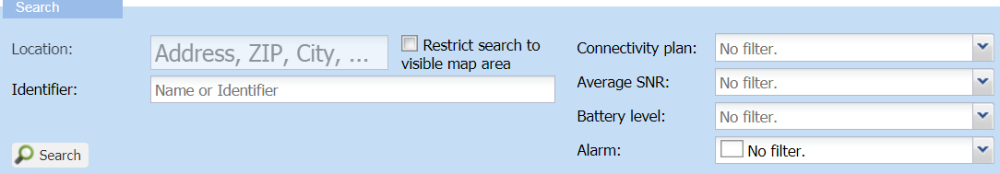
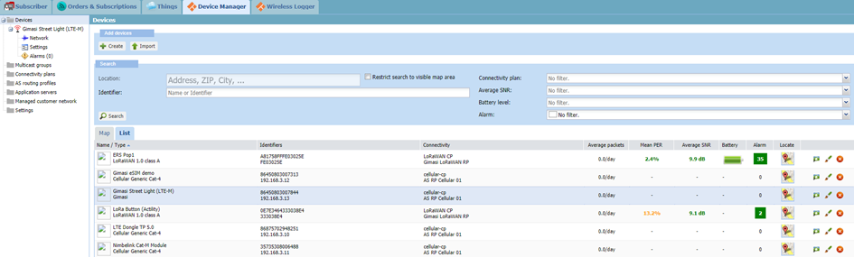
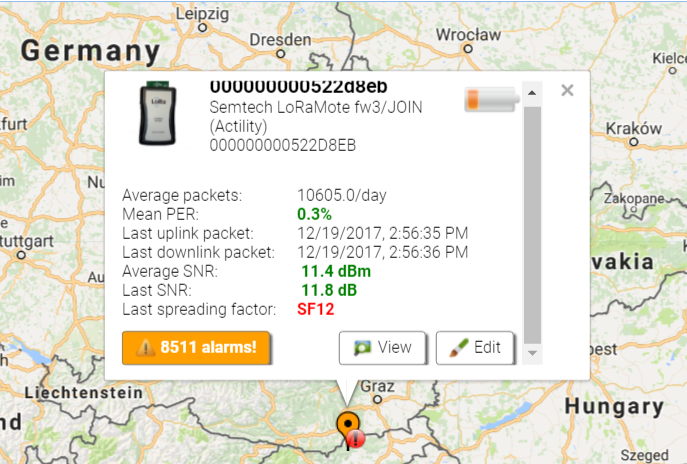

# Managing a fleet of devices

The Devices panel is displayed by default when entering Device Manager.
It gives an overview of all the LoRaWAN® and cellular devices of your
subscriber account, if any already created by you or other end-users of
your subscriber account.

It is available in read-write access and read-only access. Read more\...
For more information, see [Opening a panel and checking your read-/write access](use-interface.md#opening-a-panel-and-checking-your-read-write-access).

## Searching devices

The Search frame located in the Devices panel proposes three ways to
search LoRaWAN® and cellular devices.

 

1.  Restrict your search using the filters you want:

    

- **Location**: Entering a specific location in this field zooms in the
  desired location on the map.

- **Identifier**: It is case sensitive, and lets you search for a
  specific device by entering either the:

  - Name

  - **EUI** for LoRaWAN® devices

  - **IMEI** for cellular devices.

- The other filters below display devices matching any of the following
  criteria.

  - **Restrict search to visible map area**: Only filters devices that
    are displayed in the Map view. This check box is only available if
    the **List** tab is active.

  - **Connectivity plan**

  - **Average SNR**

  - **Battery level**

  - **Alarm**: alarm state displayed with a color and corresponding to a
    severity level

    | Alarm state                | Definition                                                                                           |
    |----------------------------|------------------------------------------------------------------------------------------------------|
    | **Critical** (Red)         | The service is affected, and an immediate corrective action is required.                             |
    | **Major** (Orange)         | The service is partly affected, and an urgent action is required.                                    |
    | **Minor** (Yellow)         | A fault that does not affect the service should be corrected to prevent a more serious problem.      |
    | **Warning** (Blue)         | A potential or impending fault affecting the service should be diagnosed and corrected if necessary. |
    | **Indeterminate** (Purple) | The severity cannot be determined.                                                                   |
    | **Cleared** (Green)        | The alarm has satisfied the clearing conditions and has been cleared by the system.                  |

1.  Click **Search**.

    -\> The search result is displayed in the **List** tab, and if the
    device has a marker, in the **Map** tab.

## Device list

### Description

The **List** tab of the Devices panel displays all filtered devices in a
list.

The columns of the list give you the following information on the
displayed devices:

<table>
<thead>
<tr>
<th> </th>
<th>Information</th>
</tr>
</thead>
<tbody>
<tr>
<td><strong>Name/Type</strong></td>
<td>Name and model</td>
</tr>
<tr>
<td><strong>Identifier</strong></td>
<td><strong>For LoRaWAN® devices</strong>: DevEUI and DevAddr of the
device that are respectively similar to a MAC address and a Network
address

<strong>For cellular devices</strong>: IMEI and IP address are used
for identification.
</td>
</tr>
<tr>
<td><strong>Connectivity</strong></td>
<td>Connectivity plan and AS routing profile</td>
</tr>
<tr>
<td><strong>Average packets</strong></td>
<td>Number of packets/day (not applicable to cellular devices)</td>
</tr>
<tr>
<td><strong>Mean PER</strong></td>
<td>Mean Packet Error Rate (not applicable to cellular devices)</td>
</tr>
<tr>
<td><strong>Average SNR</strong></td>
<td>Based on the last five packets received (not applicable to cellular
devices)</td>
</tr>
<tr>
<td><strong>Battery</strong></td>
<td>(not applicable to cellular devices)</td>
</tr>
<tr>
<td><strong>Alarm</strong></td>
<td>Number of alarms not acknowledged</td>
</tr>
<tr>
<td><strong>Locate</strong></td>
<td>Opens the Device location window displaying the device on a map</td>
</tr>
<tr>
<td><strong>Buttons</strong></td>
<td><strong>View</strong>, <strong>Edit</strong>, and
<strong>Delete</strong> a device</td>
</tr>
</tbody>
</table>

### Management

Using the arrow at the top of columns, you can filter and sort all the
properties mentioned above. You can therefore easily display all devices
for which for instance, the battery level is low, that have triggered
critical alarms, and so forth...

You can also hide or show columns.

## Accessing a device from the list

You can open a device in view or edit mode from the list.

You must have read-write access to open the device in edit mode. The
view mode is available to read-write access and read-only access. Read
more\... For more information, see [Opening a panel and checking your read-/write access](use-interface.md#opening-a-panel-and-checking-your-read-write-access).

 

1.  In the devices list, select a row corresponding to a device.

2.  Do one of the following:

- Click **View** at the end of the device row.

  -\> The device is displayed in the navigation panel.

  **Note** This view is read-only. You must click **Close** it if you want to edit the device.

- Click **Edit** at the end of the device row.

  -\> The device is displayed in the navigation panel.

## Accessing a device from the map

If a device has a marker, you can:

- View the device on the map

- Get a summary of the device information and activity

- Access to the device alarms

- Open the device in view, or edit mode if you have read-write access.
  Read more\... For more information, see [Opening a panel and checking   your read-write   access](use-interface.md#opening-a-panel-and-checking-your-read-write-access).

According to the choice of your operator, the map supports Google Maps,
OpenStreetMap or Baidu Maps.

 

1.  In the Devices panel, click the **Map** tab.

2.  In the Map, click a marker.

    -\> A pop-up window displays the following information on the
    device: 

3.  Click: he **Alarm** button to open the Active alarms panel of the device.

- **View** to open the Device panel in view mode.

- **Edit** to open the Device panel in edit mode.
