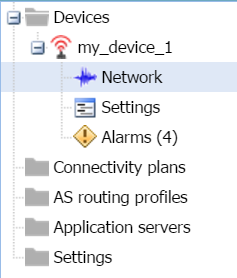
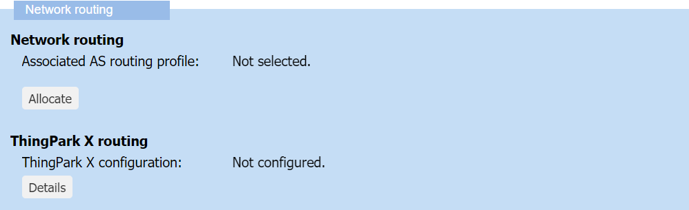
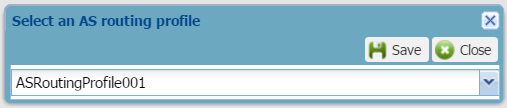
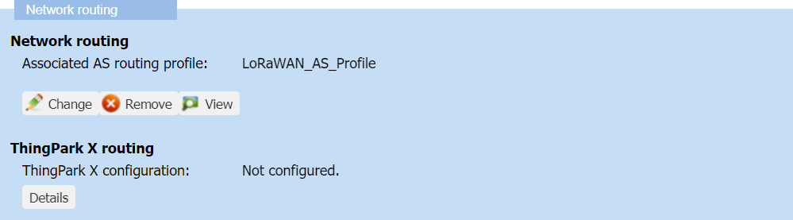

# Managing the AS routing profile of a device

You must have read-write access to Device Manager. Read more\... For
more information, see [Opening a panel and checking your read-/write
access](../use-interface.md#opening-a-panel-and-checking-your-read-write-access).

## AS routing profile compatibility rules

When managing an AS routing profile associated with a device, you must
apply the following rules:

|    | Rules |
| -- | ----- |
| **AS routing profile and connectivity plan** compatibility | **Both the AS routing profile and the connectivity plan associated with the device must be compatible**: - Use an **AS routing profile that does not contain more destinations, summing up all types of application servers in it, than defined in the connectivity plan** associated with the device, - Otherwise, change the connectivity plan if possible.  For more information, see the Maximum allowed Application Servers parameter in [LoRaWAN® unicast connectivity plan details](../reference-information.md#lorawan®-unicast-connectivity-plan-details) and [Cellular IoT connectivity plan details](../reference-information.md#cellular-iot-connectivity-plan-details). |
| **Cellular and HSM** incompatibility | **Important:** Hardware Security Module (HSM) is not applicable to cellular devices. When creating a cellular AS routing profile, do not activate the Hardware Security Module (HSM), if available.|

## Allocating an AS routing profile

If applying [AS routing profile compatibility
rules](#as-routing-profile-compatibility-rules), you can allocate:

- A LoRaWAN® AS routing profile to an existing LoRaWAN® device

- A cellular AS routing profile to an existing cellular device.

Only one AS routing profile can be allocated to a device.

**Before you begin**

- You must have read-write access to Device Manager. Read more\... For
  more information, see [Opening a panel and checking your read-/write
  access](../use-interface.md#opening-a-panel-and-checking-your-read-write-access).

- You must have created and provisioned at least two AS routing
  profiles.  
  For more information, see [Managing local application
  servers](../manage-local-application-servers/index) and [Accessing
  AS routing
  profiles](../manage-as-routing-profiles/access-as-routing-profiles).

1.  In the navigation panel, click **Devices** to display the Devices
    panel, then click the **List** or the **Map** tab.

2.  Select the device you want to see the network settings, and click
    **Edit**.

3.  In the device that appears in the navigation panel, click
    **Network**.

    

4.  In the Network panel that opens, go to the Network routing frame,
    and click **Allocate** in the Network routing area.

    

5.  In the Select an AS routing profile dialog box that opens, select the AS routing profile you want from the list.
    

    **Notes**
    - The AS routing profile at the top of the list is the AS routing
      profile by default.
    - If you are working with LoRaWAN® and cellular devices, ensure:
      - Selecting a LoRaWAN® routing profile for a LoRaWAN® device
      - Selecting a cellular routing profile for a cellular device.

6.  Click **Save**.

    -\> The name of the associated AS routing profile appears in the
    Network routing area.

## Changing the AS routing profile

Once allocated, you can change the AS routing profile of an existing
LoRaWAN® or cellular device if applying [AS routing profile
compatibility rules](#as-routing-profile-compatibility-rules).

**Before you begin**

- You must have read-write access to Device Manager. Read more\... For
  more information, see [Opening a panel and checking your read-/write
  access](../use-interface.md#opening-a-panel-and-checking-your-read-write-access).

- You must have created and provisioned at least two AS routing
  profiles.  
  For more information, see [Managing local application
  servers](../manage-local-application-servers/index) and [Managing
  AS routing profiles](../manage-as-routing-profiles/index).

 

1.  In the navigation panel, click **Devices** to display the Devices
    panel, then click the **List** or the **Map** tab.

2.  Select the device you want to see the network settings, and click
    **Edit**.

3.  In the device that appears in the navigation panel, click
    **Network**.

    

4.  In the Network panel that opens, go to the Network routing frame,
    and click **Change** in the Network routing area.

    

5.  In the Select an AS Routing profile dialog box that opens, select
    the AS routing profile you want from the list.

    

    **Notes**
    - The AS routing profile at the top of the list is the default AS
      routing profile.
    - If you are working with LoRaWAN® and cellular devices, ensure:
      - Selecting a LoRaWAN® routing profile for a LoRaWAN® device
      - Selecting a cellular routing profile for a cellular device.

6.  Click **Save**.

    -\> The name of the newly associated AS routing profile appears in
    the Subscription area.

## Removing an AS routing profile

If you do not want to use a device anymore, you can remove its AS
routing profile.

You must have read-write access to Device Manager. Read more\... For
more information, see [Opening a panel and checking your read-/write
access](../use-interface.md#opening-a-panel-and-checking-your-read-write-access).

**WARNING** This action deactivates the device on the network server

- You can reactivate the device by associating a connectivity plan
  again.

- To make the device work again, you must have direct access to the
  device to force outside Device Manager:

  - A join procedure for an OTAA device

  - A device reset for an ABP device.

If you want to replace an AS routing profile on a device you still want
to use, apply [Changing the AS routing
profile](#changing-the-as-routing-profile).

 

1.  In the navigation panel, click **Devices** to display the Devices
    panel, then click the **List** or the **Map** tab.

2.  Select the device you want to see the network settings, and click
    **Edit**.

3.  In the device that appears in the navigation panel, click
    **Network**.

    

4.  In the Network panel that opens, go to the Network routing frame,
    and click **Remove** in the Network routing area.

    

5.  In the message that appears, click **Yes** to confirm.

    -\> The AS routing profile is removed.
