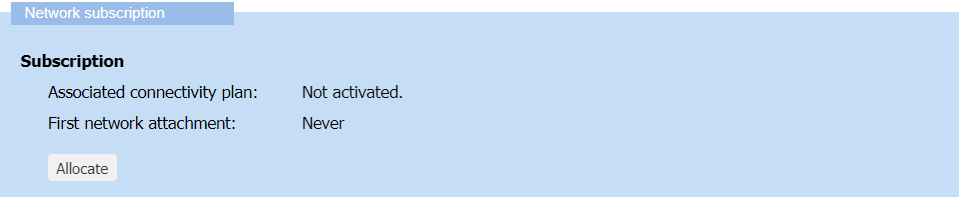
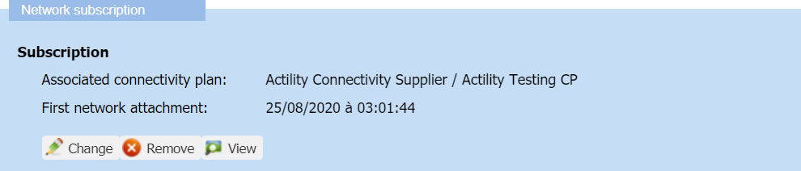

# Managing the connectivity plan of a device

You must have read-write access to Device Manager. Read more\... For
more information, see [Opening a panel and checking your read-/write access](../use-interface.md#opening-a-panel-and-checking-your-read-write-access).

## Connectivity plan compatibility rules

When managing a connectivity plan associated with a device, you must
apply the following rules:

|    | Rules |
| -- | -- |
| **Connectivity plan and device** compatibility | If you are working with both LoRaWAN® (including class B) and cellular devices, ensure:  - Allocating a **LoRaWAN® connectivity plan** for a **LoRaWAN® device**, - Allocating a **LoRaWAN® connectivity plan supporting class B** for a **class B model device**, - Allocating a **cellular connectivity plan** for a **cellular device** |
| **Connectivity plan and application server** compatibility | The connectivity plan associated with the device **must enable the routing parameter corresponding to the application server used by the device**.  For more information, see [LoRaWAN® unicast connectivity plan details](../reference-information.md#lorawan®-unicast-connectivity-plan-details) or [Cellular IoT connectivity plan details](../reference-information.md#cellular-iot-connectivity-plan-details).|
| **Connectivity plan and AS routing profile** compatibility | **Both the connectivity plan and the AS routing profile associated with the device must be compatible**. If an AS routing profile has already been associated with the device: - Use a connectivity plan that is compatible **with the number of destinations, summing up all types of application servers, contained in the AS routing profile**, - Otherwise, change or create another AS routing profile.  For more information, see the Maximum allowed Application Servers parameter in [LoRaWAN® unicast connectivity plan details](../reference-information.md#lorawan®-unicast-connectivity-plan-details) and [Cellular IoT connectivity plan details](../reference-information.md#cellular-iot-connectivity-plan-details). |

## Allocating a connectivity plan

You can associate a device with a connectivity plan after the creation
of the device if applying [Connectivity plan compatibility rules](#connectivity-plan-compatibility-rules).

You must have read-write access to Device Manager. Read more\... For
more information, see [Opening a panel and checking your read-/write access](../use-interface.md#opening-a-panel-and-checking-your-read-write-access).

1.  In the navigation panel, click **Devices** to display the Devices
    panel, then click the **List** or the **Map** tab.

2.  Select the device you want to see the network settings, and click
    **Edit**.

3.  In the device that appears in the navigation panel, click
    **Network**.

    

4.  In the Network panel that opens, go to the Network subscription
    frame, and click **Allocate** in the Subscription area.

    

5.  In the Select a network subscription dialog box that opens, select
    from the list the connectivity plan you want according to the type
    of device.

    **Note** The number of remaining connectivity plan credits is
    displayed into parenthesis. For more information, see [Viewing the     connectivity plans and available     credits](../view-connectivity-plans.md#viewing-the-connectivity-plans-and-available-credits).

6.  Click **Save**.

    -\&gt; The name of the associated connectivity plan appears in the
    Subscription area.

## Changing the connectivity plan

Once allocated, you can change the connectivity plan of a device if
applying [Connectivity plan compatibility rules](#connectivity-plan-compatibility-rules).

You must have read-write access to Device Manager. Read more\... For
more information, see [Opening a panel and checking your read-/write access](../use-interface.md#opening-a-panel-and-checking-your-read-write-access).

1.  In the navigation panel, click **Devices** to display the Devices
    panel, then click the **List** or the **Map** tab.

2.  Select the device you want to see the network settings, and click
    **Edit**.

3.  In the device that appears in the navigation panel, click
    **Network**.

    

4.  In the Network panel that opens, go to the Network subscription
    frame, and click **Change** in the Subscription area.

    

5.  In the Select a network subscription dialog box that opens, select
    from the list the connectivity plan you want according to the type
    of device.

    **Note** The number of remaining connectivity plan credits is
    displayed into parenthesis. For more information, see [Viewing the     connectivity plans and available     credits](../view-connectivity-plans.md#viewing-the-connectivity-plans-and-available-credits).

6.  Click **Save**.

    -\&gt; The name of the newly associated connectivity plan appears in
    the Subscription area.

## Removing a connectivity plan

If you do not want to use a device anymore, you can remove its
connectivity plan. You must have read-write access to Device Manager.
Read more\... For more information, see [Opening a panel and checking your read-/write access](../use-interface.md#opening-a-panel-and-checking-your-read-write-access).

**WARNING** This action deactivates the device on the network server

- You can reactivate the device by allocating a connectivity plan again.

- To make the device work again, you must have direct access to the
  device to force outside Device Manager:

  - A join procedure for an OTAA device

  - A device reset for an ABP device.

If you want to replace a connectivity plan on a device you still want to
use, apply [Changing the connectivity plan](#changing-the-connectivity-plan).

1.  In the navigation panel, click **Devices** to display the Devices
    panel, then click the **List** or the **Map** tab.

2.  Select the device you want to see the network settings, and click
    **Edit**.

3.  In the device that appears in the navigation panel, click
    **Network**.

    

4.  In the Network panel that opens, go to the Network subscription
    frame, and click **Remove** in the Subscription area.

    

5.  In the message that appears, click **Yes** to confirm.

    -\&gt; The connectivity plan is removed from the Subscription area and
    the device is deactivated.
