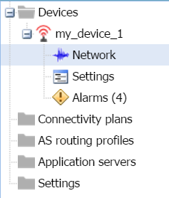

# Monitoring the device network

The Network panel of a device displays the network information of the
device that you can monitor:

- Associated connectivity plan

- First network attachment of the device

- History of daily overflow activity of the device compared to the
  connectivity plan

- Associated AS routing profile

- Network coverage (LoRaWAN® only).

 

1.  In the navigation panel, click **Devices** to display the Devices
    panel, then click the **List** or the **Map** tab.

2.  Select the device you want to see the network settings, and click
    **View** or **Edit**.

    **Note** In view mode, only **View** buttons are available.

3.  In the device that appears in the navigation panel, click
    **Network**.

    

4.  The Network panel opens displaying the following read-only
    information.

- In the Network subscription frame:

  - The Subscription area displays the current associated connectivity
    plan and the date the device has communicated for the first time.
    Click **View**, if you want to display the connectivity plan
    details, then click **Network** in the navigation panel to go back.

  - In the Daily network subscription overflow area, the chart displays
    the usage of the device in the connectivity plan, showing the number
    of packets on the selected period exceeding the subscribed
    connectivity plan. It applies to LoRaWAN® and cellular in message
    mode. For more information about how to use the charts of the
    device's statistics, see [Monitoring packets and payloads history of     a LoRaWAN®     device](../orphans/dmug-monitor-packets-payloads-history-lorawan-device)
    and [Monitoring the activity of a cellular     device](../manage-a-device/check-device-settings-activity.md#monitoring-the-activity-of-a-cellular-device).

    

- In the Network coverage frame that only applies to LoRaWAN® devices,
  you can see on the map the position of the LRR (software installed in
  the base station) which has received the last message. Click the LRR
  marker to display more details.

  

