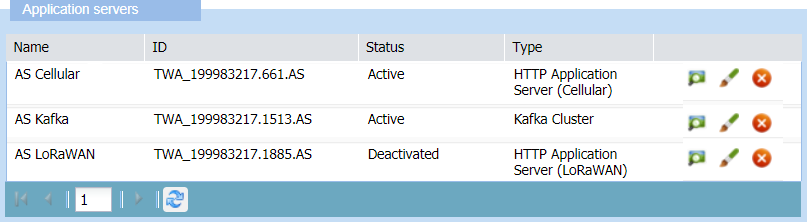

# Accessing application servers

The Application Server panel displays local application servers that
are:

- **LoRaWAN® HTTP application server**

- **Cellular HTTP application server**

- **Kafka cluster**.

Local application servers are application servers that can be created,
edited and deleted in Device Manager by the read-write access end-users
of a subscriber. Read-only access end-users only can open local
application servers in view mode to check their parameters.

&nbsp;

1.  Click **Application Servers** on the navigation panel to open the
    Application Servers panel:

    

2.  The Application Servers frame lists the active and deactivated
    applications servers, if any already created, that you can **View**.
    If you are a read-write access end-user, you can also **Edit** or
    **Delete** them.

    

