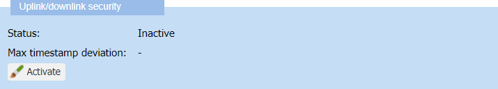
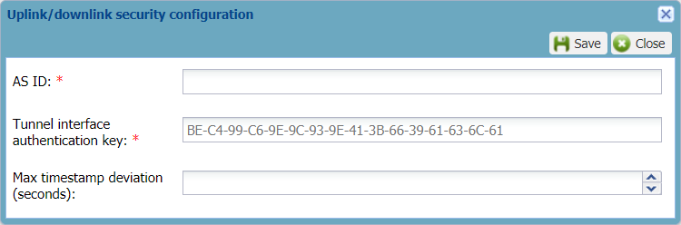
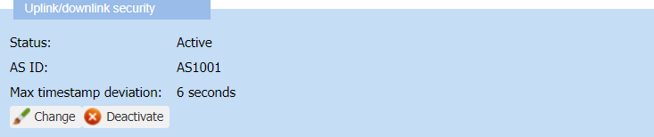

# Activating the security of a local application server

Activating the uplink/downlink security of a local application server is
optional. If you want to activate it, you must configure this security
after creating the local application server, and before adding a route.

You must have read-write access to Device Manager. Read more\... For
more information, see [Opening a panel and checking your read-write access](../use-interface.md#opening-a-panel-and-checking-your-read-write-access).

**Notes**

- If your operator made it mandatory on its platform, you must activate
  this security. If not, you cannot save the application server.

- The uplink/downlink security of the application server uses the Tunnel
  interface authentication key that needs, by default, a high entropy.

- For Kafka clusters, this security only applies to downlink packets.
  The operator can secure the uplink packets when configuring its
  platform.

## Tunnel interface authentication key's entropy

The Tunnel interface authentication key is a 128-bit hexadecimal
(32-character hexadecimal) string which is used to activate the
uplink/downlink security of the application server.

It is given by the supplier of the application server. The Tunnel
interface authentication key is shared by the LRC and the application
server to secure uplink and downlink packets passing through the tunnel
interface. For more information, see the [LRC-AS Tunnel Interface Developer Guide](../../integrating-applications-with-tpw.md#lrc-as-tunnel-interface-developer-guide).

When you provide a Tunnel interface authentication key, its entropy is
computed by the system using Shannon's algorithm:

- If the entropy is greater than or equal to the entropy threshold
  accepted by the configuration of the ThingPark Wireless platform, the
  Tunnel interface authentication key is accepted.

- If not, the Tunnel interface authentication key is rejected. For more
  information, contact the administrator of your operator's platform.

## Activating the security

This task is optional, and you must have read-write access to Device
Manager. Read more\... For more information, see [Opening a panel and checking your read-write access](../use-interface.md#opening-a-panel-and-checking-your-read-write-access).

You need the following information from the supplier of the application
server:

| Required information                          |                                                                                                                           |
|-----------------------------------------------|---------------------------------------------------------------------------------------------------------------------------|
| **AS ID Tunnel interface authentication key** | AS-ID and Tunnel interface authentication key are used by the LRC and the application server for the tunneling interface. |
| **Max timestamp deviation**                   | Optionally defines the tolerance of downlink timestamp deviation in seconds.                                              |

**Before you begin** The application server must be opened in edit mode.

 

1.  In the Uplink/downlink security frame of the application server,
    click **Activate**.

    

2.  In the Uplink/downlink security configuration dialog box that opens,
    enter the information given by the supplier of the application
    server:

    - In the **AS ID** box: Enter the application server identifier.

    - In the **Tunnel interface authentication key** box: Enter with or
      without separating dashes the 32-character hexadecimal string
      given by the supplier of the application server.

    - (Optional) In the **Max timestamp deviation** box, type or use the
      arrows to enter the value in second given by the supplier of the
      application server.

      

3.  Click **Save**.

    -\> In the Uplink/downlink security frame the status appears as
    Active, and the value of the AS ID is displayed.

    

