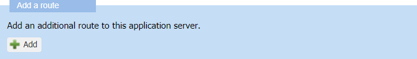
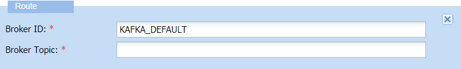

# Adding a route to a Kafka cluster

If you have created a Kafka cluster, you must add it a route to send and
receive the LoRaWAN® or cellular device packets. It consists in creating
a name for a broker topic. The name must comply with some specific
rules. You can create only one route for a Kafka cluster.

**Before you begin** The Kafka cluster must be opened in edit mode in
the Application server panel.

1.  In the Add a route frame, click **Add**.
    

2.  In the Route frame that appears, enter in the **Broker Topic** box a
    name compliant with the following rules:
    

    - The name must begin with the AS. prefix.

    - The name must have a maximum number of 32 characters, among: A\...
      Z, a\... z, 0\...9, ., -, and \_. Example: AS.application1.v1.

3.  Take note of the **Broker Topic** you have created and communicate
    it to your Project Manager and Engineer in order to create it on the
    Kafka server.

4.  Click **Save** to keep all changes made on the application server.

    -\> The Status frame of the Application server panel is updated with
    your last modifications.

    -\> The application server destination is ready to be added to a
    LoRaWAN® or a cellular AS routing profile:

    - If you want to add it to an existing AS routing profile, see
      [Adding a destination to a LoRaWAN® AS routing       profile](../manage-as-routing-profiles/add-destination-to-lorawan-as-routing-profile).

    - If you want to add it to a new AS routing profile, see [Managing       AS routing profiles](../manage-as-routing-profiles/index).
