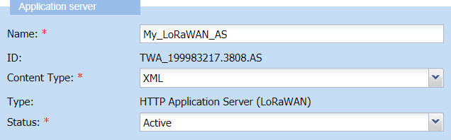

# Changing the content type of a local application server

When the local application server is created, by default its content
type is XML. Both the local application server created in Device Manager
and the third-party application server where device packets will be sent
must use the same content type to communicate. Ask the content type used
by the third-party application server to its owner.

You must have read-write access to Device Manager. Read more\... For
more information, see [Opening a panel and checking your read-write access](../use-interface.md#opening-a-panel-and-checking-your-read-write-access).

**Important** It is not recommended to change the content type of a
local application server in use.

You can use one of the following content types:

* XML
* JSON (used for local application servers created from ThingPark Wireless 5.0.)

  Reports are sent to the third-party application server in JSON format.
  
  Example:
  ```json
  {
    "DevEUI":"78A8952D2E2992C5",
    "FPort":2,
    "LrrRSSI":-60.000000
  }
  ```
* JSON untyped (deprecated)

  Reports are sent to the third-party application server in JSON format
  with all properties as string.

  Example:
  ```json
  {
    "DevEUI":"78A8952D2E2992C5",
    "FPort":"2",
    "LrrRSSI":"-60.000000"
  }
  ```

For more information, see [LRC-AS Tunnel Interface Developer Guide].

**Before you begin** The application server must be opened in edit mode.

&nbsp;

1.  In the Application server frame, select from the **Content Type**
    list the content type that matches the content type of the
    third-party application server that will receive the device packets.

    

2.  Click **Save**.

    -\&gt;The Status frame of the Application server panel is updated with
    your last modifications.
