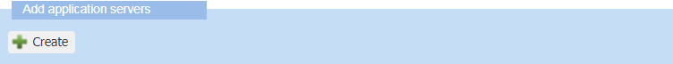
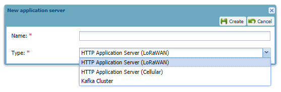
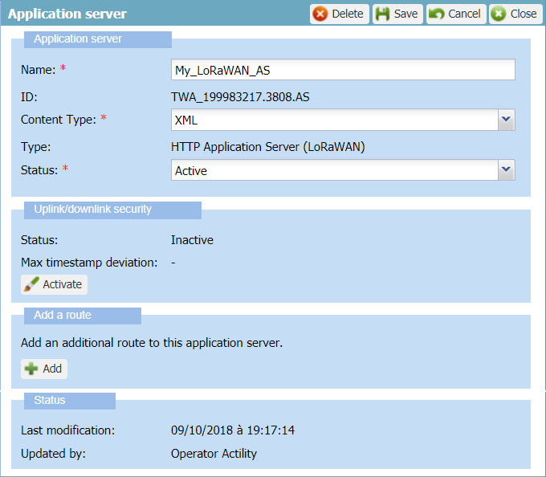

# Creating a local application server

You must have read-write access to Device Manager.Read more\... For more
information, see [Opening a panel and checking your read-write access](../use-interface.md#opening-a-panel-and-checking-your-read-write-access).

## About local application servers and creating process

Local application servers are application servers that you can create
and edit as a read-write access end-user of a subscriber in Device
Manager:

- **LoRaWAN® HTTP application server**

- **Cellular HTTP application server**

- **Kafka cluster**.

Creating a local application server consists in:

- Giving it a name

- Giving it a type corresponding to the destination and the connectivity
  that will be used to send and receive the device packets.

- By default, a local application server is created with XML content
  type.

To make the local application server work, you will then have to:

- (Optional) Change its content type according to the specifications of
  the third-party application server that will be used by the device.

- (Optional) Activate its uplink/downlink security.

- Add it one or more routes and destination URLs. Only one route can be
  created for cellular connectivity. The maximum number of destination
  URLs per route is defined according to the routing strategy by your
  operator.

When created, a local application server is active.

## Creating a LoRaWAN® or a cellular HTTP application server or a Kafka cluster

According to the type of destination and the connectivity used by the
device, you can create the following local application servers if you
have read-write access to Device Manager:

- **LoRaWAN® HTTP application server**

- **Cellular HTTP application server** used for cellular in message and
  mixed modes

- **Kafka cluster** used for both LoRaWAN® and cellular in message and
  mixed modes.

&nbsp;

1.  In the Application Servers panel, click **Create** in the Add
    application servers frame.

    

2.  In the New application server dialog box that opens:

- In the **Name** box, enter a name for the application server.  
  **Tip** To help you later when associating the local application
  server with the AS routing profile, create a name that differentiates
  a LoRaWAN® or cellular HTTP application server from a Kafka cluster.

- In the **Type** list, select the type of application server you want
  to create.

  

1.  Click **Create**.

    -\&gt; The new application server is created and opened in edit mode.

    -\&gt; By default, its content type is XML and its status is active.

    

