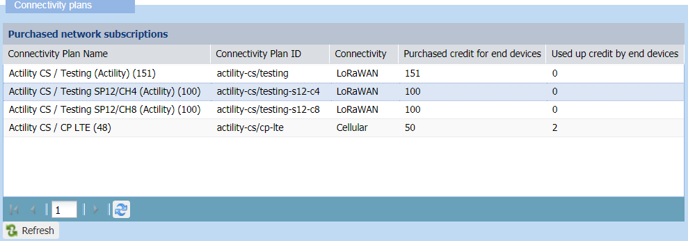

# Viewing connectivity plans

Whichever the end-user group you belong, connectivity plans are
read-only for all end-users in Device Manager.

## About connectivity plans

There are three types of connectivity plans:

- LoRaWAN® unicast connectivity plans for LoRaWAN® devices. They can
  support class B devices.

- LoRaWAN® multicast connectivity plans for LoRaWAN® devices. They can
  support class B devices.

- Cellular connectivity plans for cellular devices. They can support
  Message, Direct IP, and Mixed modes.

Connectivity plans are purchased by the Subscriber to a Vendor and are
mandatory for a device to communicate with base stations.

A connectivity plan is associated with activation and recurring fees. It
defines:

- Network connectivity features that are confirmed messages and downlink
  traffic.

- Traffic policing parameters (token bucket regulators for uplink and
  downlink traffic).

The connectivity plan allows the Subscriber to know which communication
in terms of uplink/downlink frame parameters he/she can perform using
the network. When creating a device, the Subscriber selects the
connectivity plan he/she wants to use for the device.

Connectivity plans cannot be edited in Device Manager. They are created
by the Connectivity Supplier in the Connectivity Manager to be included
in a Vendor offer. For more information, see [Supplier user guide](../../user-guide-tpw/supplier/index).

The connectivity plan associated with the device must enable the routing
parameter corresponding to the application server used by the device.
For more information, see [LoRaWAN® unicast connectivity plan details](reference-information.md#lorawan®-unicast-connectivity-plan-details)
or [Cellular IoT connectivity plan details](reference-information.md#cellular-iot-connectivity-plan-details).

## Viewing the connectivity plans and available credits

The connectivity plans panel displays a list of connectivity plans that
are available and activated in your Subscriber account. You can see the
available credit of devices that can be provisioned on all connectivity
plans.

This panel is read-only.

1.  Click **Connectivity plans** in the navigation panel to open the
    Connectivity plans panel:

    

2.  The Connectivity plan frame lists the available connectivity plans
    in your account and gives the following information. This
    information is read-only.
    

    - **Connectivity Plan Name**: name of the connectivity plan. If no
      connectivity plan is displayed, contact your operator.

      **Tip** The number in parenthesis indicates the number of
      remaining devices which can be used in the connectivity plan. It
      is obtained by subtracting the number of Purchased credit for end
      devices from Used up credit for end devices.

    - **Connectivity Plan ID**: ID of the connectivity plan (required
      for importing devices).

    - **Purchased credit for end devices**: number of maximum devices
      allowed in the plan.

    - **Used up credit by end devices**: number of devices registered on
      the selected plan, meaning how many devices have been created in
      the Subscriber account.

## Viewing the details of a connectivity plan

You can display the details of the connectivity plan you want. This
information is read-only.

 

1.  Click **Connectivity plans** in the navigation panel to open the
    Connectivity plans panel:

    

2.  In the Connectivity plan frame that appears, select the connectivity
    plan you want.

- The connectivity plan is displayed with all its parameters in the
  Connectivity plan details frame.

- For more information about all parameters of the connectivity plans,
  see:

  - [LoRaWAN® unicast connectivity plan     details](reference-information.md#lorawan®-unicast-connectivity-plan-details)

  - [LoRaWAN® multicast connectivity plan     details](reference-information.md#lorawan®-multicast-connectivity-plan-details)

  - [Cellular IoT connectivity plan     details](reference-information.md#cellular-iot-connectivity-plan-details)

1.  If you want to display another connectivity plan, select it from the
    list.
