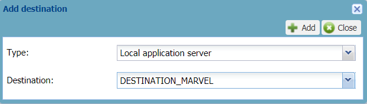

# Adding a message mode destination

For the message mode and the message mode part of the mixed mode, the
cellular AS routing profile requires one or more destinations that are
the following application servers:

- **ThingPark X destinations**

- **Local applications servers**: cellular HTTP application servers or
  Kafka clusters

To learn more, click [AS routing profiles and application servers mapping](../device-manager-user-guide/manage-as-routing-profiles/index.md#as-routing-profiles-and-application-servers-mapping).

**Important** The maximum number of destinations, summing up all types
of application servers you can add in a cellular AS routing profile, is
defined in the connectivity plan associated with the device. For more
information, see the Maximum allowed Application
Servers parameter in [Cellular IoT connectivity plan details](../device-manager-user-guide/reference-information.md#cellular-iot-connectivity-plan-details).

If you want to use a local application server, it must have only one
route and be active to work properly. To learn more, click [Adding a route to a local application server](../device-manager-user-guide/manage-local-application-servers/adding-a-route-to-a-local-application-server/index.md)
and [Deactivating a local application server](../device-manager-user-guide/manage-local-application-servers/deactivate-local-application-server).
When added to the AS routing profile, a destination displays its status.

**Before you begin**

- You must have read-write access to Device Manager. Read more\... For
  more information, see [Opening a panel and checking your read-write access](../device-manager-user-guide/use-interface.md#opening-a-panel-and-checking-your-read-write-access).

- The cellular AS routing profile must be opened in edit mode.

1.  In the AS routing profile frame, if you want to set the cellular
    message mode, select **Message only** from the **Mode** list.

    -\> The AS routing profile panel appears with message mode
    configuration.

2.  In the Message mode destinations frame, click **Add**.

    

3.  In the Add destination dialog box that appears, do one of the
    following:

    - If required by your operator to use a ThingPark X destination:

      

      1.  In the **Type** list: select **ThingPark X**.

      2.  In the **Destination** list: select the ThingPark X
          destination your operator gave you. If
          \<No cloud configured\> is
          displayed, contact your operator.

    - If you want to use a cellular HTTP application server or a Kafka
      cluster you have created earlier:

      

      1.  In the **Type** list: select **Local application server**.

      2.  In the **Destination** list: select the cellular HTTP
          application server or the Kafka cluster you want to use as a
          destination for the AS routing profile.

4.  Click **Add**.

    -\> The application server appears in the Destinations frame
    displaying its status.

5.  If you want to add another destination, click **Add**, and repeat
    from step 2.  
    Repeat as necessary. **Note** If you add more destinations that the
    number allowed in the connectivity plan you want to associate with
    the device, you will not be able to create or edit the device using
    this cellular AS routing profile.

6.  Click **Save**.

    -\> The Status frame is updated with your last modifications.

    -\>The cellular AS routing profile in message mode is ready to be
    allocated to a cellular device:

    - Either when creating the device.  
      For more information, see [Creating devices](../device-manager-user-guide/create-devices/index.md).

    - Or after you have created the device.  
      For more information, see [Managing the AS routing profile of a device](../device-manager-user-guide/manage-device-network/manage-as-routing-profile-device)
      or [Changing the AS routing profile](../device-manager-user-guide/manage-device-network/manage-as-routing-profile-device.md#changing-the-as-routing-profile).
