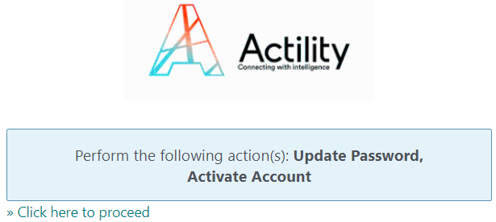

# Authenticating using an activation URL

If the account details email you received asks you to click **Account
Activation**, you have a time limit defined by your operator to create a
password using this URL.

By default, this time limit is fifteen minutes after the email is sent.
For more information, contact your vendor.

&nbsp;

1.  In the email, click the **Account Activation**.

2.  In the page that opens in your browser, click **Click here to
    proceed**.

    

3.  In the page that opens:

    1.  In the **New Password** box: Type a password.  
        -\&gt; A visual indicator allows you to know the strength level of
        the password.

    2.  In the **Confirm password** box: Type the same password.

        

4.  Click **Submit**.

- If some instructions appear, apply them repeating step 3 and 4. The
  password satisfies your operator security policy when the instructions
  stop. If necessary, contact your vendor.

1.  In the page that opens, update your **First name**, **Last name**
    and **Phone number** if necessary.

    

2.  Click **Submit**.

    -\&gt; You are redirected to a page that confirms your account
    modification.

    

3.  To complete the task, apply the steps described in [Usual logging in](../device-manager-user-guide/log-in/usual-logging-in.md).
