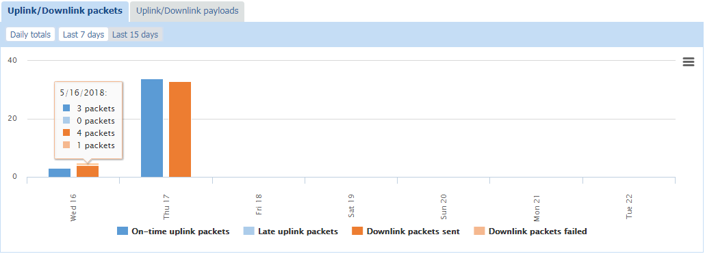
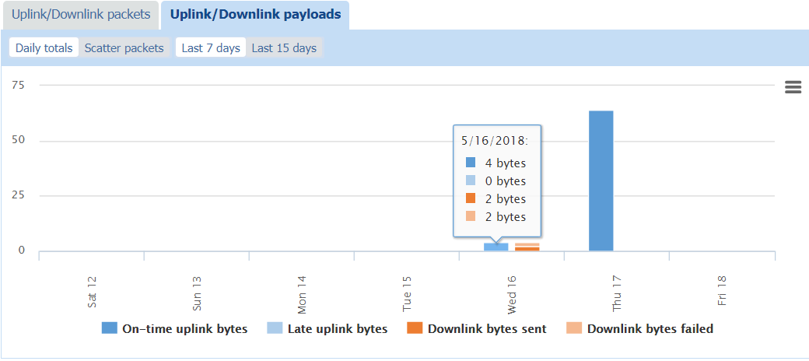
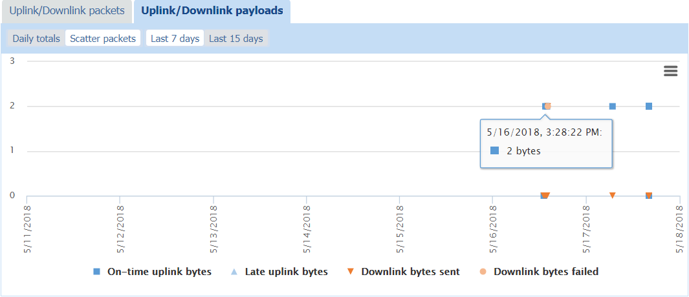

# Monitoring packets and payloads history of a LoRaWAN® device

You can display charts representing the device's packets and payloads to
check the radio traffic history over a selected period, and help you
monitor or troubleshoot a LoRaWAN® device.

**Tips**

- Hovering your mouse over an item of the chart displays additional
  traffic information.

- Clicking an item of the caption makes it appear or disappear from the
  chart and adjust the scale.

&nbsp;

1.  In the navigation panel, click **Devices** to display the Devices
    panel, then click the **List** or the **Map** tab.

2.  Select the device you want to check the activity, and click **View**
    or **Edit** to enter the Device panel.

3.  Scroll down the Device panel to display the **Uplink/Downlink
    packets** and **Uplink/Downlink payloads** tabs with the charts.

4.  Click the **Uplink/Downlink packets** tab, then:

    - Click **Daily totals** and **Last 7 days,** or **Last 15 days**,
      to view over the selected period:

      - The total number of **On-time uplink packets**

      - The total number of **Late uplink packets**

      - The total number of **Downlink packets sent**

      - And the total number of **Downlink packets failed**.

      **Tip** Hover your mouse over an item of the chart to read the
      exact number of packets with their distribution per day.

      

5.  Click the **Uplink/Downlink payloads** tab, then:

    - Click **Daily totals** and **Last 7 days,** or **Last 15 days**,
      to view over the selected period:

      - The total size of **On-time uplink bytes**

      - The total size of **Late uplink bytes**

      - The total size of **Downlink packets sent**

      - And the total size of **Downlink packets failed**.

      **Tip** Hover your mouse over an item of the chart to read the
      total size of bytes used with their distribution per day.

      

    - Click **Scatter packets** and **Last 7 days,** or **Last 15
      days**, to view over the selected period the scattering of packets
      per day of:

      - **On-time uplink bytes**

      - **Late uplink bytes**

      - **Downlink packets sent**

      - and **Downlink packets failed**.

      **Tip** Hover your mouse over a packet in the chart to see its
      timestamp and size in bytes.

      

6.  If you want to remove some information from the chart, click the
    corresponding item in the chart caption. It also adjusts the scale
    according to the information displayed.

7.  If you want to print or download this chart, see [Printing or downloading a chart](../device-manager-user-guide/manage-a-device/check-device-settings-activity.md#printing-or-downloading-a-chart).
